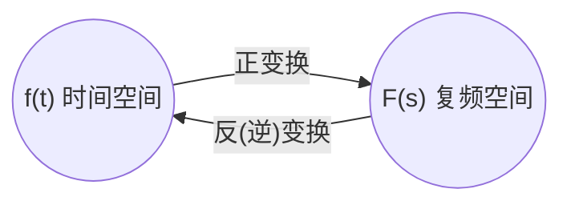

> 本笔记知识点摘录自 西安电子科技大学 郭宝龙 的 网课 [信号与系统](https://www.icourse163.org/course/XIDIAN-1001638014) 

疫情在家，于是没事看看网课自习。  
本人是应用数学专业，对于信号学很感兴趣。  
之前在一节叫图像重构 Image Reconstruction 的数学课上，没怎么弄懂， 最近在B站看到这节课，于是打算从另一个领域去搞懂。  
因为去年自学了Python, 同时最近也用它搞 AI, 就打算拿它做摘录笔记。  
本原文档是用 Jupyter notebook 写, 并转换为 Markdown 格式的。  

- [(1) 简介 Intro](https://blog.csdn.net/Varalpha/article/details/104908046)
- [(2) 傅里叶 Fourier](https://blog.csdn.net/Varalpha/article/details/104907583)
       - [常用函数的傅里叶变换汇总](https://blog.csdn.net/Varalpha/article/details/104964650)
- [(3) LTI 系统 与 滤波器](https://blog.csdn.net/Varalpha/article/details/104956275)
	- [二次抑制载波振幅调制接收系统 Python](https://blog.csdn.net/Varalpha/article/details/104976645)
- [(4) 取样 Sampling](https://blog.csdn.net/Varalpha/article/details/105014847)
- [(5) 离散傅里叶 Discrete Fourier](https://blog.csdn.net/Varalpha/article/details/105054169)
- [(6) 拉普拉斯变换 Laplace Transform](https://blog.csdn.net/Varalpha/article/details/105096437)
- [(7) 电路与系统函数](https://blog.csdn.net/Varalpha/article/details/105145892)
	- [连续系统](https://blog.csdn.net/Varalpha/article/details/105159492)
- [(8) 离散系统z域分析 -- z变换](https://blog.csdn.net/Varalpha/article/details/105174086)
	- [系统函数 H(z)](https://blog.csdn.net/Varalpha/article/details/105229322)


<a id="1-introduction"></a>
# 1. Introduction

<a id="11-%E5%91%A8%E6%9C%9F%E4%BF%A1%E5%8F%B7"></a>
## 1.1. 周期信号

* Period Signal

<a id="111-%E8%BF%9E%E7%BB%AD%E4%BF%A1%E5%8F%B7%E5%91%A8%E6%9C%9F"></a>
### 1.1.1. 连续信号周期

* 连续周期信号 $f(t)$, 周期为 $T$, 满足 
    $$ f(t) = f(t + mT), \ m = 0, \pm 1, \pm 2, \dots $$ 
    * 典型周期连续信号: 余弦信号 $\cos \omega t$ 周期为 $T = \frac{2\pi}{\omega}(s)$  
    
<a id="112-%E7%A6%BB%E6%95%A3%E4%BF%A1%E5%8F%B7%E5%91%A8%E6%9C%9F"></a>
### 1.1.2. 离散信号周期

* 离散周期信号 $f(k)$, 周期为 $N$, 满足  
    $$ f(k) = f(k +mN), \ m = 0, \pm 1, \pm 2, \dots $$  

<a id="113-%E4%BF%A1%E5%8F%B7%E7%9A%84-python-%E8%A1%A8%E7%A4%BA%E4%B8%8E%E7%BB%98%E5%9B%BE"></a>
### 1.1.3. 信号的 Python 表示与绘图

* 连续信号 $f(t) = 5 e^{-0.8t} \sin(\pi t), \, 0<t<5$ 绘图  


```python
    # 导入 需要的 library 库  
    import numpy as np # 科学计算
    import matplotlib.pyplot as plt # 画图
    import scipy.signal as sg # 导入 scipy 的 signal 库 命名为 sg

    a,b = 0.8,5
    t = np.linspace(0,5,100) # 另一种表达式 t = np.mgrid[0:5:0.01]
    y = b*np.exp(-a*t)*np.sin(np.pi*t)
    plt.xlabel('time')
    plt.ylabel('Y')
    plt.plot(t,y)
    plt.grid(True)
    plt.show()
```


********

<a id="12-%E4%BF%A1%E5%8F%B7%E5%88%86%E7%B1%BB"></a>
## 1.2. 信号分类

* 将信号 $f(t)$ 施加于 $1 \Omega$ 电阻上， 所消耗的瞬时功率为 $\lvert f(t) \rvert ^2$, 在区间 $( -\infty, \infty)$ 的**能量**和**平均功率**定义为  
    $$ E \overset{def}{=} \int_{-\infty}^\infty \lvert f(t) \rvert ^2 dt $$  
    $$ P \overset{def}{=} \lim_{T \to \infty} \frac{1}{T} \int_{-T/2}^{T/2} \lvert f(t) \rvert ^2 dt $$  

<a id="121-%E8%83%BD%E9%87%8F%E4%BF%A1%E5%8F%B7"></a>
### 1.2.1. 能量信号

* **能量有限信号**: 信号的能量 $E < \infty$ , 简称 **能量信号** , 此时 $P = 0$.
    * 离散: $E = \displaystyle\sum_{k=-\infty}^{\infty} \lvert f(k) \rvert ^2 < \infty$  

<a id="122-%E5%8A%9F%E7%8E%87%E4%BF%A1%E5%8F%B7"></a>
### 1.2.2. 功率信号

* **功率有限信号**: 信号的功率 $P < \infty$ , 简称 **功率信号** , 此时 $E = \infty$.  
    * 离散: $P = \displaystyle \lim_{N \to \infty} \frac{1}{N} \sum_{k=-N/2}^{N/2} \lvert f(k) \rvert ^2 < \infty$  

<a id="123-%E5%9B%A0%E6%9E%9C%E4%BF%A1%E5%8F%B7"></a>
### 1.2.3. 因果信号

* **因果信号**: $t <0, \ f(t) = 0$ 的信号  
    * 例如: 阶跃信号  

<a id="124-%E5%8F%8D%E5%9B%A0%E6%9E%9C%E4%BF%A1%E5%8F%B7"></a>
### 1.2.4. 反因果信号

* **反因果信号**: $t \leq 0, \ f(t) = 0$ 的信号  

<a id="125-%E5%85%B6%E4%BB%96%E7%B1%BB%E5%9E%8B"></a>
### 1.2.5. 其他类型

* 一维信号， 多维信号； 实信号，复信号； 左信号， 右信号。。。。。。

<a id="126-remark"></a>
### 1.2.6. Remark

1. 时限信号为能量信号  
2. 周期信号为功率信号  
3. 非周期信号 可能为能量也可能为功率信号  
4. $f(t) = e^t$ 既不是能量也不是功率信号  


*******************

<a id="13-%E5%86%B2%E6%BF%80%E5%87%BD%E6%95%B0"></a>
## 1.3. 冲激函数

$$\begin{aligned} \delta (x) \overset{def}{=} {\begin{cases} 0 , & x\neq 0 \\ 1 , & x = 0 \end{cases}} \end{aligned}$$  

<a id="131-%E5%8D%95%E4%BD%8D%E5%86%B2%E6%BF%80%E5%87%BD%E6%95%B0-dirac-delta-function"></a>
### 1.3.1. 单位冲激函数  Dirac delta function

* **单位冲激函数**: 奇异函数, 强度极大, 作用时间极短的物理量的理想化模型  
    $$\begin{aligned} {\begin{cases} \delta (x) = 0 , & x\neq 0 \\ \int_{-\infty}^{\infty} \delta(x) dx = 1 \end{cases}} \end{aligned}$$  
    * aka Dirac delta function  
    * 高度无穷大, 宽度无穷小, 面积为 1 的对称窄脉冲  
    
<a id="132-%E9%98%B6%E8%B7%83%E5%87%BD%E6%95%B0"></a>
### 1.3.2. 阶跃函数

* **阶跃函数**:  
    $$ \varepsilon(t) \overset{def}{=} {\begin{cases} 0, & t<0 \\ 1, & t>0 \end{cases}} $$
    * 积分: $\int_{-\infty}^{t} \varepsilon(\tau)d\tau = t \cdot \varepsilon(t)$  
    * 与 冲激函数 关联:  
        * $\delta(t) = \frac{d \varepsilon(t)}{dt}$  
        * $\varepsilon(t) = \int_{-\infty}^{t} \delta(\tau) d\tau$  
        
<a id="133-%E5%B9%BF%E4%B9%89%E5%87%BD%E6%95%B0%E5%AE%9A%E4%B9%89"></a>
### 1.3.3. 广义函数定义

* Dirac Delta function **广义函数定义**:  
    $$ \int_{-\infty}^{\infty} \delta(t) \varphi(t)dt = \varphi(0) $$  
    * 冲激函数 $\delta (t)$ 作用于检验函数 $\varphi (t)$ 的结果是赋值为 $\varphi (0)$, 称为 冲激函数的取样性质。  
    * 例如: 
        * 高斯函数 $\delta(t) = \lim_{b\to \infty} b e^{-\pi(b\cdot t)^2}$  
        * 取样函数 $\delta(t) =  \lim_{b\to \infty} \frac{\sin(bt)}{\pi t}$  

<a id="134-%E5%8F%96%E6%A0%B7%E6%80%A7%E8%B4%A8"></a>
### 1.3.4. 取样性质

* Dirac Delta function **取样性质**:  
    $$ f(t) \delta(t-a) = f(a) \delta(t-a) \longrightarrow f(t) \delta(t) = f(0) \delta(t) $$  
    $$ \int_{-\infty}^{\infty} f(t) \delta(t-a) dt = f(a) \longrightarrow \int_{-\infty}^{\infty} f(t) \delta(t) dt = f(0) $$  
    * Notice: 积分区间要包含 $t=a$  
    
<a id="135-%E5%AF%BC%E6%95%B0"></a>
### 1.3.5. 导数

* Dirac Delta function **导数**:  
    * 冲激偶 $\delta^\prime (t)$:  
        $$ f(t) \delta^\prime (t) = f(0)\delta^\prime(t) - f^\prime(0)\delta(t) $$  
        $$ \int_{-\infty}^{\infty} f(t) \delta^\prime(t) dt = - f^\prime(0) $$  
        $$ \int_{-\infty}^{\infty} f(t) \delta^\prime(t-a) dt = - f^\prime(a) $$  
        $$ \int_{-\infty}^{\infty} f(t) \delta^{(n)}(t) dt = (-1)^nf^{(n)}(0) $$  
        
<a id="136-%E5%B0%BA%E5%BA%A6%E5%8F%98%E5%8C%96"></a>
### 1.3.6. 尺度变化

* Dirac Delta function **尺度变化**:  
    $$ \delta(at) = \frac{1}{\lvert a \rvert} \delta(t) $$  
    $$ \delta^{(n)} (at) = \frac{1}{\lvert a \rvert} \frac{1}{a^n} \delta^{(n)}(t) $$  

************

<a id="14-lti-%E8%BF%9E%E7%BB%AD%E7%B3%BB%E7%BB%9F"></a>
## 1.4. LTI 连续系统

$$f(t) \to \text{LTI (linear time-invariant systems)} \to y(t)$$

<a id="141-%E5%BE%AE%E5%88%86%E6%96%B9%E7%A8%8B%E7%9A%84%E7%BB%8F%E5%85%B8%E8%A7%A3%E6%B3%95"></a>
### 1.4.1. 微分方程的经典解法

$$y^{(n)}(t) + a_{n-1}y^{(n-1)}(t)+\dots + a_1y^{(1)}(t) + a_0y(t) \\ = b_mf^{(m)}(t)+b_{m-1}f^{(m-1)}(t) + \dots + b_1f^{(1)}(t) +b_0f(t)$$ 

* **经典解法**: $y(t) = y_h(t) + y_p(t)$  
    * $y(t)$ **完全解**   
    * $y_h(t)$ **齐次解** **homogeneous solution**  
    * $y_p(t)$ **特解** 

* **特征根**: eigenvalue 特征值  
    $$ \lambda^n + a_{n-1}\lambda^{n-1} + \dots + a_0 = 0\, \to\, \lambda_i(i=1,2,\dots, n)$$


<a id="142-%E5%88%9D%E5%A7%8B%E5%80%BC"></a>
### 1.4.2. 初始值

* **初始值**: 是n阶系统在 $t=0$ 时接入激励, 其响应在 $t=0_+$ 时刻的值, 即 $y^{(j)}(0_+) \, (j=0,1,2,\dots,{n-1})$  

* **初始状态**: 是系统在激励尚未接入的 $t=0_-$ 时刻的响应值 $y^{(j)}(0_-)$, 该值反映了系统的历史情况，且与激励无关。  

<a id="143-%E5%93%8D%E5%BA%94"></a>
### 1.4.3. 响应

$$y(t) = y_{zi}(t) + y_{zs}(t)$$

* **零输入响应**: $y_{zi}(t)$ (zero input)  

* **零状态响应**: $y_{zs}(t)$ (zero status)
    * $y_{zs}(0_-) = 0 \longrightarrow y_{zi}(0_+)=y_{zi}(0_-)=y(0_-)$

* **响应分类**:  
    * 固有响应：系统固有频率 或叫自由响应  
    * 强迫响应：与激励函数有关  
    * 暂态响应：随时间增长而消失  
    * 稳态响应：通常为阶跃函数和周期  

<a id="144-python-%E6%B1%82%E8%A7%A3%E7%B3%BB%E7%BB%9F%E7%9A%84%E5%93%8D%E5%BA%94"></a>
### 1.4.4. Python 求解系统的响应

* 系统的微分方程为 
    $$ 77 y{\left(t \right)} + 2 \frac{d}{d t} y{\left(t \right)} + \frac{d^{2}}{d t^{2}} y{\left(t \right)} = f(t)$$  
    * 在 $t\geq0$ 时，接入激励 $f(t)=10\sin(2\pi t)$, 求零状态响应  
    * 可得 $y^{\prime\prime}{\left(t \right)} = - 77 y{\left(t \right)} - 2 y^{\prime}{\left(t \right)} + f(t) , \, t\geq0$


```python
    # 使用方程解  
    from scipy.integrate import odeint, solve_bvp, solve_ivp
    # odeint: Integrate a system of ordinary differential equations
    # solve_bvp: Solve a boundary-value problem for a system of ODEs
    # solve_ivp: Solve an initial value problem for a system of ODEs

    # 一阶微分方程组  
    def fvdp(t,y):
        '''
        来源：https://www.jianshu.com/p/ab57b600b854?utm_campaign=shakespeare
        要把y看出一个向量，y = [dy0,dy1,dy2,...]分别表示y的n阶导
        对于二阶微分方程，肯定是由0阶和1阶函数组合而成的，所以下面把y看成向量的话，y0表示最初始的函数，也就是我们要求解的函数，y1表示一阶导，对于高阶微分方程也可以以此类推
        '''
        y0, y1 = y
        ft = 10*np.sin(2*np.pi*t)
        y2 = -2*y1-77*y0+ft
        # y0是需要求解的函数，y1是一阶导
        # 返回的顺序是[一阶导， 二阶导]，这就形成了一阶微分方程组
        return [y1, y2]

    y0 = [0, 0] # 初值[0,0]表示y(0)=0,y'(0)=0  
    t = np.linspace(0,5,100)
    y = odeint(fvdp, y0, t, tfirst=True) # 用 odeint 计算 y(t)
    y_ = solve_ivp(fvdp, t_span=(0,5), y0=y0, t_eval=t) # 用 solve_ivp 计算 y(t)

    # 开始绘图
    plt.subplot(211)
    y1, = plt.plot(t, y[:,0], label='y')
    y1_, = plt.plot(t,y[:,1],label='y‘')            
    plt.legend(handles=[y1,y1_], loc='upper right')
    plt.grid(True)

    plt.subplot(212)
    y2, = plt.plot(y_.t, y_.y[0,:],'g--',label='y(0)')
    y2_, = plt.plot(y_.t, y_.y[1,:],'r-',label='y(1)')
    plt.legend(handles=[y2,y2_], loc='upper right')
    plt.grid(True)

    plt.show()
```


```python
    # 用已有库的方法解 sg is scipy.signal
    sys = sg.lti([1],[1, 2, 77]) # 方程里的系数  
    ft = 10*np.sin(2*np.pi*t)
    _,y,_ = sg.lsim(sys,ft,T=t)
    # 开始绘图
    plt.plot(t,y,label='simple way') 
    plt.grid(True)
    plt.show()
```


<a id="145-%E5%86%B2%E6%BF%80%E5%93%8D%E5%BA%94"></a>
### 1.4.5. 冲激响应

* 由单位冲激函数 $\delta(t)$ 所引起的零状态响应，记为 $h(t)$ 。  
    * $\delta(t) \to \text{LTI} \to h(t)$  
    * 隐含条件:  
        $f(t) = \delta(t)$  
        对二阶系统 $h(0_-) = h^\prime(0_-) = 0$  

<a id="146-%E9%98%B6%E8%B7%83%E5%93%8D%E5%BA%94"></a>
### 1.4.6. 阶跃响应

* 由单位阶跃函数 $\varepsilon(t)$ 所引起的零状态响应，记为 $g(t)$  
    * $\varepsilon(t) \to \text{LTI} \to g(t)$  
    * 隐含条件:  
        $f(t) = \varepsilon(t)$  
        $g(0_-)=g^\prime(0_-)=0$  
        
* 关联:  
    $g(t) = \int^t_{-\infty} h(\tau) d\tau$  
    $h(t) = \frac{d }{d t}g(t)$  
    
<a id="147-python-%E5%86%B2%E6%BF%80%E5%93%8D%E5%BA%94%E4%B8%8E%E9%98%B6%E8%B7%83%E5%93%8D%E5%BA%94"></a>
### 1.4.7. Python 冲激响应与阶跃响应

* 求以下系统的冲激响应和阶跃响应:  
    $$7y^{\prime\prime}(t) + 4y^{\prime}(t) + 6y(t) = f^\prime(t) + f(t)$$


```python
    sys = sg.lti([1,1],[7,4,6]) # 方程里的系数 由高次幂到低次幂  
    st, sy = sg.step2(sys)
    it, iy = sg.impulse2(sys)
    sy1, = plt.plot(st, sy, label='step')
    iy1, = plt.plot(it, iy, label='impluse')
    # 开始绘图
    plt.legend(handles=[sy1,iy1], loc='upper right')
    plt.grid(True)
    plt.show()
```


*******************

<a id="148-%E5%8D%B7%E7%A7%AF%E7%A7%AF%E5%88%86-convolution"></a>
### 1.4.8. 卷积积分 Convolution

* 来源 $\hat{f}(t) = \displaystyle\sum_{n=-\infty}^{\infty} f(n\Delta)\Delta p(t-n\Delta)$ , p 为脉冲  
    $$\lim_{\Delta\to0} \hat{f}(t) = f(t) = \int_{-\infty}^{\infty} f(\tau)\delta(t-\tau)d\tau$$  
    
* 由 $\int_{-\infty}^{\infty} f(\tau)\delta(t-\tau)d\tau \longrightarrow \int_{-\infty}^{\infty} f(\tau)h(t-\tau)d\tau$  
    可得 $f(t) \to \text{LTI} \to y_{zs}(t)$  
    * 卷积积分 $y_{zs}= \int_{-\infty}^{\infty} f(\tau)h(t-\tau)d\tau$  

* 定义:  
    * $f_1$ 与 $f_2$ 的 卷积: $f(t) =  \int_{-\infty}^{\infty} f_1(\tau)f_2(t-\tau)d\tau$   
    * 记为 $f(t) = f_1(t) \star f_2(t)$  

* 代数性质:  
    * 三定律:  
        1. 交换律: $f_1 \star f_2 = f_2 \star f_1$  
        2. 分配律: $f_1 \star [f_2 + f_3] = f_1\star f_2 + f_1 \star f_3$  
        3. 结合律: $[f_1\star f_2]\star f_3 = f_1\star [f_2 \star f_3]$  
       
* 特性:  
    * $f(t)\star\delta(t-t_0) = \delta(t-t_0) \star f(t) = f(t-t_0)$  
    * $f(t)\star \delta^{(n)}(t) = f^{(n)}(t)$  
    * $f(t) \star \varepsilon(t) = \int_{-\infty}^{t} f(\tau)d\tau$  
    * $\varepsilon(t) \star \varepsilon(t) = t \cdot \varepsilon(t)$  
    * 衍生:  
        * $f(t) = f_1(t)\star f_2(t)$  
        * $f(t-t_1-t_2) = f_1(t-t_1)\star f_2(t-t_2) = f_1(t-t_1-t_2)\star f_2(t) = f_1 \star f_2(t-t_1-t_2)$  
    
* 微分特性:  
    * $\frac{d^n}{d t^n}[f_1(t) \star f_2(t)] = f_1^{(n)}(t) \star f_2(t) = f_1(t) \star f_2^{(n)}(t)$  
    * $\int_{-\infty}^{t}[f_1(\tau) \star f_2(\tau)]d\tau = [\int_{-\infty}^{t}f_1(\tau)d\tau]\star f_2(t) = f_1(t) \star [\int_{-\infty}^{t}f_2(\tau)d\tau]$  
    * if $f_1(-\infty) = 0 \, \text{or} \, f_2^{(-1)}(\infty)=0, \, \text{then} \, f_1(t)\star f_2(t) = f_1^\prime(t) \star f_2^{(-1)}(t)$  


* 常用公式汇总:  
    * $K \star f(t) = K \cdot [f(t) \text{净面积}]$  
    * $f(t) \star \delta(t) = f(t)$  
    * $f(t) \star \delta^\prime(t) = f^\prime(t) \star \delta(t) = f^\prime(t)$  
    * $f(t) \star \varepsilon(t) = f(t) \star \delta^{(-1)} (t) = f^{(-1)}(t) \star \delta(t) = f^{(-1)}(t)$  
    * $\varepsilon(t) \star \varepsilon(t) = t \cdot \varepsilon(t)$  
    * $e^{-\alpha t}\varepsilon(t) \star e^{-\alpha t}\varepsilon(t) = t\cdot e^{-\alpha t}\varepsilon(t)$  
    * $e^{-\alpha_1 t}\varepsilon(t) \star e^{-\alpha_2 t}\varepsilon(t) =\displaystyle\frac{1}{\alpha_2 - \alpha_1}(e^{-\alpha_1 t} - e^{-\alpha_2 t})\varepsilon(t) \, (\alpha_1 \neq \alpha_2)$  
    * $\varepsilon(t) \star e^{-\alpha t}\varepsilon(t) = \frac{1}{\alpha} (1-e^{-\alpha t})\varepsilon(t)$  
    * $f(t) \star \delta_T (t) = f(t) \star \displaystyle \sum^{\infty}_{m=-\infty} \delta(t-mT) =  \sum^{\infty}_{m=-\infty} f(t-mT)$  
        * 周期为 $T$ 的周期单位冲激函数序列 $\delta_T(t) = \sum^\infty_{m=-\infty} \delta(t-mT)$ ， 常称为**梳状 comb 函数**。
        
* 相关函数:  
    * 雷达卷积函数:  
        $$R_{12} (t) = f_1(t) \star f_2(-t) = \int_{-\infty}^{\infty}f_1(\tau)f_2(\tau-t)d\tau = \int_{-\infty}^{\infty}f_1(\tau+t)f_2(\tau)d\tau = R_{21}(-t)$$  
        $$R_{21} (t) = f_1(-t) \star f_2(t) = \int_{-\infty}^{\infty}f_1(\tau)f_2(\tau+t)d\tau = \int_{-\infty}^{\infty}f_1(\tau-t)f_2(\tau)d\tau = R_{12}(-t)$$  
        * Normally $R_{12}(\tau) \neq R_{21}(\tau)$
    * 自相关函数:  
        $$R (t) = f(t) \star f(-t) = \int_{-\infty}^{\infty}f(\tau)f(\tau-t)d\tau = \int_{-\infty}^{\infty}f(\tau+t)f(\tau)d\tau = R(-t)$$  

* 其他:  
    * 多径传输中存在失真问题， 发射机经某些物体反射产生**回波**现象，就算是反射信号也被采集。  
        把在多条路径上 由延迟时间与衰减系数 的情况 称为混响。  
        为了从 有干扰信号的回波系统中提取正常信号，可以设计**逆系统**进行补偿。  
        $$e(t) \to \text{回波系统} h(t) \to r(t) \to \text{逆系统} h_i (t) \to e(t)$$  
        为了保证 输出为原激励信号 $e(t) = e(t) \star \delta (t)$ 必须满足 $h(t) \star h_i(t) = \delta(t)$  
        求 $h_i(t)$ 的问题 称为 **解卷积** 或 **反卷积**  
    * **自适应滤波器** AF (**Adaptive Filter**) 可以根据误差信号调整系数 去对消 噪声信号，使得输出信号趋近于真实信号。  

<a id="149-python-%E6%B1%82%E5%8D%B7%E7%A7%AF%E7%A7%AF%E5%88%86"></a>
### 1.4.9. Python 求卷积积分

* 已知两个连续时间信号为:  
    $$ f_1(t) = \begin{cases} 2, \, & 0<t<1 \\ 0, \, & \text{else} \end{cases} \hspace{3em} f_2(t) = \begin{cases} t, \, & 0<t<2 \\ 0, \, & \text{else} \end{cases}  $$ 


```python
    # sg is scipy.signal
    t1 = np.array([t*0.1 for t in range(-10,31)]) # t in [-1, 3]
    f1t = np.array([2 if 0<t<10 else 0 for t in range(-10,31)])
    t2 = np.array([t*0.1 for t in range(-10,31)]) # t in [-1,3]
    f2t = np.array([t*0.1 if 0<t<20 else 0 for t in range(-10,31)]) 
    yt = sg.convolve(f1t, f2t,'full')*0.1 # 计算卷积 calculate convolution  
    t3 = np.array([t*0.1 for t in range(-20,61)]) # t in [-1+-1, 3+3]
    # 开始绘图
    plt.plot(t3, yt, label='conv')
    plt.grid(True)
    plt.show()
```


<a id="1410-%E8%BF%9E%E7%BB%AD%E7%B3%BB%E7%BB%9F%E7%9A%84%E7%AE%97%E5%AD%90-p"></a>
### 1.4.10. 连续系统的算子 P

* 微分算子: $P = \frac{d}{dt}$ ;  $P^{(n)} = \frac{d^n}{dt^n}$  

* 积分算子: $P^{-1} = \int^{t}_{-\infty} (\cdot) d\tau$  

* 性质: 
    * $P$ 的 **正幂** 多项式可以因式分解  
    * 设 $A(P), B(P)$ 为 $P$ 的**正幂**多项式，则 $A(P)B(P) = B(P)A(P)$  
    * 微分算子方程公因子 **不能随意** 消去  
    * 设 $A(P), B(P), D(P)$ 为 $P$ 的**正幂**多项式,  
        有 $\displaystyle D(P) \cdot [\frac{A(P)}{D(P)\cdot B(P)}]f(t) = \frac{A(P)}{B(P)}f(t)$  
        但 $\displaystyle\frac{A(P)}{D(P)\cdot B(P)}[D(p)f(t)] \neq \frac{A(P)}{B(P)}f(t)$  

* **传输算子**:  
    $$H(P) = \displaystyle \frac{B(P)}{A(P)} = \frac{b_m P^m+ b_{m-1} P^{m-1} + \dots + b_0}{P^n + a_{n-1}P^{n-1} + \dots + a_0}$$  


***************

<a id="15-%E5%B7%AE%E5%88%86%E6%96%B9%E7%A8%8B"></a>
## 1.5. 差分方程

<a id="151-%E5%AE%9A%E4%B9%89"></a>
### 1.5.1. 定义

* 一阶差分:  
    $$\text{一阶前向差分}\, \displaystyle \frac{\Delta f(k)}{\Delta k} = \frac{f(k+1)-f(k)}{(k+1)-k} \\ \longrightarrow \Delta f(k) = f(k+1) - f(k)$$  
    $$\text{一阶后向差分}\, \displaystyle \frac{\nabla f(k)}{\nabla k} = \frac{f(k)-f(k-1)}{k-(k-1)} \\ \longrightarrow \nabla f(k) = f(k) - f(k-1)$$

* 线性性质:  
    $$\nabla[\alpha f_1(k) + bf_2(k)] = \alpha \nabla f_1(k) + b\nabla f_2(k)$$

* 二阶差分:  
    $$\nabla^2 f(k) = \nabla[\nabla f(k)] = f(k) - 2f(k-1) + f(k-2)$$  
    
* m阶差分:  
    $$\nabla^{m} f(k) = f(k) + b_1f(k-1) + \dots + b_mf(k-m)$$

<a id="152-%E7%BB%8F%E5%85%B8%E8%A7%A3%E6%B3%95"></a>
### 1.5.2. 经典解法

* **差分方程** 本质上是 **递推的代数方程**, 若已知初始条件和激励, 利用**迭代法**可求其数值解。  

$$y(k) + a_{n-1}y(k-1)+\dots + a_0y(k-n) \\ = b_mf(k)+b_{m-1}f^(k-1) + \dots + b_0f(k-m)$$ 

* **经典解法**: $y(k) = y_h(k) + y_p(k)$  
    * $y(k)$ **完全解**   
    * $y_h(k)$ **齐次解** **homogeneous solution**  
        $$y(k) + a_{n-1}y(k-1)+\dots + a_0y(k-n) =  0$$
    * $y_p(k)$ **特解** 

* **特征根**: eigenvalue 特征值  
    $$ 1 + a_{n-1}\lambda^{-1} + \dots + a_0\lambda^{-n} = 0\, \to\, \lambda_i(i=1,2,\dots, n)$$

 

<a id="153-%E5%88%9D%E5%A7%8B%E5%80%BC"></a>
### 1.5.3. 初始值

* **初始状态**: 用 $y(-1), y(-2), \dots, y(-n)$ 描述 n阶系统的初始状态。  

<a id="154-%E5%93%8D%E5%BA%94"></a>
### 1.5.4. 响应

$$y(-l) = y_{zi}(-l) + y_{zs}(-l)$$

* **零输入响应**: $y_{zi}(k)$ (zero input)
    * 离散系统的激励为零，仅由系统的初始状态引起的响应  
    $$y_{zi}(k) +\alpha_{n-1} y_{zi}(k-1) + \dots + \alpha_0 y_{zi}(k-n) = 0$$

* **零状态响应**: $y_{zs}(k)$ (zero status)
    * 系统的初始状态 $y_{zs}(-l) = 0, \, l = 1,2, \dots, n$为零，仅由激励 $f(k)$ 引起的响应  
    * **初始值**：由迭代法求出 $y_{zs}(j),\, j = 0,1,\dots,n-1$  

* **响应分类**:  
    * 固有响应：系统固有频率 或叫自由响应  
    * 强迫响应：与激励函数有关  
    * 暂态响应：随时间增长而消失  
    * 稳态响应：通常为阶跃函数和周期  

<a id="155-python-%E6%B1%82%E8%A7%A3%E7%A6%BB%E6%95%A3%E7%B3%BB%E7%BB%9F%E7%9A%84%E9%9B%B6%E7%8A%B6%E6%80%81%E5%93%8D%E5%BA%94"></a>
### 1.5.5. Python 求解离散系统的零状态响应

* 输入信号 $f(k) = s(k) + d(k)$, 其中 $s(k)= (2k)0.9^k, \, d(k)$ 是随机噪声信号。求以下系统的零状态响应(均值滤波结果)，取 $M=5$。 
    $$y(k) = \displaystyle \frac{1}{M}\sum^{M-1}_{n=0}f(k-n)$$  


```python
    # sg is scipy.signal
    d = np.random.rand(1,51)-0.5 # random.rand 出来的是 0到1 的随机数
    k = np.array([k for k in range(0,51)])
    s = 2*k*np.power(0.9,k)
    f = s+d[0]

    plt.subplot(211)
    plt.stem(k,f,'-',use_line_collection=True)
    plt.grid(True)

    M = 5
    a = 1
    b = np.ones(5)/5
    plt.subplot(212)
    y = sg.filtfilt(b,a,f) # digital filter forward and backward to a signal
    plt.stem(k,y,':',use_line_collection=True)
    plt.grid(True)
    
    plt.xlabel('time index k')
    plt.show()
```


<a id="156-%E5%8D%95%E4%BD%8D%E8%84%89%E5%86%B2%E5%BA%8F%E5%88%97"></a>
### 1.5.6. 单位脉冲序列

* 单位脉冲序列 (单位样值序列/单位取样序列)  
    $$\begin{aligned}\delta(k) = \begin{cases} 1 & k = 0 \\ 0  & k \neq 0\end{cases}\end{aligned}$$  
    * 位移:  
        $$\begin{aligned}\delta(k-k_0) = \begin{cases} 1 & k = k_0 \\ 0  & k \neq k_0\end{cases}\end{aligned}$$  
    * 加: $\delta(k) + 2\delta(k) = 3\delta(k)$  
    * 乘: $\delta(k) \cdot \delta(k) = \delta(k)$  
    * 延时: $\delta(k-1) \cdot \delta(k-2) = 0$  
    * 迭分:  
        $$\begin{aligned}\displaystyle \sum^{k}_{i=-\infty} \delta(i) & = \begin{cases} 0, & k<0 \\ 1, & k\geq0 \end{cases} \\ & = \varepsilon(k)\end{aligned}$$  
    * 取样性质:  
        * $f(k)\delta(k) = f(0) \delta(k)$  
        * $f(k)\delta(k-k_0) = f(k_0)\delta(k-k_0)$  
        * $\displaystyle \sum_{k=-\infty}^{\infty} \delta(k) = 1$  
        * $\displaystyle \sum_{k=-\infty}^{\infty} f(k) \delta(k) = f(0)$  
        * $\displaystyle \sum_{k=-\infty}^{\infty} f(k) \delta(k-k_0) = f(k_0)$  
    * 偶函数: $\delta(k) = \delta(-k)$  


<a id="157-%E5%8D%95%E4%BD%8D%E9%98%B6%E8%B7%83%E5%BA%8F%E5%88%97"></a>
### 1.5.7. 单位阶跃序列

* 单位阶跃序列   
    $$\begin{aligned}\varepsilon(k) = \begin{cases} 0 & k < 0 \\ 1 & k \geq 0\end{cases}\end{aligned}$$  
    * 位移:  
        $$\begin{aligned}\varepsilon(k-k_0) = \begin{cases} 0 & k < k_0 \\ 1  & k \geq k_0\end{cases}\end{aligned}$$  
    * 加: $\varepsilon(k) + 2\varepsilon(k) = 3\varepsilon(k)$  
    * 乘: $\varepsilon(k) \cdot \varepsilon(k) = \varepsilon(k)$  
    * 延时: $\varepsilon(k-1) \cdot \varepsilon(k-5) = \varepsilon(k-5)$  
    * 迭分:  
        $$\begin{aligned}\displaystyle \sum^{k}_{i=-\infty} \varepsilon(i) & = \begin{cases} 0, & k<0 \\ k+1, & k\geq0 \end{cases} \\ & = (k+1)\varepsilon(k)\end{aligned}$$  
    * 与 $\delta(k)$ 的关系:  
        $$\begin{aligned} \delta(k) & = \varepsilon(k) - \varepsilon(k-1) \\ \varepsilon(k) & = \displaystyle \sum_{i=-\infty}^{k}\delta(i) \end{aligned}$$


<a id="158-%E5%8D%95%E4%BD%8D%E8%84%89%E5%86%B2%E5%93%8D%E5%BA%94"></a>
### 1.5.8. 单位脉冲响应

* 由单位脉冲序列 $\delta(k)$ 所引起的零状态响应，记为 $h(k)$ 。  
    * 隐含条件:  
        $f(k) = \delta(k)$  
        对二阶系统 $h(-1) = h(-2) = 0$  

<a id="159-%E5%8D%95%E4%BD%8D%E9%98%B6%E8%B7%83%E5%93%8D%E5%BA%94"></a>
### 1.5.9. 单位阶跃响应

* 由单位阶跃序列 $\varepsilon(k)$ 所引起的零状态响应，记为 $g(k)$  
    * 隐含条件:  
        $f(k) = \varepsilon(k)$  
        对二阶系统 $g(-1)=g(-2)=0$  
        
* 关联:  
    $g(t) = \displaystyle \sum^{k}_{i=-\infty} h(i)$  
    $h(t) = \nabla g(k) = g(k) - g(k-1)$  
    
<a id="1510-python-%E6%B1%82%E8%A7%A3%E5%8D%95%E4%BD%8D%E8%84%89%E5%86%B2%E5%93%8D%E5%BA%94"></a>
### 1.5.10. Python 求解单位脉冲响应

* 求以下离散系统的单位脉冲响应:  
    $$y(k) + 3y(k-1) +2y(k-2) = f(k)$$


```python
    # sg is scipy.signal
    k = np.array([k for k in range(11)])
    a = [1., 3., 2.]
    b = [1.]
    h = sg.lfilter(b,a,k) # IIR or FIR filter
    plt.stem(k,h,'-', use_line_collection = True)
    plt.grid(True)
    plt.show()
```


*******************

<a id="1511-%E5%8D%B7%E7%A7%AF%E5%92%8C"></a>
### 1.5.11. 卷积和

* 由 $\displaystyle\sum_{i=-\infty}^{\infty} f(i)\delta(k-i) \longrightarrow \sum_{i=-\infty}^{\infty} f(i)h(k-i)$  
    可得 $f(k) \to \text{LTI 零状态} \to y_{zs}(k)$  
    * 卷积和 $y_{zs}(k)= \displaystyle\sum_{i = -\infty}^{\infty} f(i)h(k-i)$  
    
* 定义:  
    * $f_1$ 与 $f_2$ 在区间 $(-\infty,\infty)$ 的 卷积: $f(k) = \displaystyle\sum_{i=-\infty}^{\infty} f_1(i)f_2(k-i)$   
    * 记为 $f(k) = f_1(k) \star f_2(k)$  
    * $y_{zs}(k)= \displaystyle\sum_{i = -\infty}^{\infty} f(i)h(k-i)= f(k)\star h(k)$  
    * 若 $f_1(k)$ 是因果序列 ($f_1(k)=0,\, k<0$), 则: $f(k) = \displaystyle\sum_{i=0}^{\infty} f_1(i)f_2(k-i)$  
    * 若 $f_2(k)$ 是因果序列 ($f_2(k)=0,\, k<0$), 则: $f(k) = \displaystyle\sum_{i=-\infty}^{k} f_1(i)f_2(k-i)$  
    * 若 $f_1(k), \, f_2(k)$ 均是因果序列 ($f_1(k)=f_2(k)=0,\, k<0$), 则: $f(k) = \displaystyle[\sum_{i=0}^{k} f_1(i)f_2(k-i)]\varepsilon(k)$  

* 代数性质:  
    * 三定律:  
        1. 交换律: $f_1 \star f_2 = f_2 \star f_1$  
        2. 分配律: $f_1 \star [f_2 + f_3] = f_1\star f_2 + f_1 \star f_3$  
        3. 结合律: $[f_1\star f_2]\star f_3 = f_1\star [f_2 \star f_3]$  

* 特性:  
    * $f(k)\star\delta(k-k_0) = \delta(k-k_0) \star f(k) = f(k-k_0)$  
    * $\delta(k) \star \delta(k) = \delta(k)$  
    * $f(k) \star \varepsilon(k) = \displaystyle\sum_{-\infty}^{k} f(i)$  
    * $\varepsilon(k) \star \varepsilon(k) = (k+1) \cdot \varepsilon(k)$  
    * $\nabla[f_1(k) \star f_2(k)] = \nabla f_1(k) \star f_2(k) = f_1(k) \star \nabla f_2(k)$  
    * 衍生:  
        $\begin{aligned}f(k) &= f_1(k)\star f_2(k) \\ f(k-k_1-k_2) & = f_1(k-k_1)\star f_2(k-k_2) \\ &= f_1(k-k_1-k_2)\star f_2(k) \\ & = f_1 \star f_2(k-k_1-k_2)\end{aligned}$  
    
<a id="1512-python-%E6%B1%82%E5%8D%B7%E7%A7%AF%E5%92%8C"></a>
### 1.5.12. Python 求卷积和

* 求以下两个离散序列的卷积：  
    $$x_1(k) = \sin(k),\, 0\leq k \leq 10 \hspace{3em} x_2(k) = 0.8^k,\, 0\leq k\leq 15$$  


```python
    # sg is scipy.signal
    k1 = np.linspace(0,10,11)
    x1 = np.sin(k1)
    plt.subplot(221)
    plt.stem(k1,x1,'-',use_line_collection=True)
    plt.grid(True)
    plt.title('x_1(k)=sin(k)')
    
    k2 = np.linspace(0,15,16)
    x2 = np.power(0.8,k2)
    plt.subplot(222)
    plt.stem(k2,x2,'-',use_line_collection=True)
    plt.grid(True)
    plt.title('x_2(k) = 0.8^k')
    
    plt.subplot(212)
    y = sg.convolve(x1, x2,'full') # 使用 scipy.signal 的卷积函数 convolve
    k3 = np.linspace(0, 25,26)
    plt.stem(k3,y,'-',use_line_collection=True)
    plt.grid(True)
    plt.title('y(k)')
    
    plt.xlabel('time index k')
    plt.subplots_adjust(top=1, wspace=0.4, hspace=0.5) # 调整视图  
    plt.show()
```


<a id="1513-%E5%B7%AE%E5%88%86%E7%AE%97%E5%AD%90-e"></a>
### 1.5.13. 差分算子 E

$$\begin{aligned} E^{-1} & \to \text{延迟算子} \hspace{3em} & E & \to \text{超前算子} \\ E^{-1}f(k) & = f(k-1) & Ef(k) & = f(k+1) \\ E^{-2}f(k) & = f(k-2)  & E^{2}f(k) & = f(k+2) \\ E^{-n}f(k) & = f(k-n) & E^{n}f(k) & = f(k+n)\end{aligned}$$  

* 性质: 
    * $E$ 的 **正幂** 多项式可以因式分解 也可以相乘  
    * 设 $A(E), B(E)$ 为 $E$ 的正幂或负幂多项式，则 $A(E)B(E) = B(E)A(E)$  
    * 差分算子方程公因子 **不能随意** 消去  
    * 设 $A(E), B(E), D(E)$ 为 $E$ 的**正幂**多项式,  
        有 $\displaystyle D(E) \cdot [\frac{A(E)}{D(E)\cdot B(E)}]f(t) = \frac{A(E)}{B(E)}f(t)$  
        但 $\displaystyle\frac{A(E)}{D(E)\cdot B(E)}[D(E)f(t)] \neq \frac{A(E)}{B(E)}f(t)$  

* **传输算子**:  
    $$H(E) = \displaystyle \frac{B(E)}{A(E)} = \frac{b_m E^m+ b_{m-1} E^{m-1} + \dots + b_0}{E^n + a_{n-1}E^{n-1} + \dots + a_0}$$  

_________________

<a id="2-%E5%82%85%E9%87%8C%E5%8F%B6-fourier"></a>
# 2. 傅里叶  Fourier

<a id="21-%E5%82%85%E9%87%8C%E5%8F%B6%E7%BA%A7%E6%95%B0"></a>
## 2.1. 傅里叶级数

<a id="211-%E7%9F%A2%E9%87%8F%E6%AD%A3%E4%BA%A4"></a>
### 2.1.1. 矢量正交

* 两正交矢量的**内积为零**: $\vec{V_1} \cdot \vec{V_2} = \lvert V_1 \rvert \cdot \lvert V_2\rvert \cos 90^\circ = 0$  
* **正交矢量集**: 由两两正交的矢量组成的矢量集合。  
* **矢量正交分解**: 任意 $N$ 维矢量可有 $N$ 维度 正交坐标系表示:
    $$\vec{V} = c_1\vec{V_1} + c_2\vec{V_2} + \cdots + c_r\vec{V_r} + \cdots + c_n \vec{V_n}, \, (V_i \cdot V_j = 0, \, i \neq j)$$  
    $$c_r =\frac{\lvert V \rvert \cos \theta_r}{\lvert V_r \rvert} = \frac{\vec{V} \cdot \vec{V_r}}{\vec{V_r}\cdot\vec{V_r}}$$


<a id="212-%E4%BF%A1%E5%8F%B7%E6%AD%A3%E4%BA%A4"></a>
### 2.1.2. 信号正交

* **定义**: 在 $(t_1,t_2)$ 区间的两个函数 $\varphi_1(t)$ 和 $\varphi_2(t)$, 若满足  
    $$\int_{t_1}^{t_2} \varphi_1(t) \varphi_2^* (t)d t = 0, \, \text{(两函数的内积为0)}$$  
    则称 $\varphi_1(t)$ 和 $\varphi_2(t)$ 在区间 $(t_1, t_2)$ 内正交  
    * 实函数正交 $\int_{t_1}^{t_2} \varphi_1(t) \varphi_2 (t)d t = 0, \, \text{(两函数的内积为0)}$  

* **正交函数集**: 若 $n$ 个函数 $\varphi_1(t), \varphi_2(t), \cdots , \varphi_n(t)$ 构成一个函数集, 当这些函数在区间 $(t_1,t_2)$ 内满足  
    $$\begin{aligned}\int_{t_i}^{t_j} \varphi_1(t) \varphi_2^* (t)d t ={\begin{cases} 0,\, & i\neq j \\ K_j \neq 0 , \, & i=j \end{cases}}\end{aligned}$$  
    则称此函数为函数集在区间 $(t_1,t_2)$ 上的正交函数集。
    * 若 $K_i= 1$, 称为标准正交函数集。  

* **完备正交函数集**: 如果在正交函数集 $\{ \varphi_1(t), \varphi_2(t), \cdots , \varphi_n(t) \}$ 之外，不存在任何函数 $\varphi(t) (\neq0)$ 满足  
    $$\int_{t_1}^{t_2} \varphi(t) \varphi_i^* (t)d t = 0, \, (i = 1,2,\cdots, n)$$   
    则称此函数集为完备正交函数集。  
    
* **信号的正交分解**: 设由 $n$ 个函数 $\varphi_1(t), \varphi_2(t), \cdots, \varphi_n(t)$ 在区间 $(t_1,_2)$ 构成一个正交函数空间。将任一函数 $f(t)$ 用这 $n$ 个正交函数的线性组合来近似, 可表示为  
    $$f(t) \approx C_1\varphi_1(t) + C_2\varphi_2(t) + \cdots + C_i\varphi_i(t) + \cdots + C_n\varphi_n(t) = \displaystyle \sum^{n}_{j=1} C_j \varphi_j(t)$$  
    * 使误差的均方误差 $\overline{\varepsilon^2} = \displaystyle \frac{1}{t_2-t_1} \int_{t_1}^{t_2}\big[f(t)-\sum^n_{j=1} C_j\varphi_k(t)\big]^2 dt$ 最小,  
        要令 $\displaystyle\frac{\partial\overline{\varepsilon^2}}{\partial C_i} = 0$ 即  
        $$\displaystyle\overline{\varepsilon^2} = \frac{1}{t_2-t_1}\Big[\int^{t_2}_{t_1} f^2(t)dt - \sum^n_{j=1} \int^{t_2}_{t_1}\big[C_j\varphi_j(t)\big]^2dt\Big]\geq0$$  
        * 可知 在正交函数去近似 $f(t)$ 时, 所取的项数越多, 即 $n$ 越大, 则均方误差越小。当 $n\to\infty$ 时 (完备正交函数集), 均方误差为零。  

* **广义傅里叶系数**: 
    * 复变函数: $C_i = \displaystyle\frac{\int^{t_2}_{t_1}f(t)\varphi_i^*(t)dt}{\int^{t_2}_{t_1}\varphi_i(t)\varphi_i^*(t)dt} = \frac{1}{K_i}\int^{t_2}_{t_1}f(t)\varphi_i^*(t)dt$  

* **帕什瓦尔** Parseval 方程:
    $$\int^{t_2}_{t_1} f^2(t)dt = \sum^\infty_{i=1} \int^{t_2}_{t_1}\big[C_i\varphi_j(t)\big]^2dt$$  
    * 物理意义: 在区间 $(t_1,t_2)$, 信号 $f(t)$ 所含由的能量恒等于此信号在完备正交函数集 中各正交分量能量之和, 即 **能量守恒定理** 也称 **帕什瓦尔定理**。  
    * 数学本质: 矢量空间信号正交变换的范数不变性。  


<a id="213-%E4%B8%89%E8%A7%92%E5%87%BD%E5%BD%A2%E5%BC%8F"></a>
### 2.1.3. 三角函形式

* 三角函数集 $\{ 1, \cos(n\Omega t), \sin(n\Omega t), n = 1,2,\cdots\}$  

* 三角形式的傅里叶级数: 设周期信号为 $f(t)$, 其周期为 $T$, 角频率为 $\Omega = 2\pi/T$, 当满足 **Dirichlet 狄里赫利** 条件时, 可展开为  
    $$\begin{aligned}f(t) = \displaystyle \frac{a_0}{2} + \sum^\infty_{n=1} a_n \cos(n\Omega t) + \sum^\infty_{n=1} b_n \sin(n\Omega t) \\ \text{合并 n 次正余弦分量} \to f(t) = \frac{A_0}{2} + \sum^\infty_{n=1} A_n \cos\big(n\Omega t + \varphi_n\big) \\ \begin{cases} A_n & = \sqrt{a^2_n + b^2_n} \\ \varphi_n & = - \arctan \frac{b_n}{a_n} \end{cases} \begin{cases} a_n & = A_n \cos \varphi_n \\ b_n & = - A_n \sin \varphi_n \end{cases} \end{aligned}$$  
    * 系数 $a_n, b_n$ 称为**傅里叶系数**  
    * 直流分量系数: $\displaystyle\frac{a_0}{2} = \frac{1}{T}\int^{\frac{T}{2}}_{-\frac{T}{2}}f(t)dt$  
    * 余弦分量系数:  $\displaystyle a_n = \frac{2}{T}\int^{\frac{T}{2}}_{-\frac{T}{2}}f(t)\cos(n\Omega t)dt$  
    * 正弦分量系数:  $\displaystyle b_n = \frac{2}{T}\int^{\frac{T}{2}}_{-\frac{T}{2}}f(t)\sin(n\Omega t)dt$  
    * 直流分量 $A_0/2$ , 基波 (一次谐波) $A_1 \cos(\Omega t + \varphi_1)$ , n次谐波 $A_n \cos(n \Omega t + \varphi_n)$  

> **Dirichlet 狄里赫利 条件**:  
>    1. f(x) must absolutely integrable over a period. 在单个周期内绝对可积  
>        $$\int^T_0 \lvert f(t) \rvert dt < \infty$$  
>    2. f(x) must have a finite number of exterma in any given interval, i.e. there must be a finite number of maxima and minima in the interval. 在一个周期内，函数有有限个极大值或极小值。  
>    3. f(x) must have a finite number of discontinues in any given interval, however the discontinuity cannot be infinite. 函数在任意有限区间内连续，或只有有限个第一类间断点  
>    4. f(x) must be bounded.


* 谐波特性:  
    1. $f(t)$ 为偶函数 $\big(f(t)=f(-t)\big)$ 时，$b_n = 0$ 展开为**余弦**级数  
    2. $f(t)$ 为奇函数 $\big(f(t)=-f(-t)\big)$ 时，$a_n = 0$ 展开为**正弦**级数  
    3. $f(t)$ 为奇谐函数 $\big(f(t)=-f(t\pm T/2)\big)$ 时，$a_i= b_i = 0, \, (i=0,2,4,\cdots)$ 展开级数只含奇次谐波分量，不含偶次谐波分量。  
    4. $f(t)$ 为偶谐函数 $\big(f(t)=f(t\pm T/2)\big)$ 时，$a_i= b_i = 0, \, (i=1,3,5,\cdots)$ 展开级数只含偶次谐波分量，不含奇次谐波分量。  

* 例：图示方波信号f(t) 为奇谐函数 展开为傅里叶级数  

    解得: $\displaystyle f(t) = 0 + \frac{4}{\pi} \sum^n_{i=0}\big[\frac{1}{1+2i}\sin{\big((1+2i)\Omega t\big)}\big], \, \Omega = \frac{2\pi}{T}, \, T=2$  


* **吉布斯现象**: 在**有限项**傅里叶级数表示**有间断点**的信号时, 在间断点附近不可避免的会出现**震荡**和**超调量**。超调量的幅度不会随所取项数的增加而减小。只是随着项数的增多, 震荡频率变高, 并向间断点处压缩, 从而使它所占有的能量减小。当选取的项数很大时, 该超调量趋近于一个常数, 大约等于总跳变值的**9%**, 并从间断点开始以起伏震荡的形式逐渐衰减下去。


<a id="214-%E6%8C%87%E6%95%B0%E5%BD%A2%E5%BC%8F"></a>
### 2.1.4. 指数形式

* **欧拉公式 Euler's formula**: $e^{\pm jt} = \cos(t) \pm j\sin(t)$

* **指数形式**: 利用欧拉公式可得  
    $$\begin{aligned}\displaystyle f(t) & = \frac{A_0}{2} + \sum^\infty_{n=1} A_n \cos\big(n\Omega t + \varphi_n\big)\\ & = \frac{1}{2}\sum^{\infty}_{n=-\infty} A_n e^{j\varphi_n}e^{jn\Omega t} \\ & = \sum^{\infty}_{n=-\infty}e^{jn\Omega t} F_n, \, \big(F_n = \frac{1}{2}  A_n e^{j\varphi_n} = \lvert F_n \rvert e^{j\varphi_n} = \frac{1}{2}(a_n-j b_n)\big) \end{aligned}$$

* **复傅里叶系数** 简称 **傅里叶系数** 为 $F_n$:  
    * 利用欧拉公式可得 $\displaystyle F_n = \frac{1}{T} \int^{\frac{T}{2}}_{-\frac{T}{2}} f(t) e^{-jn\Omega t} dt$  

<a id="215-%E9%A2%91%E8%B0%B1"></a>
### 2.1.5. 频谱

|频谱分类|直流分量|幅度|相位|n|
|:--:|:--:|:--:|:--:|:--:|
|单边谱|$A_0/2$|$A_n$|$\varphi_n$|$n=0,1,2,\cdots$|
|多边谱|$F_0$|$\lvert F_n\rvert$|$\varphi_n$|$n=0,\pm1,\pm2,\cdots$|


----------

* $\lvert F_n \rvert$ 是 $n$ 的**偶**函数, 双边幅度谱的谱线高度为单边幅度谱的一半，关于纵轴对称; 而直流分量值不变。  
* $\varphi_n$ 是 $n$ 的**奇**函数，双边相位谱可以由单边相位谱直接关于零点奇对称。  

<a id="216-sa-%E5%87%BD%E6%95%B0"></a>
### 2.1.6. Sa 函数

$$\text{Sa}(x) = \displaystyle\frac{\sin(x)}{x}$$

* 对于脉冲幅度为 $1$, 宽度为 $\tau$, 周期为 $T$ 的**周期矩形脉冲**,  
    $$\begin{aligned}F_n &= \displaystyle \frac{1}{T}\int^{\frac{T}{2}}_{-\frac{T}{2}}f(t) e^{-jn\Omega t} dt \\ &= \frac{1}{T}\int^{\frac{T}{2}}_{-\frac{T}{2}}e^{-jn\Omega t} dt \\ &= \frac{\tau}{T}\text{Sa}\big(\frac{n\Omega \tau}{2}\big)\end{aligned}$$

* 用 Python 画出 $T=4\tau, \displaystyle\Omega=\frac{2\pi}{\tau}$ 的频谱 $F_n$  


```python
    # 导入 需要的 library 库  
    import numpy as np # 科学计算
    import matplotlib.pyplot as plt # 画图工具
    import scipy.signal as sg # 导入 scipy 的 signal 库 命名为 sg
    
    # 用 Python 表示 
    def Sa(x):
        return np.divide(np.sin(x),x) if x != 0 else 1

    def F_n(T,ns,tau):
        omega = 2*np.pi/T
        return np.array([round(np.divide(tau,T)*Sa(np.divide(n*omega*tau, 2)),6) for n in ns])
    
    # 画图
    n = np.linspace(-12,12,25)
    y = F_n(8*np.pi, n, 2*np.pi)
    plt.stem(n, y, '-',label='f', markerfmt='C3o',  use_line_collection=True)
    plt.xticks(n[::4],[fr'${i*4}\Omega$'for i in range(-3,4)])
    plt.title(r'FIG. 2.1: $T=4\tau, \Omega = 2\pi/\tau$')
    plt.show()
```


<a id="217-%E9%A2%91%E8%B0%B1%E7%89%B9%E7%82%B9"></a>
### 2.1.7. 频谱特点

* 周期信号频谱的特点  
    1. 离散性: 以**基频** $\Omega$ 为间隔的若干离散谱线组成;  
    2. 谐波性: 谱线仅含有**基频** $\Omega$ 的整数倍分量;  
    3. 收敛性: 整体趋势减小。  
    
* $T$ 不变, $\tau$ 变小  
    * 谱线间隔 $\Omega$ 不变  
    * 幅度下降  
    * 零点右移动, 两零点间谱线数目 $T/\tau$ 增加


* $\tau$ 不变, $T$ 变大
    * 谱线间隔 $\Omega$ 变小,  
    * 幅度下降,   
    * 频谱变密。  


* 当 $T \to \infty$ 时, 谱线间隔 $\Omega = 2\pi/T \to 0$, 谱线幅度 $\to 0$, 周期信号的**离散频谱**过渡为**非周期信号**的**连续频谱**。  
    * 频谱密度函数:  
$$\begin{aligned}F_n &= \displaystyle \frac{1}{T}\int^{\frac{T}{2}}_{-\frac{T}{2}}f(t) e^{-jn\Omega t} dt \\
    T & \to \infty \, \text{时} \\ 
    \Omega & \to d \Omega \; \text{(无穷小量)} \\ 
    n\Omega &\to \omega \; \text{(离散}\to \text{连续)} \\
    F(j\omega) & = \lim_{T\to\infty} F_nT \; \text{(单位频率上的频谱)} \\
    &= \lim_{T\to\infty}\int^{\frac{T}{2}}_{-\frac{T}{2}}f(t) e^{-jn\Omega t} dt \\
    &=\int^{\infty}_{-\infty} f(t) e^{-j\omega t} dt \end{aligned}$$  
    * $F(j\omega)$ 称为频谱密度函数，简称**频谱密度**或**频谱**。  

* 收敛性分析:  
    1. 振幅是收敛的: 信号的能量主要集中在低频分量中  
    2. 收敛具有不同速度: 信号连续光滑， 幅度谱快速衰减。  
        * 低频反应信号的主要信息, 高频表现细节。  
        > 方波的幅度谱 按照 $\frac{1}{n}$ 缓慢衰减  
        > 三角波的幅度谱 按照 $\frac{1}{n^2}$ 缓慢衰减  
        

<a id="218-%E5%91%A8%E6%9C%9F%E4%BF%A1%E5%8F%B7%E7%9A%84%E5%8A%9F%E7%8E%87"></a>
### 2.1.8. 周期信号的功率

* 周期信号一般为功率信号, 其平均功率为:  
    $$\begin{aligned}P & =\frac{1}{T} \int^{\frac{\tau}{2}}_{-\frac{\tau}{2}}f^2(t)dt \\ 
    &=\frac{1}{T} \int^{\frac{\tau}{2}}_{-\frac{\tau}{2}} \Big[ \frac{A_0}{2} + \sum^\infty_{n=1} A_n \cos\big(n\Omega t + \varphi_n\big)\Big]^2 dt \\
    &= \frac{A_0}{2}^2 + \sum^\infty_{n=1} \frac{1}{2} A_n^2\\
    &= \lvert F_0 \rvert ^2 + 2 \sum^\infty_{n=1} \lvert F_n\rvert^2 \\
    &= \sum^\infty_{n=-\infty} \lvert F_n\rvert^2 \end{aligned}$$  
    * 这是 **帕斯瓦尔定理(Parseval's theorem)** 在傅里叶级数情况下的具体体现。  
    * 含义: 周期信号平均功率 $=$ 直流和谐波分量平均功率之和。  
    * 表明: 对于周期信号, 在时域中求得的信号功率与在频率中求得的信号功率相等。  
    
 

<a id="219-%E9%A2%91%E5%B8%A6%E5%AE%BD%E5%BA%A6"></a>
### 2.1.9. 频带宽度

* 在满足一定失真条件下, 信号可以用某段频率范围的信号来表示, 此频率范围称为频段宽度。  

* 第一个零点 (例图 FIG 2.1 $[-4\Omega, 4\Omega]$) 集中了信号 **绝大部分能量**（平均功率）由频谱的**收敛性**可知，信号的功率集中在低频段。  
    > 例图中 第一个零点以内各分量的功率占总功率 约 90.3%  
    
1. 一般把第一个零点作为信号的频带宽度。记为: $B_\omega = \frac{2\pi}{\tau}$ or $B_f = \frac{1}{\tau}$ 宽度与脉冲成反比。   
2. 对于一般周期信号，将幅度下降为 $\frac{1}{10}\lvert F_n\rvert _{\text{max}}$ 的频率区间定义为频带宽度。  
3. 系统的通频带 $>$ 信号的带宽，才能不失真。

_________________

<a id="22-%E5%82%85%E9%87%8C%E5%8F%B6%E5%8F%98%E6%8D%A2"></a>
## 2.2. 傅里叶变换

$$ f(t) \longleftrightarrow F(j\omega)$$
$$F(j\omega) =\int^{\infty}_{-\infty} f(t) e^{-j\omega t} dt = \mathfrak{F}\big[f(t)\big]$$
$$f(t) =\displaystyle \frac{1}{2\pi} \int^{\infty}_{-\infty} F(j\omega) e^{j\omega t} d\omega = \mathfrak{F}^{-1}\big[F(j\omega)\big]$$

* $F(j\omega)$ 称为 $f(t)$ 的**傅里叶变换**  
* $F(j\omega)$ 一般是复函数，写为  
    $$F(j\omega) = \lvert F(j\omega)\rvert e^{j\varphi(\omega)}$$
* $\lvert F(j\omega)\rvert \sim \omega$ 幅度频谱，频率 $\omega$ 的偶函数
* $\lvert \varphi(\omega)\rvert \sim \omega$ 相位频谱，频率 $\omega$ 的奇函数

* Remark:  
    1. 函数 $f(t)$ 的傅里叶变换存在的充分条件:  
        $$\int^{\infty}_{-\infty} \lvert f(t)\rvert dt < \infty$$  
    2. 下列关系还可方便计算一些积分:  
        $$F(0) = \int^{\infty}_{-\infty} f(t) dt$$  
        $$f(0) = \frac{1}{2\pi} \int^{\infty}_{-\infty} F(j\omega) d\omega $$  

<a id="221-%E5%B8%B8%E7%94%A8%E5%87%BD%E6%95%B0%E7%9A%84%E5%82%85%E9%87%8C%E5%8F%B6%E5%8F%98%E6%8D%A2"></a>
### 2.2.1. 常用函数的傅里叶变换

1. 单边指数函数  
$$\begin{aligned}
f(t) = e^{-\alpha t} \varepsilon(t) = \begin{cases} e^{-\alpha t} \; & t>0 \\ 0 \; & t<0 \end{cases}\; \alpha>0
\end{aligned}$$  

$$\begin{aligned}
F(j\omega) = \displaystyle \frac{1}{\alpha + j\omega} 
\end{aligned}$$  

2. 双边指数函数  
$$\begin{aligned}
f(t) = e^{-\alpha \lvert t\rvert} = \begin{cases} e^{-\alpha t} \; & t>0 \\ e^{\alpha t} \; & t<0 \end{cases}\; \alpha>0
\end{aligned}$$  

$$\begin{aligned}
F(j\omega) = \displaystyle \frac{2\alpha}{\alpha^2 + \omega^2} 
\end{aligned}$$  


3. 门函数(矩形脉冲) $g_\tau$  
$$\begin{aligned}
g_\tau(t) = \begin{cases}1 \; & \lvert t\rvert \leq \frac{\tau}{2} \\ 0 \; & \lvert t\rvert > \frac{\tau}{2} \end{cases}
\end{aligned}$$  

$$\begin{aligned}
F(j\omega) = \tau \text{Sa} \Big\lgroup \displaystyle \frac{\omega\tau}{2} \Big\rgroup
\end{aligned}$$  

4. 冲激函数 $\delta, \delta^\prime, \delta^{(n)}$  
$$\begin{aligned}
f(t) \longleftarrow& \longrightarrow F(j\omega) \\
\delta \longleftarrow& \longrightarrow 1 \\
\delta^\prime \longleftarrow& \longrightarrow j\omega \\
\delta^{(n)} \longleftarrow& \longrightarrow (j\omega)^n \end{aligned}$$  


5. 常数 1  
$$\begin{aligned}1 \longleftarrow& \longrightarrow 2\pi\delta{(\omega)} \end{aligned}$$  

6. 符号函数  
$$\begin{aligned}
\text{sgn}(t)\longleftarrow& \longrightarrow \frac{2}{j\omega}
\end{aligned}$$  
$$\begin{aligned}
\text{sgn}(t) = \begin{cases}-1 \; & t<0 \\ 1 \; & t>0 \end{cases}
\end{aligned}$$  

7. 阶跃函数 $\varepsilon$  
$$\begin{aligned}
\varepsilon(t)\longleftarrow& \longrightarrow \pi \delta(\omega) + \frac{1}{j\omega} \end{aligned}$$  
$$\begin{aligned}
\varepsilon(t) = \begin{cases}0 \; & t<0 \\ 1 \; & t>0 \end{cases} \; = \frac{1}{2} + \frac{1}{2} \text{sgn}(t)
\end{aligned}$$  


<a id="222-%E6%80%A7%E8%B4%A8"></a>
### 2.2.2. 性质

* 线性性质  
    * if $f_1(t) \leftrightarrow F_1(j\omega)$, $f_2(t) \leftrightarrow F_2(j\omega)$  
        then $a\cdot f_1 + b\cdot f_2 \leftrightarrow a\cdot F_1 + b \cdot F_2$  
    
* 奇偶性  
    * if $f(t) \leftrightarrow F(j\omega)$  
        then $f(-t) \leftrightarrow F(-j\omega)$  
    > 若$f(t)$为实偶函数, $F(j\omega)$为实偶函数  
    > 若$f(t)$为实奇函数, $F(j\omega)$为实奇函数

* 尺度变换  
    * if $f(t) \leftrightarrow F(j\omega)$  
        then $f(\alpha t) \leftrightarrow \frac{1}{\lvert \alpha \rvert}F(j\frac{\omega}{\alpha}), \alpha$ 为非零实数  

    * $0<\alpha<1$ 时域扩展，频带压缩  
    * $\alpha>1$ 时域压缩，频域扩展 $\alpha$ 倍  
    * Remark:  
        * 信号的持续时间与信号占有频带成反比，有时为加速信号的传递，要将信号持续时间压缩，则要以展开频带为代价。  

* 对称性  
    * if $f(t) \leftrightarrow F(j\omega), (\; t\to -\omega, \; \omega \to t)$  
        then $F(j t) \leftrightarrow 2\pi f(-\omega)$  

* 时移性 $t_0$  
    * if $f(t) \leftrightarrow F(j\omega)$  
        then $f(t \pm t_0) \leftrightarrow e^{\pm j \omega t_0}F(j\omega), \; t_0$ 为实常数  
    * if $F(j\omega) = \lvert F(j\omega)\rvert e^{j \varphi(\omega)}$  
        then $f(t \pm t_0) \leftrightarrow \lvert F(j\omega)\rvert e^{j[\varphi(\omega)\pm \omega t_0]}, \; t_0$ 为实常数  
    * Remark:  
        * 幅度频谱无变化，只影响相位频谱，相移 $\pm \omega t_0$

* 频移性 $\omega_0$  
    * if $f(t) \leftrightarrow F(j\omega)$  
        then $e^{\mp j\omega_0 t}f(t)\leftrightarrow F\big[j(\omega\pm\omega_0)\big], \; \omega_0$ 为实常数。  
    * 频移特性的实质是**频谱搬移**，它是通信理论中信号**调制**与**解调**的理论基础。  
    * $\cos(\omega_0 t)$ 调制信号——**载波**    
    * $\omega_0$ 调制频率 —— **载频**  


<a id="223-%E5%8D%B7%E7%A7%AF%E5%AE%9A%E7%90%86"></a>
### 2.2.3. 卷积定理

* 时域卷积:  
    * if $f_1(t) \leftrightarrow F_1(j\omega), \;f_2(t) \leftrightarrow F_2(j\omega)$  
    * then $f_1(t) \star f_2(t) \longleftrightarrow F_1(j\omega) F_2(j\omega)$  

* 频域卷积:  
    * if $f_1(t) \leftrightarrow F_1(j\omega), \;f_2(t) \leftrightarrow F_2(j\omega)$  
    * then $\displaystyle f_1(t) f_2(t) \longleftrightarrow \frac{1}{2\pi}F_1(j\omega)\star F_2(j\omega)$ 


<a id="224-%E5%BE%AE%E7%A7%AF%E5%88%86%E7%89%B9%E6%80%A7"></a>
### 2.2.4. 微积分特性

* 时域微分:  
$$f^{(n)} (t) \longleftrightarrow (j\omega)^n F(j\omega)$$  

* 时域积分:  
$$\begin{aligned}\displaystyle \int^{t}_{-\infty} f(x) dx \longleftrightarrow \pi F(0)\delta(\omega) + \frac{F(j\omega)}{j\omega} \\ F(0) = F(j\omega)\Big\vert_{\omega = 0} = \int^{\infty}_{-\infty}f(t)dt \end{aligned}$$  

* 频域微分:  
$$(-jt)^n f (t) \longleftrightarrow F^{(n)}(j\omega)$$  

* 频域积分:  
$$\begin{aligned}\displaystyle \pi f(0)\delta(t) + \frac{f(t)}{-jt} \longleftrightarrow \int^{\omega}_{-\infty}F(jx)dx \\ f(0) = \frac{1}{2\pi}\int^{\infty}_{-\infty}F(j\omega)d\omega \end{aligned}$$  


<a id="225-%E8%83%BD%E9%87%8F%E8%B0%B1"></a>
### 2.2.5. 能量谱

* 信号能量:  
    * 信号(电压或电流) $f(t)$ 在 $1\Omega$ 电阻上的瞬时功率为 $\lvert f(t) \rvert^2$ , 在区间 $(-T,T)$ 的能量为  
        $$\int^{T}_{-T} \lvert f(t) \rvert^2 dt$$  
    * 定义: 时间 $(-\infty, \infty)$ 区间上信号的能量。  
        $$E = \lim_{T\to\infty} \int^{T}_{-T} \lvert f(t) \rvert^2 dt$$  
    * 如果信号能量有限，即 $0<E<\infty$ ，称为能量有限信号，简称**能量信号**。
        > 例如门函数，三角形脉冲，单边或双边指数衰减信号等。

* 帕什瓦尔方程 (能量方程) (Parseval's theorem):  
    $$\begin{aligned} \displaystyle E & = \lim_{T\to\infty} \int^{T}_{-T} \lvert f(t) \rvert^2 dt \\
    &= \int^{\infty}_{-\infty} \lvert f(t) \rvert^2 dt \\
    &= \frac{1}{2\pi} \int^{\infty}_{-\infty} \lvert F(j\omega) \rvert^2 d\omega \\  \end{aligned}$$

* 能量密度 $E(\omega)$  
    * **定义**: 单位频率的信号能量。  
    * **物理意义**: 为了表征能量在频域中的分布情况而定义的能量密度函数，简称为**能量频谱**或**能量谱**。  
        * 在频带 $df$ 内信号的能量为 $E(\omega) df$, 因而信号在整个频率区 $(-\infty,\infty)$ 的总能量为：
            $$E = \int^{\infty}_{-\infty} E(\omega) df = \frac{1}{2\pi} \int^{\infty}_{-\infty} E(\omega) d\omega$$  
            $$E(\omega) = \lvert F(j\omega) \rvert ^2$$  


<a id="226-%E4%BF%A1%E5%8F%B7%E5%8A%9F%E7%8E%87"></a>
### 2.2.6. 信号功率

* 信号功率  
    * 定义: 时间 $(-\infty, \infty)$ 区间上信号 $f(t)$ 的平均功率。  
* **复函数**:  
    $$\displaystyle P \overset{def}{=} \lim_{T\to\infty} \frac{1}{T} \int^{\frac{T}{2}}_{-\frac{T}{2}} \lvert f(t) \rvert ^2 dt$$  
* **实函数**:  
    $$\displaystyle P \overset{def}{=} \lim_{T\to\infty} \frac{1}{T} \int^{\frac{T}{2}}_{-\frac{T}{2}}  f(t) ^2 dt$$  
* 如果信号功率有限，即 $0<P<\infty$，信号称为功率有限信号，简称**功率信号**。如周期信号等。  
    > 若信号能量 $E$ 有限，则 $P=0$ ;  
    > 若信号功率 $P$ 有限，则 $E=\infty$  
* 功率密度 **功率谱**  
    * 定义: $\lvert F_T(j\omega)\rvert ^2/T$ 为 $f(t)$ 的功率密度函数。  
    * 解释: 单位频率的信号功率。  
        $$P(\omega) = \lim_{T\to\infty} \frac{\lvert F_T(j\omega)\rvert ^2}{T} $$  
    * 信号的功率谱 $P (\omega) $是 $\omega$ 的偶函数，它只取决于频谱函数的模量，而与相位无关。  
    * **单位**: $W\cdot s$  


<a id="227-%E7%9B%B8%E5%85%B3%E5%AE%9A%E7%90%86"></a>
### 2.2.7. 相关定理


* 相关函数  
    * if $f_1(t) \leftrightarrow F_1(j\omega), \;f_2(t) \leftrightarrow F_2(j\omega)$  
    * then  
    $$\begin{aligned}\displaystyle F\big[R_{12}(\tau)\big] &\longleftrightarrow F_1(j\omega) F_2^* (j\omega) \\ F\big[R_{21}(\tau)\big] &\longleftrightarrow F_1^*(j\omega) F_2 (j\omega)\end{aligned}$$  

    
* 自相关函数:  
$$\begin{aligned}\displaystyle F\big[R(\tau)\big] = F(j\omega) F^* (j\omega)= \lvert F(j\omega)\rvert^2 \end{aligned}$$  


* 能量谱:  
    $$\begin{aligned} R(\tau) = \mathfrak{F}^-1 \big[ E(\omega)\big], & \; E(\omega) = \mathfrak{F} \big[ R(\tau) \big]\\ 
     R(\tau) \longleftarrow& \longrightarrow E(\omega)\\
     \int^{\infty}_{-\infty}f(t)f(t-\tau)dt \longleftarrow& \longrightarrow  \lvert F(j\omega) \rvert ^2\end{aligned}$$
    * 能量有限信号的能量谱 $E(\omega)$ 与自相关函数 $R(\tau)$ 是一对傅里叶变换。  
    * 信号的能量谱 $E (\omega)$ 是 $\omega$ 的偶函数，它只取决于频谱函数的模量，而与相位无关。**单位**：$J\cdot s$ 。  

* 功率谱  
    $$\begin{aligned}\begin{cases} R_{12} (\tau) &= \displaystyle\lim_{T\to\infty} \big[ \frac{1}{T} \int^{\frac{T}{2}}_{-\frac{T}{2}} f_1(t)f_2(t-\tau)dt \big] \\ 
     R_{21} (\tau) &= \displaystyle\lim_{T\to\infty} \big[ \frac{1}{T} \int^{\frac{T}{2}}_{-\frac{T}{2}} f_1(t-\tau)f_2(t)dt \big] 
    \end{cases} \end{aligned}$$  
    $$\begin{aligned} R (\tau) &= \displaystyle\lim_{T\to\infty} \big[ \frac{1}{T} \int^{\frac{T}{2}}_{-\frac{T}{2}} f(t)f(t-\tau)dt \big]\end{aligned}$$  
    $$\begin{aligned}\mathfrak{F} \big[R(\tau)\big]= \lim_{T\to\infty} \frac{\lvert F_T(j\omega)\rvert ^2}{T} = P(\omega) \\ 
    \end{aligned}$$  
    * **维纳-欣钦(Wiener-Khintchine)关系**: 
        $$\begin{aligned}R(\tau) \longleftrightarrow P(\omega)\end{aligned}$$  
        * 功率有限信号的功率谱 $P (\omega)$ 与自相关函数 $R(\tau)$ 是一对傅里叶变换, 它们的关系 称为 **维纳-欣钦(Wiener-Khintchine)关系**  


<a id="228-python-%E7%BB%98%E5%9B%BE-%E7%99%BD%E5%99%AA%E5%A3%B0-white-noise"></a>
### 2.2.8. Python 绘图 白噪声 white noise

* 对于随机信号，由于不能直接用频谱表示，但是可以利用自相关函数求其功率谱密度，借助功率谱描述随机信号的频域特性。白噪声是一种典型的随机信号。  
* **白噪声(white noise)**是指功率谱密度在整个频域内均匀分布的随机噪声  
* 通信中的白噪声主要包含三类:  
    1. 无源器件,如电阻、馈线等类导体中电子布朗运动引起的热噪声;  
    2. 有源器件,如真空电子管和半导体器件中由于电子发射的不均匀性引起的散粒噪声;  
    3. 宇宙天体辐射波对接收机形成的宇宙噪声。(其中前两类是主要的)  
* 例:  
    * 白噪声对所有的频率其功率密度谱都是常数,  
        $$P_N(\omega) = N, \; -\infty < \omega < \infty$$ 
        根据维纳-欣钦关系，可得白噪声的自相关函数,  
        $$R_N(\tau) = \mathfrak{F}^{-1}\big[P(\omega)\big] = N\delta(\tau)$$  
    * 可见，白噪声信号的自相关函数是冲激信号，这表明白噪声在各时刻取值杂乱无章，没有任何相关性，因而对 $\tau \neq 0$ 的所有时刻 $R_N(\tau)$ 都为 $0$ ，仅在 $\tau=0$ 时刻为强度为 $N$ 的冲激。  
    * Remark: 白噪声是一种理想化的信号模型，具有无限带宽，实际不可能存在。因为白噪声的平均功率为无穷大，这在物理上是不可实现的。  
        $$P = \frac{1}{2\pi} \int^{\infty}_{-\infty} \text{P}(\omega) d\omega = \frac{1}{2\pi} \int^{\infty}_{-\infty} N d\omega \longrightarrow \infty$$  
    * 然而，白噪声在数学处理上比较方便，因此它是系统分析的有力工具。不过在工程中，只要噪声信号保持常数功率谱的带宽远大于它所作用线性系统的通频带，那么即可将此噪声视为白噪声。  
    > **热噪声**和**散粒噪声**在很宽的频率范围内具有均匀的功率谱密度，通常可以认为它们是白噪声。  


```python
    NFFT = 1024 # NFFT为取样点数
    Fs=10000 # Fs为取样频率
    t = np.linspace(0,(NFFT-1)/Fs,NFFT) # 时间
    y = np.random.randn(NFFT) # 产生高斯白噪声，2*pi为其功率
    plt.subplot(311)
    plt.plot(t,y)
    plt.grid(True)
    plt.title('White noise wave') # 白噪声波形
    plt.subplot(312)
    cory = np.correlate(y,y,'full')[NFFT-200:NFFT+200+1]/NFFT # 自相关函数， cory为自相关函数，
    lags = np.linspace(-200,200,401) # 自相关函数的长度 取[-200,200]
    plt.plot(lags,cory)
    plt.grid(True)
    plt.title('White noise correlate') # 白噪声相关函
    plt.subplot(313)
    f = np.fft.fft(cory) # 对自相关系数进行傅里叶变换：即功率谱密度
    k = np.abs(f) # k是cory傅里叶变换的幅值
    fl = np.linspace(0,len(k)-1,len(k))*Fs/len(k) # fl为f的长度。
    plt.plot(fl,k)
    plt.grid(True)
    plt.title('White noise power spectrum') # 白噪声功率谱
    plt.subplots_adjust(top=1.4, wspace=0.4, hspace=0.5) # 调整视图  
    plt.show()
```


<a id="229-%E5%91%A8%E6%9C%9F%E4%BF%A1%E5%8F%B7"></a>
### 2.2.9. 周期信号

* 正、余弦信号的傅里叶变换  
    * 已知  
        $$\begin{aligned}1 \longleftarrow& \longrightarrow 2\pi\delta{(\omega)}\\e^{j\omega_0 t} \longleftarrow& \longrightarrow 2\pi \delta (\omega - \omega_0) \\e^{-j\omega_0 t} \longleftarrow& \longrightarrow 2\pi \delta (\omega + \omega_0) \end{aligned}$$  
    * 由欧拉公式和线性性质  
        $$\begin{aligned}\cos (\omega_0 t) \longleftarrow& \longrightarrow \pi \big[ \delta(\omega + \omega_0) + \delta(\omega-\omega_0)\big] \\
        \sin (\omega_0 t) \longleftarrow& \longrightarrow j\pi \big[ \delta(\omega + \omega_0) - \delta(\omega-\omega_0)\big] \end{aligned}$$  

* 一般周期信号的傅里叶变换  
    * 指数形式的傅里叶级数  
    $$f_T(t) = \sum_{n=-\infty}^{\infty} F_n e^{jn\Omega t}$$  
    * 复傅里叶系数  
    $$\displaystyle F_n = \frac{1}{T} \int^{\frac{T}{2}}_{-\frac{T}{2}} f(t) e^{-jn\Omega t} dt$$  
    * 傅里叶变换
    $$F_T(j\omega) = \mathfrak{F} \big[f_T(t)\big] = 2\pi \sum_{n=-\infty}^{\infty} F_n \delta (\omega- n\Omega)$$  
    * 周期信号 $f_T(t)$ 的频谱由冲激序列组成:  
        * **位置**: $\omega = n \Omega$ (谐波频率)  
        * **强度**: $2\pi F_n$ 或 $\Omega 
 F_0(jn\Omega)$ (离散谱)  

    
    * 周期信号f(t)也可看作一时限非周期信号f0(t)的周期拓展, 即:  
    $$f_T(t) = \delta_T(t) \star f_0(t)$$  
    * 可得公式:  
    $$\begin{aligned}F_T(j\omega) &= \Omega \delta_\Omega (\omega) F_0(j\omega) , \; \Big(\Omega = \frac{2\pi}{T}\Big) \\
    &= \Omega \sum_{n=-\infty}^{\infty} F_0(jn\Omega) \delta (\omega- n\Omega)\end{aligned}$$
    * 同时可得:  
    $$\displaystyle F_n =  \frac{\Omega}{2\pi} F_0 (jn\Omega) = \frac{1}{T} F_0 \Big(j\frac{2n\pi}{T}\Big)$$  


<a id="230-%E5%B8%B8%E7%94%A8%E5%87%BD%E6%95%B0%E7%9A%84%E5%82%85%E9%87%8C%E5%8F%B6%E5%8F%98%E6%8D%A2%E6%B1%87%E6%80%BB"></a>
### 2.3.0. 常用函数的傅里叶变换汇总

$$\begin{aligned}
\displaystyle f({\color{blue}t}) \longleftarrow& \longrightarrow F({\color{blue}j\omega}) \\
F(j t) \longleftarrow& \longrightarrow {\color{blue}2\pi }f(-\omega)\\
f({\color{blue}\alpha} t) \longleftarrow& \longrightarrow {\color{blue}\frac{1}{\lvert \alpha \rvert}}F(j\frac{\omega}{{\color{blue}\alpha}})\\
{\color{blue}a}\cdot f_1 + {\color{blue}b}\cdot f_2 \longleftarrow& \longrightarrow {\color{blue}a}\cdot F_1 + {\color{blue}b}\cdot F_2 \\
f(t {\color{blue}\pm t_0}) \longleftarrow& \longrightarrow  {\color{blue}e^{\pm j \omega t_0}}F(j\omega)\\
f(t {\color{blue}\pm t_0}) \longleftarrow& \longrightarrow \lvert F(j\omega)\rvert {\color{blue}e^{j[\varphi(\omega)\pm \omega t_0]}}\\
{\color{blue}e^{\mp j\omega_0 t}}f(t)\longleftarrow& \longrightarrow F\big[j(\omega{\color{blue}\pm\omega_0})\big]\\
f_1(t) {\color{blue}\star} f_2(t) \longleftarrow& \longrightarrow F_1(j\omega){\color{blue}\cdot} F_2(j\omega)\\
f_1(t){\color{blue}\cdot} f_2(t) \longleftarrow& \longrightarrow {\color{blue}\frac{1}{2\pi}}F_1(j\omega){\color{blue}\star} F_2(j\omega)\\
f^{{\color{blue}(n)}} (t) \longleftarrow& \longrightarrow {\color{blue}(j\omega)^n} F(j\omega)\\
\int^{t}_{-\infty} f(x) dx \longleftarrow& \longrightarrow \pi F(0)\delta(\omega) + \frac{F(j\omega)}{j\omega}\\
{\color{blue}(-jt)^n} f (t) \longleftarrow& \longrightarrow F^{{\color{blue}(n)}}(j\omega)\\
\pi f(0)\delta(t) + \frac{f(t)}{{\color{red}-}jt} \longleftarrow& \longrightarrow \int^{\omega}_{-\infty}F(jx)dx\\
 e^{-\alpha t} \varepsilon(t)\longleftarrow& \longrightarrow \frac{1}{\alpha + j\omega}\\
e^{-\alpha \lvert t\rvert} \longleftarrow& \longrightarrow \frac{2\alpha}{\alpha^2 + \omega^2} \\
g_{\color{blue}\tau}(t) \longleftarrow& \longrightarrow {\color{blue}\tau} \text{Sa} \Big\lgroup \displaystyle \frac{\omega{\color{blue}\tau}}{2} \Big\rgroup\\
{\color{red}1} \longleftarrow& \longrightarrow {\color{blue}2\pi}\delta{(\omega)}\\
{\color{red}\delta} \longleftarrow& \longrightarrow 1 \\
\delta^{\color{blue}\prime} \longleftarrow& \longrightarrow {\color{blue}j\omega} \\
\delta^{{\color{blue}(n)}} \longleftarrow& \longrightarrow (j\omega)^{\color{blue}n} \\
{\color{red}\varepsilon}(t)\longleftarrow& \longrightarrow \pi \delta(\omega) + \frac{1}{j\omega}\\
{\color{blue}\text{sgn}}(t)\longleftarrow& \longrightarrow \frac{2}{j\omega}\\
\downarrow R(\tau) \longleftarrow& \longrightarrow {\color{red}E}(\omega) \downarrow \\
{\int^{\infty}_{-\infty}f(t)f(t-\tau)dt} \longleftarrow& \longrightarrow \lvert F(j\omega) \rvert ^2\\
\downarrow  R(\tau) \longleftarrow& \longrightarrow  {\color{red}P}(\omega)\downarrow \\
\lim_{T\to\infty} \big[ \frac{1}{T} \int^{\frac{T}{2}}_{-\frac{T}{2}} f(t)f(t-\tau)dt \big] \longleftarrow& \longrightarrow \lim_{T\to\infty} \frac{\lvert F_T(j\omega)\rvert ^2}{T}\\
e^{j{\color{blue}\omega_0} t} \longleftarrow& \longrightarrow 2\pi \delta (\omega {\color{blue}- \omega_0}) \\
e^{-j\omega_0 t} \longleftarrow& \longrightarrow 2\pi \delta (\omega + \omega_0) \\
{\color{blue}\cos} ( \omega_0 t )\longleftarrow& \longrightarrow \pi \big[ \delta(\omega + \omega_0) {\color{blue}+} \delta(\omega-\omega_0)\big] \\
{\color{blue}\sin} (\omega_0 t) \longleftarrow& \longrightarrow {\color{blue}j}\pi \big[ \delta(\omega + \omega_0){\color{blue} -} \delta(\omega-\omega_0)\big] \\
f_{\color{blue}T}(t) \longleftarrow& \longrightarrow F_{\color{blue}T}(j\omega)\\
\delta_T(t) \star f_0(t) \longleftarrow& \longrightarrow \Omega \delta_\Omega(\omega) F_0(j\omega)\\
\delta_T(t) \star f_0(t) \longleftarrow& \longrightarrow \Omega \sum_{n=-\infty}^{\infty} F_0(jn\Omega) \delta (\omega- n\Omega)\\
\sum_{n=-\infty}^{\infty} F_n e^{jn\Omega t} \longleftarrow& \longrightarrow 2\pi \sum_{n=-\infty}^{\infty} F_n \delta (\omega- n\Omega) \\
\end{aligned}$$  

--------------

<a id="3-lti-%E7%B3%BB%E7%BB%9F-%E4%B8%8E-%E6%BB%A4%E6%B3%A2%E5%99%A8"></a>
# 3. LTI 系统 与 滤波器


$$f(t) \to \boxed{\text{LTI (linear time-invariant systems)}} \to y(t)$$  
$$f(t) \to \boxed{h(t)} \to y(t)$$  
$$y(t) = f(t) \star h(t)$$  

---------------

<a id="31-%E9%A2%91%E5%9F%9F%E5%88%86%E6%9E%90"></a>
## 3.1. 频域分析

<a id="311-%E5%9F%BA%E6%9C%AC%E4%BF%A1%E5%8F%B7"></a>
### 3.1.1. 基本信号

* 傅里叶分析是将任意信号分解为无穷多项不同频率的虚指数函数之和。  

* **周期信号**:  
    $$f_T(t) = \displaystyle \sum^{\infty}_{n=-\infty} F_n e^{jn\Omega t}$$  
    * 基本信号 $e^{jn\Omega t}$  

* **非周期信号**:  
    $$f(t) = \displaystyle \frac{1}{2\pi} \int^{\infty}_{-\infty} F(j\omega)e^{j\omega t} d \omega$$  
    * 基本信号 $e^{j\omega t}$  

* 频域分析中，基本信号的定义域为 $(–\infty，\infty)$ ，而 $t= – \infty$ 总可认为系统的状态为 $0$ ，因此傅里叶分析中的响应指零状态响应，常写为 $y(t)$。

* 设 LTI 系统的冲激响应为 $h(t)$ ，当激励是角频率 $\omega$ 的基本信号 $e^{j\omega t}$ 时，其响应  
    $$y(t) = h(t) \star e^{j\omega t}$$  
    * 根据卷积定义, 可得  
    $$\begin{aligned}y(t) & = \int^{\infty}_{-\infty} h(\tau) e^{j\omega(t-\tau)} d\tau \\ &= {\color{blue}\int^{\infty}_{-\infty} h(\tau) e^{-j\omega \tau} d\tau} \cdot e^{j\omega t} \\  &= {\color{blue}\mathfrak{F} \big[ h(t)\big] } \cdot e^{j\omega t} \\ &= {\color{blue}H(j\omega)} \cdot e^{j\omega t} \end{aligned}$$  

* $h(t)$ 的傅里叶变换，记为 $H(j\omega)$ ，常称为系统的频率响应函数。  
    $$H(j\omega)= \mathfrak{F} \big[ h(t)\big] =\int^{\infty}_{-\infty} h(\tau) e^{-j\omega \tau} d\tau $$  
    
* $H(j\omega)$ 反映了响应 $y(t)$ 的幅度和相位  

$$e^{j\omega t} \to \boxed{h(t)} \to {\color{blue}H(j\omega)} \cdot e^{j\omega t}$$  


<a id="312-%E5%82%85%E9%87%8C%E5%8F%B6%E5%8F%98%E6%8D%A2%E5%88%86%E6%9E%90%E6%B3%95"></a>
### 3.1.2. 傅里叶变换分析法

* 一般信号  
    $$\begin{aligned}\displaystyle 
    e^{j\omega t}  &\to \boxed{h(t)} \to H(j\omega) \cdot e^{j\omega t}\; \downarrow \text{齐次性}\\ 
    \frac{1}{2\pi}  F(j\omega) d \omega \cdot {\color{blue} e^{j\omega t} }&\to  \boxed{h(t)} \to \frac{1}{2\pi} F(j\omega) d\omega \cdot{\color{blue} H(j\omega) e^{j\omega t}}\; \downarrow \text{可加性} \\ 
    \frac{1}{2\pi} \int^{\infty}_{-\infty} F(j\omega)e^{j\omega t} d \omega & \to \boxed{h(t)} \to \frac{1}{2\pi} \int^{\infty}_{-\infty} H(j\omega)F(j\omega) \cdot e^{j\omega t} d\omega \\ 
    f(t) &\to \boxed{h(t)} \to y(t) = \mathfrak{F}^{-1} \big[F(j\omega)H(j\omega)\big]\\
    F(j\omega)  &\to \boxed{H(j\omega)} \to {\color{red}Y(j\omega)=F(j\omega)\cdot H(j\omega)} \\
    f(t) &\to \boxed{h(t)} \to y(t) = f(t) \star h(t)\\
    \end{aligned}$$  


* 步骤:  
    1. 求输入信号 $f(t)$ 的傅里叶变换 $F(j\omega)$ ;  
    2. 求系统函数 $H(j\omega)$ ;  
    3. 求零状态响应 $y(t)$ 的傅里叶变换 $Y(j\omega)=F(j\omega)\cdot H(j\omega)$ ;  
    4. 求 $Y (j\omega)$ 的傅里叶逆变换 $y(t)=\mathfrak{F} ^{-1}\big[F(j\omega)H(j\omega)\big]$ 。  

<a id="313-%E5%82%85%E9%87%8C%E5%8F%B6%E7%BA%A7%E6%95%B0%E5%88%86%E6%9E%90%E6%B3%95"></a>
### 3.1.3. 傅里叶级数分析法

* 对周期输入信号，还可用傅里叶级数分析法  

* 周期信号的指数形式傅里叶级数:  
    $$f_T(t) = \displaystyle \sum^{\infty}_{n=-\infty} F_n e^{jn\Omega t}$$  

* 系统零状态响应:  
    $$\begin{aligned}\displaystyle y(t) = h(t) \star f_T(t) &= \sum^{\infty}_{n=-\infty} F_n \big[h(t) \star e^{jn\Omega t} \big]\\ \Big\{e^{jn\Omega t} \to \boxed{h(t)} \to H(jn\Omega) \cdot e^{jn\Omega t}\Big\} & = \sum^{\infty}_{n=-\infty}{\color{blue} F_n H (jn\Omega)} e^{jn\Omega t}\\ & = \sum^{\infty}_{n=-\infty} {\color{blue}Y_n} e^{jn\Omega t}\end{aligned}$$   

    $$F_n \to \boxed{H(jn\Omega)} \to{\color{red}Y_n=F_n\cdot H(jn\Omega)}$$  

* 步骤:  
    1. 求周期输入信号 $f_T(t)$ 的傅里叶系数 $F_n$ ;  
    2. 求系统频率响应 $H(jn\Omega)= H(j\omega)\big\vert_{\omega=n\Omega}$ ;  
    3. 求零状态响应 $y(t)$ 的傅里叶系数 $Y_n=F_n\cdot H(jn\Omega)$;  
    4. 求傅里叶级数展开式 $y(t) = \sum^{\infty}_{n=-\infty} F_n H (jn\Omega) e^{jn\Omega t}$ 。  


* 周期信号采用三角形式傅里叶级数  
    $$f_T(t) = \frac{A_0}{2} + \sum^\infty_{n=1} A_n \cos\big(n\Omega t + \varphi_n\big)$$  
    * 设系统频率响应函数:  
    $$H(j\omega) = \lvert H(j\omega) \rvert e^{j\theta(\varphi)}$$  
    $$H(jn\Omega) = \lvert H(jn\Omega)\rvert e^{j\theta(n\Omega)} = H(j\omega)\big\vert_{\omega = n\Omega}$$  
    * 可推导出:  
    $$y(t) = \displaystyle \frac{A_0}{2} {\color{green}\overset{\text{直流增益}}{H(0)}}+ \sum^{\infty}_{n=1} A_n {\color{green}\overset{\text{幅值相乘}}{\lvert H(jn\Omega)\rvert}} \cos\big[n\Omega t + \varphi_n {\color{green} \overset{\text{相位相加}}{+ \theta(n\Omega)}} \big]$$  


<a id="314-%E9%A2%91%E7%8E%87%E5%93%8D%E5%BA%94%E5%87%BD%E6%95%B0"></a>
### 3.1.4. 频率响应函数

* 频率响应函数 $H(j\omega)$  
    * 定义: 系统零状态响应 $y(t)$ 的傅里叶变换 $Y(j\omega)$ 与激励 $f(t)$ 的傅里叶变换 $F(j\omega)$ 之比。即:  
        $$H(j\omega) = \displaystyle \frac{Y(j\omega)}{F(j\omega)}$$  
    * $H(j\omega)$ 一般为复函数, 记为:  
        $$H(j\omega) =\lvert H(j\omega) \rvert e^{j\theta(\omega)} =  \displaystyle \frac{\lvert Y(j\omega)\rvert }{\lvert F(j\omega)\rvert } e^{j[\varphi_y(\omega) - \varphi_f(\omega)]} $$  

    * $\lvert H(j\omega) \rvert$ 称为**幅频特性**(或**幅频响应**), 是 $\omega$ 的偶函数；
    * $\theta(\omega)$ 称为**相频特性**(或**相频响应**), 是 $\omega$ 的奇函数。

* 频率响应函数的求法  
    1. $H(j\omega) = \mathfrak{F}\big[h(t)\big]$  
    2. $H(j\omega) = \displaystyle \frac{Y(j\omega)}{F(j\omega)}$  
        1. 由电路的频域模型直接求出;  
        2. 由微分方程求出, 对微分方程两边取傅里叶变换。  


<a id="315-python-%E6%B1%82%E8%A7%A3%E7%B3%BB%E7%BB%9F%E5%93%8D%E5%BA%94"></a>
### 3.1.5. Python 求解系统响应

* 已知系统的频率响应函数和输入分别为:  
    $$\displaystyle H(j\omega) = \frac{1-j\omega}{1+j\omega} , \; f(t) = \sin(t) + \sin(3t)$$  
    * 用 Python 求解系统响应
    


```python
    # 导入 需要的 library 库  
    import numpy as np # 科学计算
    import matplotlib.pyplot as plt # 画图工具
    import scipy.signal as sg # 导入 scipy 的 signal 库 重命名为 sg
    
    # 用 Python 表示 
    t = np.linspace(0,4*np.pi,401) 
    a, b = [1,1],[-1,1] # 频率响应函数的分母 分子系数
    ft = np.sin(t) + np.sin(3*t) # 激励
    sys = sg.lti(b,a)
    _,yt,_ = sg.lsim(sys,ft, T= t)
    # 开始绘图
    y1, = plt.plot(t,ft,'--',label=r'$f(t)$') 
    y2, = plt.plot(t,yt,label=r'$y(t)$') 
    plt.legend(handles=[y1,y2], loc='upper right')
    plt.xticks(t[::100],[fr'${int(i/np.pi)}\pi$'for i in t[::100]])
    plt.grid(True)
    plt.show()
```


-------------

<a id="32-%E6%BB%A4%E6%B3%A2%E5%99%A8"></a>
## 3.2. 滤波器


<a id="321-%E6%97%A0%E5%A4%B1%E7%9C%9F%E4%BC%A0%E8%BE%93"></a>
### 3.2.1. 无失真传输

* 系统对于信号的作用大体可分为两类：一类是**信号的传输**，一类是**滤波**。传输要求信号尽量不失真，而滤波则要求滤去或削弱不需要的成分，必然伴随着失真。  

* 定义:  
    * 信号无失真传输是指系统的输出信号与输入信号相比，只有幅度的大小和出现时间的先后不同，而没有波形上的变化。  
    * 输入信号 $f(t)$ ，经过无失真传输后，输出信号应为  
        $$y(t) = K f(t- {\color{blue}t_d})$$  
    * 其频谱关系为  
        $$Y(j\omega) = K {\color{blue}e^{-j\omega t_d}} F(j\omega)$$  

* 条件:  
    1. 对 ${\color{red}h(t)}$ 的要求:  
        $$h(t) = K \delta(t - {\color{blue}t_d})$$  
    2. 对 ${\color{red}H(j\omega)}$ 的要求:  
        $$H(j\omega) = \displaystyle\frac{Y(j\omega)}{F(j\omega)} = K {\color{blue}e^{-j\omega t_d}}$$  
        即  
        $$\lvert H(j\omega) \rvert = K,\; \theta(\omega) = -\omega t_d$$  

* Remark: 上述是信号无失真传输的**理想**条件。当传输**有限带宽**的信号时，只要在信号<u>占有频带范围内</u>，系统的幅频、相频特性满足以上条件即可。  


<a id="322-%E7%90%86%E6%83%B3%E4%BD%8E%E9%80%9A%E6%BB%A4%E6%B3%A2%E5%99%A8"></a>
### 3.2.2. 理想低通滤波器

* (LPF) **Low-pass filter**  
    
    
* 定义:  
    * 具有如图所示矩形幅频特性、线性相频特性的系统称为理想低通滤波器。  
    * $\omega_C$ 称为截止角频率  
    * 理想低通滤波器的频率响应可写为:  
    $$\begin{aligned}H(j\omega) = \begin{cases} e^{-j\omega t_d} ,\, &\lvert \omega \rvert < \omega_C \\ 0 ,\, &\lvert \omega \rvert > \omega_C  \end{cases} = g_{2\omega_C} (\omega) e^{-j\omega t_d} \end{aligned}$$  
    即:  
    $$\begin{aligned}\lvert H(j\omega)\rvert &= \begin{cases} 1 ,\, &\lvert \omega \rvert < \omega_C \\ 0 ,\, &\lvert \omega \rvert > \omega_C  \end{cases}\\\varphi &= -j\omega t_d \end{aligned}$$

* 冲激响应:  
    $$\begin{aligned}h(t) & = \mathfrak{F}^{-1}\big[ g_{2\omega_C} (\omega) e^{-j\omega t_d} \big] \\ & =\frac{\omega_C}{\pi} \text{Sa} \big[\omega_C (t- t_d)\big] \end{aligned}$$ 


* 结论  
    1. 比较输入输出，可见严重失真  
        * 原因: $\delta(t)\leftrightarrow1$ 信号频带无限宽，理想低通滤波器通频带是有限的， $\omega_C$ 以上的频率成分截止。  
    2. 理想低通滤波器是**物理不可实现的非因果系统**  

* 阶跃响应:  
    $$\begin{aligned}g(t) & = h(t) \star \varepsilon (t) \\
    & = \int^{t}_{-\infty} h(\tau) d\tau\\
    & = \frac{1}{2} + \frac{1}{\pi} \text{Si} \big[ \omega_C(t - t_d) \big] \end{aligned}$$  
    * 正弦积分:  
    $$\text{Si} (y) = \int^{y}_{0} \frac{\sin(x)}{x} dx$$  
    * 特点:  
        1. 奇函数  
        2. 最大值 $\text{Si}(\pi)$  
        3. 最小值 $\text{Si}(-\pi)$  
        4. 稳态值 $\text{Si}(\infty)=\pi/2$  
    
    
    * 上升时间 $\tau_r$ :  
        * 输出由最小值到最大值所经历的时间。  
        $$\tau_r = \frac{2\pi}{\omega_C} = \frac{1}{B}$$  
        * 可见：阶跃响应的上升时间 $t_r$ 与滤波器带宽 $B$ 成反比  
            
        * 特点: 
            * 有明显失真，只要 $\omega_C<\infty$ ，则必有振荡，其过冲比稳态值高约 $9%$ 。这一由频率截断效应引起的振荡现象称为**吉布斯现象**。  
            $$g_\text{max} = \frac{1}{2} + \frac{1}{\pi} \text{Si} (\pi) \approx 1.0895$$  


<a id="323-%E7%89%A9%E7%90%86%E5%8F%AF%E5%AE%9E%E7%8E%B0%E7%B3%BB%E7%BB%9F%E7%9A%84%E6%9D%A1%E4%BB%B6"></a>
### 3.2.3. 物理可实现系统的条件

* 时域特性: 因果条件  
    $$h(t) = 0, \; t<0$$

* 频域特性:  
    $$\begin{aligned}\underset{{\color{red}\text{(必要条件)}}}{{\color{blue}\text{佩利-维纳准则}}} \begin{cases}
    &\displaystyle\int^{\infty}_{\infty}\lvert H(j\omega) \rvert ^2 d\omega < \infty \\ &\text{平方可积条件} \\ \\
    &\displaystyle\int^{\infty}_{\infty}\frac{\lvert \ln \lvert H(j\omega) \rvert \rvert}{1+\omega^2}  d\omega < \infty 
    \end{cases} \end{aligned}$$

* Remark：  
    1. 物理可实现系统时域特性表明，**响应不应在激励作用之前出现**；  
    2. 对于物理可实现系统,可以允许 $H(j\omega)$ **特性**在某些不连续的频率点上为 $0$ ，但**不允许在一个有限频带内为** $0$。按此原理，理想低通、理想高通、理想带通、理想带阻等理想滤波器都是不可实现的；  
    3. 佩利-维纳准则要求可实现的幅度特性其总的**衰减不能过于迅速**；  
    4. 佩利-维纳准则是系统**物理可实现的必要条件**，而不是充分条件。  

* 几种常见的实际滤波器  
    * ${\color{red}理想滤波器}, \; {\color{blue}实际滤波器}$


### 二次抑制载波振幅调制接收系统  


* 已知: 
    输入信号:  
    $$f(t) = \displaystyle \frac{sin(t)}{\pi t} = \frac{\text{Sa(t)}}{\pi} , \; -\infty < t < \infty$$  
    调制信号:  
    $$s(t) = cos(500t) , \; -\infty <t<\infty$$  
    
* 问: 输出信号 $y(t) = ?$  


* 下式说明:  
    * $\text{Sa}(t)/\pi$ 为非周期, 使用 傅里叶变换分析法  
    * 步骤 ([详见](https://blog.csdn.net/Varalpha/article/details/104956275#312-%E5%82%85%E9%87%8C%E5%8F%B6%E5%8F%98%E6%8D%A2%E5%88%86%E6%9E%90%E6%B3%95)):  
        1. 从图中已知系统函数 $H(j\omega)= g_2$ 门宽为 $2$ ;  
        2. 求输入信号 $f(t)$ 的傅里叶变换 $F(j\omega)$ ;  
        3. 求调制信号的傅里叶变换 $S(j\omega)$ ;  
        4. 求零状态响应 $y(t)$ 的傅里叶变换 $Y(j\omega)=F_b(j\omega)\cdot H(j\omega)$ ;  
        5. 求 $Y (j\omega)$ 的傅里叶逆变换 $y(t)=\mathfrak{F} ^{-1}\big[F_b(j\omega)H(j\omega)\big]$ 。  
    * 其中 $\delta$ 卷积特性 $\delta(k-k_1) \star \delta(k+k_2) = \delta(k-k_1+k_2)$  
        * $g(\omega)$ 门函数特性 为 $0,\; \omega>1 \; \text{or}\; \omega<-1$  
    

* 可知  
    $$H(j\omega) = g_2(\omega)$$  
    $$\begin{aligned}f(t)= \frac{\text{Sa(t)}}{\pi}  &\longleftrightarrow g_2(\omega)=F(j\omega) \\
    s(t) = cos(500t)  &\longleftrightarrow \pi \big[\delta(\omega+500)+\delta(\omega-500)\big]=S(j\omega)\end{aligned}$$  
    
    $$\begin{aligned}y(t) & = f(t){\color{blue} \times} s(t){\color{blue} \times} s(t) \star h(t)\\
    Y(j\omega) & = {\color{blue}\frac{1}{4 \pi^2}} F(j\omega) {\color{blue}\star} S(j\omega) {\color{blue}\star} S(j\omega) \cdot H(j\omega) \\
    &= \frac{1}{4 \pi^2} g_2(\omega) {\color{blue}\star} \pi \big[\delta(\omega+500)+\delta(\omega-500)\big] {\color{blue}\star} \pi \big[\delta(\omega+500)+\delta(\omega-500)\big] \cdot H(j\omega) \\
    &= \frac{1}{4 {\color{green}\pi^2}} g_2(\omega) {\color{blue}\star} {\color{green}\pi^2} \big[\delta(\omega+1000)+2\delta+\delta(\omega-1000)\big] \cdot H(j\omega)  \\
    &= \frac{1}{4} g_2(\omega) {\color{blue}\star} \big[\delta(\omega+1000)+2\delta+\delta(\omega-1000)\big] \cdot g_2(\omega)  \\
    &= \frac{1}{2}g_2(\omega)\\
    y(t) & = \frac{Sa(t)}{2\pi} = \frac{1}{2}f(t) \end{aligned}$$  
    
    


```python
    # 导入 需要的 library 库  
    import numpy as np # 科学计算
    import matplotlib.pyplot as plt # 画图工具
    import scipy.signal as sg # 导入 scipy 的 signal 库 重命名为 sg
```


```python
    # 用 Python 表示 
    t = np.linspace(-4*np.pi,4*np.pi,1601) 
    def draw_graph(t,f,title): # 设置好绘图参数
        plt.plot(t,f,'-') 
        plt.xticks(t[::200],[fr'${int(i/np.pi)}\pi$'for i in t[::200]])
        plt.title(title)
        plt.grid(True)
        plt.show()
```


```python
    ft = np.sin(t)/(np.pi*t)
    # 开始绘图
    draw_graph(t,ft,r'$f(t)$')
```


```python
    st = np.cos(500*t)
    fat = ft*st
    # 开始绘图
    draw_graph(t,fat,r'$f_a(t)$')
```


```python
    fbt = fat*st
    # 开始绘图
    draw_graph(t,fbt,r'$f_b(t)$')
```


$$H(j\omega)=g_2(\omega) \longleftrightarrow \frac{\sin(t)}{t\pi} = \frac{\text{Sa}(t)}{\pi} = h(t)$$  


```python
    ht = np.sin(t)/(t*np.pi)
    yt = sg.convolve(fbt,ht)*(np.pi/200) # 低通滤波器  
    draw_graph(t,yt[800:2401],r'$y(t)$')
```


* 为更清楚展示原理, 取 $s(t) =\cos(10t)$  


```python
    st = np.cos(10*t)
    fat2 = ft*st
    # 开始绘图
    draw_graph(t,fat2,r'$f_a(t),\; s(t) =\cos(10t)$')
```


```python
    fbt2 = fat2*st
    # 开始绘图
    draw_graph(t,fbt2,r'$f_b(t),\; s(t) =\cos(10t)$')
```


```python
    yt2 = sg.convolve(fbt2,ht)*(np.pi/200)
    # 开始绘图
    draw_graph(t,yt2[800:2401],r'$y(t),\; s(t) =\cos(10t)$')
```


<a id="4-%E5%8F%96%E6%A0%B7"></a>
# 4. 取样

---------------

<a id="41-%E5%8F%96%E6%A0%B7"></a>
## 4.1. 取样

* 取样 (采样)  

* 定义:  
    * **取样** 是利用取样脉冲序列 $s(t)$ 从连续信号 $f(t)$中“抽取”一系列离散样本值的过程；得到的离散信号称为**取样信号**。  
    * 取样过程可看成由原信号 $f(t)$ 和取样信号 $s(t)$ 的乘积来描述。  
        $$f_S(t) = f(t) s(t)$$  
        * $T_S$ 取样间隔  
        * $f_S = 1/T_S$ 取样频率  
        * $F_S(j\omega) = \frac{1}{2\pi} F(j\omega) \star S(j\omega)$ 取样信号频谱  
    * 设 $f(t)$ 是**带限信号**, 即 $f(t)$ 的频谱只在区间 $(-\omega_m, \omega_m)$ 为有限值，其余区间为 $0$ 。  
        $$f(t) \longleftrightarrow F(j\omega)$$  
    * **矩形脉冲取样**: $s(t)$ 是周期为 $T_S$ 的矩形脉冲信号(或称为**开关函数**) 。  
        $$S(j\omega) = 2\pi \displaystyle\sum^\infty_{n=-\infty}\frac{\tau}{T_S} \text{Sa} \Big(\frac{n\omega_S \tau}{2}\Big)\delta(\omega-n\omega_S)$$  
        $$F_S(j\omega) = \displaystyle \frac{1}{2\pi} F(j\omega)\star S(j\omega) = \frac{\tau}{T_S} \sum^{\infty}_{n=-\infty} \text{Sa}\Big (\frac{n\omega_S\tau}{2}\Big)F\big[j(\omega-n\omega_S)\big]$$  
        
        
    * **冲激取样**: $s(t)$ 是周期为 $T_S$ 的冲激函数序列 $\delta_{T_S}(t)$ 。  
        $$\begin{aligned} \text{取样} \begin{cases}\text{自然取样(矩形取样)}\\\text{理想取样(冲激取样)} \end{cases} \end{aligned}$$  
        $$S(j\omega) = 2\pi \displaystyle\sum^\infty_{n=-\infty}\frac{1}{T_S} \delta(\omega-n\omega_S)$$  
        $$F_S(j\omega) = \displaystyle \frac{1}{2\pi} F(j\omega)\star S(j\omega) = \frac{1}{T_S} \sum^{\infty}_{n=-\infty} F\big[j(\omega-n\omega_S)\big]$$  
        


    * Remark:  
        * 画取样信号 $f_S(t)$ 的频谱时，设定 $\omega_S \geq 2\omega_m$ , 此时其频谱**不发生混叠**，因此利用低通滤波器从 $F_S(j\omega)$ 中提取出 $F(j\omega)$ , 即从 $f_S(t)$ 中恢复原信号 $f(t)$。否则将发生频谱混叠，而无法恢复原信号。  
        


<a id="411-%E5%8F%96%E6%A0%B7%E5%AE%9A%E7%90%86---%E6%97%B6%E5%9F%9F"></a>
### 4.1.1. 取样定理 - 时域

* **要点**:  
    1. $f(t)$ 为带限信号 $(-\omega_m,\omega_m)$ 频谱区间。  
    2. $T_s \leq \frac{1}{2f_m}$ 均匀采样间隔 $f_s = 2f_m,\; T_s = 1/f_s$  
    3. $f(t) = \sum^{\infty}_{n=-\infty} f(nT_s) \text{Sa} \big[ \frac{\omega_s}{2} (t-nT_s)\big]$   


* **重要意义**:  
    * 取样定理是**连续信号**与**离散信号**间的一座**桥梁**，为其相互转换提供了理论依据。  
    * 在一定条件下，一个带限连续信号完全可以用其离散样本值表示。即这些样本值包含了该连续信号的全部信息，用它们可以恢复原信号。  

* 由于  
    $$f_S(t) = f(t) s(t) = f(t) \sum^{\infty}_{n=-\infty} \delta(t-nT_S) = \sum^{\infty}_{n=-\infty} f(nT_S) \delta(t-nT_S)$$  
    * 当 $\omega_S \geq 2\omega_m$ 时，将冲激取样信号通过低通滤波器:  
        $$\begin{aligned}\displaystyle h(t) = T_s \frac{\omega_C}{\pi} \text{Sa} (\omega_C t) \longleftrightarrow H(j\omega) = \begin{cases}T_S,\; & \lvert \omega\rvert < \omega_C \\ 0,\; &\lvert \omega\rvert > \omega_C  \end{cases} \end{aligned}$$  
    * 其截止角频率 $\omega_C$ 取 $\omega_m < \omega_C < \omega_S -\omega_m$, 即可恢复原信号。  
    * 为方便, 取 $\omega_C = 0.5\omega_S$ 。  
* **取样定理**:  
    $$\begin{aligned}f(t) &= \Big[\sum^{\infty}_{n=-\infty} f(nT_S) \delta(t-nT_S)\Big]\star \text{Sa} (\frac{\omega_S t}{2} ) \\ & = \sum^{\infty}_{n=-\infty} f(nT_S) \text{Sa} \big[\frac{\omega_S}{2} (t-nT_S)\big]\end{aligned}$$
    * 只要已知各取样值 $f(nT_s)$, 就可唯一地确定出原信号 $f(t)$。
        
        


* 时域取样定理：一个频谱在区间 $(-\omega_m,\omega_m)$ 以外为 $0$ 的带限信号 $f(t)$ ,可唯一地由其在均匀间隔 $T_S[T_S<1/(2f_m)]$ 上的样值点 $f(nT_S)$ 确定。     
* Remark: 为恢复原信号，必须满足两个条件:  
    1. $f(t)$ 必须是**带限信号**;  
    2. 取样频率不能太低，必须 $f_S>2f_m$ ，或者说，取样间隔不能太大，必须 $T_S <1/(2f_m)$;否则将发生混叠。  

* 通常把最低允许的取样频率 $f_S=2f_m$ 称为**奈奎斯特频率** (**Nyquist Sampling Rate**)，把最大允许的取样间隔 $T_S=1/(2f_m)$ 称为**奈奎斯特间隔**(**Nyquist Space**) 。  

    


|信号表达式|频谱|最高角频率 $$\omega_m$$ |奈奎斯特角频率 $$\omega_s = 2\omega_m$$ |  
|:----------:|:----------:|:----------:|:----------:|
|$$f_1(\alpha t);\; \alpha\neq 0$$|$$\displaystyle\frac{1}{\lvert\alpha\rvert}F_1(j\frac{\omega}{\alpha})$$|$$\lvert\alpha\rvert\omega_{m1}$$|$$2\lvert\alpha\rvert\omega_{m1}$$|  
|$$f_1(t) + f_2(t)$$|$$F_1(j\omega)+F_2(j\omega)$$|$$\max\{\omega_{m1},\omega_{m2}\}$$|$$2 \max\{\omega_{m1},\omega_{m2}\}$$|  
|$$f_1(t) \star f_2(t)$$|$$F_1(j\omega)\cdot F_2(j\omega)$$|$$\min\{\omega_{m1},\omega_{m2}\}$$|$$2 \min\{\omega_{m1},\omega_{m2}\}$$|  
|$$f_1(t) \cdot f_2(t)$$|$$\frac{1}{2\pi}F_1(j\omega)\star F_2(j\omega)$$|$$\omega_{m1}+\omega_{m2}$$|$$2 (\omega_{m1}+\omega_{m2})$$|  
|$$f_1^2(t)$$|$$\frac{1}{2\pi}F_1(j\omega)\star F_1(j\omega)$$|$$2\omega_{m1}$$|$$4\omega_{m1}$$|    

<a id="412-%E5%8F%96%E6%A0%B7%E5%AE%9A%E7%90%86---%E9%A2%91%E5%9F%9F"></a>
### 4.1.2. 取样定理 - 频域

* 根据时域与频域的**对偶性**，可推出**频域取样定理**  

* 一个在时域区间 $(-t_m,t_m)$ 以外为 $0$ 的 ${\color{blue}\text{时限信号}f(t)}$ 的频谱函数 $F(j\omega)$ ，可唯一地由其在均匀频率间隔 $f_s[{\color{blue}f_s<1/(2t_m)}]$ 上的样值点 $F(jn\omega_s)$ 确定。  
    $$F(j\omega) =\displaystyle \sum^{\infty}_{n=-\infty} F(j\frac{n\pi}{t_m}) \text{Sa} (\omega t_m -n\pi), \; t_m = \frac{1}{2f_s}$$  

<a id="413-python-%E5%AE%9E%E7%8E%B0sa%E4%BF%A1%E5%8F%B7%E7%9A%84%E9%87%87%E6%A0%B7%E5%92%8C%E6%81%A2%E5%A4%8D"></a>
### 4.1.3. Python 实现Sa信号的采样和恢复

* 信号 $Sa(t)$ 作为被采样信号，信号带宽 $B=1$ , 采样频率 $\omega_s=2B$ ，此频率下的采样为 Nyquist 采样，对采样及恢复过程用 Python 进行仿真。  


```python
    # 导入 需要的 library 库  
    import numpy as np # 科学计算
    import matplotlib.pyplot as plt # 画图工具
    import scipy.signal as sg # 导入 scipy 的 signal 库 重命名为 sg
```


```python
    # 用 Python 表示 
    B = 1 # 信号带宽
    wc = B # 滤波器截止频率  
    Ts = np.pi/B # 采样间隔  
    ws = 2*np.pi/Ts # 采样角频率  
    N = 100 # 滤波器时域采样点数  
    n = np.arange(-N,N+1)
    nTs = n *Ts # 采样数据的采样时间
    fs = np.sinc(nTs/np.pi) # 函数的采样点  
    Dt = 0.005 # 恢复信号的采样间隔  
    t = np.arange(-15,15+Dt,Dt) # 恢复信号的范围
    fa = np.dot(fs,Ts*wc/np.pi*np.sinc((wc/np.pi)*np.ones((len(nTs),1))*t -nTs.reshape(1,201).T*np.ones((1,len(t))))) # 信号重构
    error = np.abs(fa-np.sinc(t/np.pi)) # 求重构信号与原信号的归一化误差
```


```python
    # Nyquist 抽样信号  
    plt.figure(figsize=(10,3))
    plt.stem(t[::100], np.sinc(t/np.pi)[::100], '-',label='f1', markerfmt='C3o', use_line_collection=True)
    plt.ylabel(r'$f(kT_S)$')
    plt.xlabel(r'$kT_S$')
    plt.title(r'$Sa(t) = sinc(t/\pi)$')
    plt.show()
```


```python
    # Nyquist抽样信号重构sa(t)
    plt.figure(figsize=(10,3))
    plt.plot(t,fa)
    plt.grid(True)
    plt.ylabel(r'$f_a(t)$')
    plt.xlabel(r'$t$')
    plt.title(r'$Sa(t) = sinc(t/\pi)$')
    plt.show()
```


```python
    # Nyquist抽样信号与原信号的误差error(t)
    plt.figure(figsize=(10,3))
    plt.plot(t,error)
    plt.grid(True)
    plt.ylabel(r'$error(t)$')
    plt.xlabel(r'$t$')
    plt.title(r'$error(t)$')
    plt.show()
```


* 从误差图形中可以看到，用采样信号恢复的信号与原始信号的误差是极小的，而且这种误差来自于计算过程的数值计算误差。  
* 表明:对一个信号进行Nyquist采样后，能够无误差地从采样信号中恢复出原信号。  


<a id="414-%E5%BA%94%E7%94%A8%E6%A1%88%E4%BE%8B-cd%E6%95%B0%E5%AD%97%E5%BD%95%E9%9F%B3%E7%B3%BB%E7%BB%9F"></a>
### 4.1.4. 应用案例: CD数字录音系统

* CD数字录音系统:  
    1. 麦克风采集声音信号，并输出模拟电信号，即麦克风实现 **声电转换** 的功能;  
    2. 模拟低通滤波器对来自麦克风的模拟信号进行 **滤波** ，滤除高频噪声;  
    3. 为了便于后续的数字处理，需要对模拟信号进行 **采样保持** ;  
    4. 将模拟信号进行采样以后得到的信号一般称为 **离散信号** 。离散信号需要进行 **模数转换** (Analog Digital Convert, ADC)，得到 **数字信号** ，这个过程称为 **量化** ；  
    5. 将数字信号编码、调制、同步处理后刻入CD。  


* 关键问题:   
    * CD系统如何选择采样率？
    * CD系统的设计目标是期望能够记录下人类听觉系统所能听到的所有声音，其频率范围是 20Hz ～ 20KHz；由时域采样定理知道，采样频率要达到原始信号的 2 倍。这就是图中采样率是 44.1KHz 的原因，采用 44.1KHz 而不是 40KHz 是为了留有一定余量。当然，采样频率越大越有利于完美再现原始信号，但过高的采样率将导致数据量过大。  


<a id="5-%E7%A6%BB%E6%95%A3%E5%82%85%E9%87%8C%E5%8F%B6-discrete-fourier"></a>
# 5. 离散傅里叶 Discrete Fourier


<a id="51-%E5%82%85%E9%87%8C%E5%8F%B6%E5%8F%98%E6%8D%A2%E7%89%B9%E6%80%A7"></a>
## 5.1. 傅里叶变换特性

|变换<br>Transform|时域|<font color=red>时域</font>特性<br><font color=red>Time Domain</font>|频域|<font color=red>频域</font>特性<br><font color=red>Frequency Domain</font>|  
|:----------:|:----------:|:----------:|:----------:|:----------:|  
|**傅里叶变换**<br>(FT)<br>Fourier Transform||连续<br><font color=green>非周期</font><br>$$\displaystyle x({\color{red}t}) = \frac{1}{2\pi}\int^{\infty}_{-\infty}X(j\omega)e^{j\omega {\color{red}t}}d\omega$$||连续<br><font color=green>非周期</font><br>$$\displaystyle X({\color{red}j\omega}) = \int^{\infty}_{-\infty}x(t)e^{{\color{red}-j\omega} t}dt$$|  
|**傅里叶级数**<br>(FS)<br>Fourier Series||连续<br><font color=blue>周期</font><br>$$\displaystyle \tilde{x}({\color{red}t}) = \sum^{\infty}_{k = -\infty} X(jk\Omega)e^{jk\Omega {\color{red}t}}$$||离散<br><font color=green>非周期</font><br>$$\displaystyle X( {\color{red}jk\Omega}) = \frac{1}{T} \int^{T}_{0} \tilde{x}(t) e^{{\color{red}-jk\Omega} t} dt$$|  
|**离散时间傅里叶变换**<br>(DTFT)<br>Discrete Time Fourier Transform||离散<br><font color=green>非周期</font><br>$$\displaystyle x[{\color{red}n}] = \frac{1}{2\pi}\int^{\pi}_{-\pi}X(j\omega)e^{j\omega {\color{red}n}}d\omega$$||连续<br><font color=blue>周期</font><br> $$\displaystyle X(e^{ {\color{red}j\omega}}) = \sum^{\infty}_{n=-\infty} x[n] e^{{\color{red}-j\omega} n}$$|  
|**离散傅里叶级数**<br>(DFS)<br>Discrete Fourier Series||离散<br><font color=blue>周期</font><br>$$\displaystyle \tilde{x}[{\color{red}n}] = \sum^{N-1}_{k=0} \tilde{X}[k]e^{j\frac{2\pi}{N}k{\color{red}n}}$$<br>$$-\infty < {\color{red}n}< +\infty$$||离散<br><font color=blue>周期</font><br>$$\displaystyle \tilde{X}[{\color{red}k}] = \frac{1}{N}\sum^{N-1}_{n=0} \tilde{x}[n]e^{ {\color{red}-}j\frac{2\pi}{N}{\color{red}k}n}$$<br>$$-\infty < {\color{red}k}< +\infty$$|  
|**离散傅里叶变换**<br>(DFT)<br>Discrete Fourier Transform||离散<br><font color=green>非周期</font><br>$$\displaystyle x[{\color{red}n}] = \frac{1}{N} \sum^{N-1}_{k=0} X[k]e^{j\frac{2\pi}{N}k{\color{red}n}}$$  $$0 < {\color{red}n}< N-1$$||离散<br><font color=green>非周期</font><br>$$\displaystyle X[{\color{red}k}] = \sum^{N-1}_{n=0} x[n]e^{ {\color{red}-}j\frac{2\pi}{N}{\color{red}k}n}$$  $$0 < {\color{red}k}< N-1$$|   

* 说明: 
    * 除离散傅里叶变换外，若某个信号在时域（或频域）内是周期的，则经变换   （或反变换）后其变换结果在频域（或时域）内是离散的；若信号在时域（或频域）内是离散的，则其变换（或反变换）结果在频域（或时域）内是周期的。
    * 周期性和离散性呈现出对偶关系。 
    * 离散傅里叶变换则提供了一种在时域和频域内均是离散的信号变换方法。  


 ## 5.2. 傅里叶变换中连续到离散的演化  
 
 
 
 ### 5.2.1 演化 离散时间傅里叶变换(DTFT)    
 
 
 $$F(j\omega) = \int^{\infty}_{-\infty} f(t) e^{-j\omega t} dt$$  
 
 * 傅里叶变换式中，不论在时域还是在频域，信号都是**连续**的。  
 * 但以计算机为代表的数字处理系统只能存储和处理**有限长度**的离散数字信号，且无法直接进行**连续积分**运算。   
 * 所以需要对信号离散化。  
 * 由采样定理知，序列可以看作在满足采样定理的条件下对连续信号进行采样得到，则有：  
     $$X(j\omega) = \displaystyle \sum^{\infty}_{n=-\infty} x\big[ n\cdot \Delta t\big] e^{-j\omega n \Delta t} \Delta t$$  
     
* **离散时间傅里叶变换**（**DTFT**－Discrete-time Fourier Transform）, 将时域间隔单位归一化后 $\Delta t = 1$ ，得到 ：  
    $$X(j\omega) = \displaystyle \sum^{\infty}_{n=-\infty} x\big[ n\big] e^{-j\omega n}$$  
    * 上式是将连续傅里叶变换中的时域信号进行离散化后得到
 
* 分析：DTFT仍未达到便于数字系统处理的目的：  
    1. 时域序列的长度仍然是**无限长**的  
    2. 信号在**频域**仍然是**连续**的  


<a id="511-%E6%BC%94%E5%8C%96-%E7%A6%BB%E6%95%A3%E5%82%85%E9%87%8C%E5%8F%B6%E5%8F%98%E6%8D%A2dft"></a>
### 5.2.2. 演化 离散傅里叶变换(DFT)


* 对DTFT而言，其频域变换结果是以 $2\pi$为周期的连续周期函数  
* 为此，对时限信号在频域内以 $2\pi/N$ 为间隔对 **DFTF** 的变换结果进行频域取样  
    $$X[k] = \displaystyle \sum^{N-1}_{n=0} x[n] e^{-h\frac{2\pi}{N}nk} , \, k =0,\cdots , N-1$$
* 上式在频域内也是离散且有限的，这非常适合于计算机等数字信号处理系统来进行处理。    
* 该式实际上给出的是非周期离散序列的 **离散傅里叶变换** (**DFT**- Discrete Fourier Transform)。  


<a id="512-%E6%BC%94%E5%8C%96-%E7%A6%BB%E6%95%A3%E5%82%85%E9%87%8C%E5%8F%B6%E7%BA%A7%E6%95%B0dfs"></a>
### 5.2.3. 演化 离散傅里叶级数(DFS)

* 对周期为 $T$ 的连续信号 $x(t)$ 而言，其傅里叶级数为  
    $$\displaystyle X(jk\Omega) = \frac{1}{T}\int^{T}_{0}\tilde{x}(t) e^{-jk\Omega t}dt$$  
* 其中 $\Omega = \frac{2\pi}{T}$ , 它也是频域中两条相邻谱线的间隔。  

* 若要将周期信号在时域内进行离散化，只需以**恰当**的**采样率**进行**采样**，即可得到对应的周期序列。  

* **离散傅里叶级数**（**DFS**- Discrete Fourier Series）：  
    * 对周期为 $N$ 的周期离散序列 $x(n)$ 而言，时域积分演变为离散求和  
        $$\displaystyle \tilde{X}(jk\Omega) = \frac{1}{N}\sum^{N-1}_{n=0} \tilde{x}(n)e^{-jk\Omega n}$$  
        
* 若离散周期序列 $\tilde{x}(n)$ 的一个周期取出来，记作 $x(n)$  
    * 且将**DFS**变换结果中的一个周期取出来，记作 $X(jk\Omega)$ , 则：  
        $$\displaystyle \tilde{X}（jk\Omega) = \frac{1}{N}\sum^{N-1}_{n=0} \tilde{x}(n)e^{ -j\frac{2\pi}{N}kn}$$  
    * 上式本质上与**离散傅里叶变换**（**DFT**）相同。由此可见，**离散傅里叶变换**(**DFT**)可以从**DTFT**延伸而来，也可以认为是从**DFS**演变得到。  

* 需要说明的是，在常见的信号处理应用中，离散傅里叶变换(DFT)占据主导地位。  

<a id="52-%E7%A6%BB%E6%95%A3%E5%82%85%E9%87%8C%E5%8F%B6%E5%8F%98%E6%8D%A2dft"></a>
## 5.3. 离散傅里叶变换(DFT)

* 定义:  
    * ：对于一个长度为 $N$ 的离散信号 $x[n] _{(n = 0,\cdots,K,\cdots, N-1)}$ 其离散傅里叶变换（**DFT**）为  
    $$X[k] = \displaystyle \sum^{N-1}_{n=0} x[n] W^{nk}_{N}, \;(k= 0,\cdots,K,\cdots, N-1)$$  
    * 其中 $W_N = e^{-j\frac{2\pi}{N}}$
    
* **可验证**: $w^k = \big[ 1 ,\; W_N^{-k} ,\; W_N^{-2k},\; \cdots ,\; K ,\; \cdots ,\; W_N^{-(N-1)k} \big]^T$ 构成 $N$ 维复数空间 $C^N$ 中的一组 **正交基**, 也是 **DFT** 的基数。  

* 由于 $\lVert w^{(k)} \rVert^2 = N$ , 为了使其成为正交规范基，可以通过 $\frac{1}{\sqrt{N}}$ 的缩放因子而使其规范化。  

* 由离散傅里叶变换的公式可知，信号在经过变换后的长度不变，但是由于 **DFT** 的基是复数，所以通常变换系数也为复数，因此可以从幅度和相位两个方面来分析 **DFT** 的特性。  

* **离散傅里叶反变换**: 若 $X[k]_{(k=0,\cdots,K,\cdots, N-1)}$ 长度为 $N$ 的离散傅里叶变换系数序列，则称:  
    $$\displaystyle x[n] = \frac{1}{N} \sum^{N-1}_{k=0} X[k] W_N^{-nk}, \; (n=0,\cdots,K,\cdots, N-1)$$  
    * 为 $X[k]$ 的**离散傅里叶反变换**(**IDFT**)  


* 离散傅里叶变换的**物理意义**:  
    * 离散傅里叶反变换是将一个有限信号 $x[n]$ 表示成了 $N$ 个离散正弦分量的加和，每个正弦分量的振幅和初始相位由系数 $X[k]$ 给出。  
    * 更直观地，可以将离散傅里叶反换描述为：  
        1. 设计一组包含 $N$ 个复正弦分量信号发生器；
        2. 将其中第 $k$ 个正弦量发生器的频率设置为 $\displaystyle \frac{2\pi k}{N}$  
        3. 将其中第 $k$ 个正弦量发生器的振幅设置为 $\displaystyle \frac{\lvert X[k]\rvert}{N}$     
        4. 将其中第 $k$ 个正弦量发生器的相位设置为 $\angle X[k]$  
        5. 同时启动发生器，将它们的输出相加。按照先后顺序，前 $N$ 个输出值为 $x[n], \; n=0,\cdots , K, \cdots, N-1$   

<a id="521-python-%E5%88%86%E6%9E%90%E4%B8%A4%E4%B8%AA%E4%BF%A1%E5%8F%B7%E7%A6%BB%E6%95%A3%E5%82%85%E9%87%8C%E5%8F%B6%E5%8F%98%E6%8D%A2%E7%BB%93%E6%9E%9C%E7%9A%84%E5%B7%AE%E5%BC%82"></a>
### 5.3.1. Python 分析两个信号离散傅里叶变换结果的差异

* 试分析两个信号离散傅里叶变换结果的差异  
    $$\begin{aligned}x_1[n] & = \cos\Big(\frac{\pi}{8} n\Big), \; & n= 0, \cdots, 63 \\ x_2[n] & = \cos\Big(\frac{\pi}{8} n + \frac{\pi}{3}\Big), \; & n= 0, \cdots, 63\end{aligned}$$  


```python
    # 导入 需要的 library 库  
    import numpy as np # 科学计算
    import matplotlib.pyplot as plt # 画图工具
    import scipy.signal as sg # 导入 scipy 的 signal 库 重命名为 sg
```


```python
n = np.linspace(0,63,64)
x_1 = np.cos(np.pi/8*n)
x_2 = np.cos(np.pi/8*n+np.pi/3)
```


```python
plt.figure(figsize=(9,4))
plt.title(r'$x_1[n] = \cos(\frac{\pi}{8} n); n= 0, \cdots, 63$')
plt.stem(n, x_1, '-',label='x_1', markerfmt='C3o',  use_line_collection=True)
plt.show()
```


```python
plt.figure(figsize=(9,4))
plt.title(r'$x_2[n] = \cos(\frac{\pi}{8} n + \frac{\pi}{3}); n= 0, \cdots, 63$')
plt.stem(n, x_2, '-',label='x_1', markerfmt='C3o',  use_line_collection=True)
plt.show()
```


```python
K = np.linspace(0,63,64)
W_64 = np.exp(-1j * 2*np.pi / 64)
X1 = np.array([np.sum(x_1*np.power(W_64,n*k)) for k in K])
X2 = np.array([np.sum(x_2*np.power(W_64,n*k)) for k in K])
```


```python
plt.figure(figsize=(9,4))
plt.rcParams['font.sans-serif']=['SimHei']
plt.title(r'$x_1[n]$幅度')
plt.stem(n, X1.real, '-',label='x_1', markerfmt='C3o',  use_line_collection=True)
plt.show()
```


```python
plt.figure(figsize=(9,4))
plt.rcParams['font.sans-serif']=['SimHei']
plt.title(r'$x_2[n]$幅度')
plt.stem(n, X2.real, '-',label='x_2', markerfmt='C3o',  use_line_collection=True)
plt.show()
```


```python
plt.figure(figsize=(9,4))
plt.rcParams['font.sans-serif']=['SimHei']
plt.rcParams['axes.unicode_minus']=False
plt.title(r'$x_1[n]$相位')
plt.stem(n, X1.imag/180*np.pi, '-',label='x_1', markerfmt='C3o',  use_line_collection=True)
plt.ylim((-np.pi,np.pi))
plt.show()
```


```python
plt.figure(figsize=(9,4))
plt.rcParams['font.sans-serif']=['SimHei']
plt.rcParams['axes.unicode_minus']=False
plt.title(r'$x_2[n]$相位')
plt.stem(n, X2.imag/180*np.pi, '-',label='x_2', markerfmt='C3o',  use_line_collection=True)
plt.ylim((-np.pi,np.pi))
plt.show()
```


* 从上述图可以看出，两个信号的幅频特性相同，但相频特性有明显差异，这与时域表达式中两信号具有相同的角频率但初相不同的结果是一致的。  

# 6. 拉普拉斯变换 

-------------------

## 6.1. 拉普拉斯变换 Laplace Transform  


### 6.1.1 双边拉普拉斯变换的定义  

* 有些函数不满足绝对可积条件，求解傅里叶变换困难。为此，可用一衰减因 ${\color{blue}e^{-\sigma t}}$ (${\color{red}\sigma}$ 为实常数）乘信号 $f(t)$, <font color = blue>适当选取 $\sigma$ 的值</font>， 使乘积信号 $f(t) e^{-\sigma t}$ 当 $t\to \infty$ 时 信号幅度趋近于 $0$, 从而使 $f(t) e^{-\sigma t}$ 的傅里叶变换存在。  
    $$\begin{aligned}F_b ({\color{red}\sigma} + j \omega) & =\mathfrak{F}\big[ f(t) {\color{red}e^{-\sigma t} }\big] \\ & = \int^{\infty}_{-\infty}f(t) {\color{red}e^{-\sigma t}} e^{-j\omega t}dt \\ & = \int^{\infty}_{-\infty}f(t) e^{-({\color{red}\sigma} + j\omega)t} dt \end{aligned}$$  

* 相应的傅里叶逆变换为:  
    $$f(t){\color{red}e^{-\sigma t}} = \frac{1}{2\pi} \int^{\infty}_{-\infty} F_b ({\color{red}\sigma} + j\omega) e^{j\omega t} d \omega$$  
    $$f(t) = \frac{1}{2\pi} \int^{\infty}_{-\infty} F_b ({\color{red}\sigma} + j\omega) e^{({\color{red}\sigma} +j\omega) t} d \omega$$  


* 令 ${\color{red}s = \sigma + j\omega}, \; d \omega = ds/j$ 有:  
    $$F_b ({\color{red}s}) = \int^{\infty}_{-\infty}f(t) e^{-{\color{red}s}t} dt$$  
    $$f({\color{red}t}) = \frac{1}{2\pi {\color{blue}j}} \int^{{\color{blue}\sigma+ j}\infty}_{{\color{blue}\sigma -j}\infty} F_b ({\color{blue}s}) e^{{\color{blue}s}{\color{red} t}} d {\color{blue}s}$$  
    
* $F_b(s)$ 称为 $f(t)$ 的**双边拉氏变换**（或**象函数**），  
* $f(t)$ 称为$F_b(s)$ 的**双边拉氏逆变换**（或**原函数**）  

### 6.1.2 收敛域  

只有选择适当的 $\sigma$ 值才能使积分收敛，信号 $f(t)$ 的双边拉普拉斯变换存在  

* <font color = blue>**收敛域**</font>：使 $f(t)$ 拉氏变换存在的 $\sigma$ 取值范围。  

* 例1: 因果信号 $f_1(t) = e^{\alpha t} \varepsilon (t)$, 求其拉普拉斯变换:  
    $$\begin{aligned}F_{1b}(s) & = \int^{\infty}_0 e^{\alpha t} e^{-st}dt\\& = \frac{1}{s-\alpha} \big[ 1-\lim_{t\to\infty} e^{-(\sigma-\alpha)t} e^{-j\omega t}\big] \\ & = \begin{cases}\frac{1}{s-\alpha} ,\; &\mathcal{Re}[s] = \sigma > \alpha \\ 不定, \; &\mathcal{Re}[s] = \sigma = \alpha \\ 无界 ,\; &\mathcal{Re}[s] = \sigma  < \alpha \end{cases}\end{aligned}$$  
    * 可见，对于因果信号，仅当 $\mathcal{Re}[s]=\sigma>\alpha$ 时，其拉氏变换存在。收敛域如图所示。   
    
    
    
* 例2: 反因果信号 $f_2(t) = e^{\beta t} \varepsilon (-t)$, 求其拉普拉斯变换:  
    $$\begin{aligned}F_{2b}(s) & = \int^0_{-\infty} e^{\beta t} e^{-st}dt\\& = \frac{-1}{s-\beta} \big[ 1-\lim_{t\to-\infty} e^{-(\sigma-\beta)t} e^{-j\omega t}\big] \\ & = \begin{cases}\frac{-1}{s-\beta} ,\; &\mathcal{Re}[s] = \sigma < \beta \\ 不定, \; &\mathcal{Re}[s] = \sigma = \beta \\ 无界 ,\; &\mathcal{Re}[s] = \sigma  > \beta \end{cases}\end{aligned}$$  
    * 可见，对于反因果信号，仅当 $\mathcal{Re}[s]=\sigma<\beta$ 时，其拉氏变换存在。收敛域如图所示。   
    
    
* 例3: 双边信号  
    $$\begin{aligned}f_3(t) = f_1(t) + f_2(t) = \begin{cases}e^{\beta t}, & t<0 \\ e^{\alpha t} &t>0 \end{cases}\end{aligned}$$
    * 仅当 $\beta > \alpha$ 其收敛域为 $\alpha< \mathcal{Re} [s] <\beta$ 的一个带状区域，如图所示。  
    
    
* **双边拉氏变换必须标出收敛域**。  

* 对于双边拉普拉斯变换而言，$F_b(s)$ 和收敛域一起，可以唯一地确定 $f(t)$。即  
    $$f(t) \overset{\text{一一对应}}{\longleftrightarrow} F_b(S) + {\color{blue} \text{收敛域}}$$  
    
* 不同的信号可以有相同的 $F_b(s)$ ，但收敛域不同。  

### 6.1.3 单边拉氏变换的定义  

* 通常遇到的信号都有初始时刻，不妨设其初始时刻为坐标原点。  
* 这样, $t<0$ 时, $f(t) = 0$。 从而拉氏变换式写为:  
    $$F(s) = \int^{\infty}_{0_-} f(t) e^{-st} dt$$
    * 称为**单边拉氏变换**。 简称**拉氏变换**。  
    * 其收敛域一定是 $Re[s]>\alpha$ ，可以省略。  
* $F(s) = \mathfrak{L}[f(t)]$  
    $$\mathfrak{L}[f(t)] = F(s) \overset{\text{def}}{=} \int^{\infty}_{0} f(t) e^{-st} dt$$  
* $f(t) = \mathfrak{L}^{-1}[F(s)]$  
    $$\mathfrak{L}^{-1}[F(s)] =f(t) \overset{\text{def}}{=} \Big[\frac{1}{2\pi j} \int^{\sigma+ j\infty}_{\sigma -j\infty} F_b (s) e^{s t} d s\Big]\varepsilon(t)$$
    $${\color{red}f(t)\overset{\text{1-to-1}}{\longleftrightarrow} F(s)}$$


### 6.1.4 单边拉氏变换与傅里叶变换的关系  

$$F(s) = \int^{\infty}_{0} f(t) e^{-st} dt, \; \mathcal{Re}[s] >\sigma_0$$  
$$F(j\omega) = \int^{\infty}_{0} f(t) e^{-j\omega t} dt$$  

* 要讨论其关系，$f(t)$ 必须为因果信号:  

* 根据收敛坐标 $\sigma_0<0$ 的值可分为以下三种情况:  
    1. $\sigma_0<0$，即 $F(s)$ 的收敛域包含 $j\omega$ 轴，则 $f(t)$ 的傅里叶变换存在，并且  
        $$F(j\omega)=F(s)\big\vert_{s=j\omega}$$  
        * 如 $f(t) = e^{-2t} \varepsilon(t) \longleftrightarrow F(s) = 1/(s+2), \; \sigma >-2$  
        * 则 $F(j\omega) = 1/(j\omega+2)$  
          
    2. $\sigma_0=0$，即 $F(s)$ 的收敛边界为 $j\omega$ 轴，则
        $$F(j\omega)=\lim_{\sigma\to0}F(s)$$  
        * 如 $f(t) = \varepsilon(t) \longleftrightarrow F(s) = 1/s$  
        * 则  
        $$\begin{aligned} F(j\omega) &=\lim_{\sigma\to0}\frac{1}{\sigma+j\omega}\\ & = \lim_{\sigma\to0} \frac{\sigma}{\sigma^2 + \omega^2} + \lim_{\sigma\to0}\frac{-j\omega}{\sigma^2+\omega^2} \\&= \pi \delta(\omega) +\frac{1}{j\omega}\end{aligned}$$  
          
    3. $\sigma_0>0$，即 $F(j\omega)$ 不存在。  
        * 如 $f(t) = e^{2t} \varepsilon(t) \longleftrightarrow F(s) = 1/(s-2), \; \sigma >2$  
        * 则其傅里叶变换 $F(j\omega)$ 不存在  

        


### 6.1.5 常见信号的拉普拉斯变换  


$$\begin{aligned} \displaystyle \delta(t) \longleftarrow & \longrightarrow 1,\; \sigma > -\infty \\
\varepsilon(t)\longleftarrow & \longrightarrow \frac{1}{s},\; \sigma > 0 \\
1 \longleftarrow & \longrightarrow \frac{1}{s},\; \sigma >0 \\
e^{s_0 t} \longleftarrow & \longrightarrow \frac{1}{s-s_0}, \; \sigma > \mathcal{Re}[s_0] \\ 
\cos(\omega_0 t) = \frac{e^{j\omega_0 t} + e^{-j\omega_0 t}}{2} \longleftarrow & \longrightarrow \frac{s}{s^2 +\omega_0^2} \\
\sin(\omega_0 t) = \frac{e^{j\omega_0 t} - e^{-j\omega_0 t}}{2j} \longleftarrow & \longrightarrow \frac{\omega_0}{s^2 +\omega_0^2} \\
f_T(t) \longleftarrow & \longrightarrow \frac{1}{1-e^{-sT}} \int^{T}_{0} f_T(t) e^{-st} dt \\ 
\delta_T(t) \longleftarrow & \longrightarrow \frac{1}{1-e^{-sT}} \end{aligned}$$  

* 周期信号 $f_T(t)$ 解释:  
    $$\begin{aligned}F_T(s) & = \int^{\infty}_0 f_T(t) e^{-st} dt \\ &= \int^{T}_0 f_T(t) e^{-st} dt + \int^{2T}_T f_T(t) e^{-st} dt + \cdots \\ & = \sum^{\infty}_{n=0} \int^{(n+1)T}_{nT} f_T(t) e^{-st} dt\end{aligned}$$  
    令 $t = t+nT$:  
    $$\sum^{\infty}_{n=0} e^{-nsT} \int^{T}_{0} f_T(t) e^{-st} dt = \frac{1}{1-e^{-sT}} \int^{T}_{0} f_T(t) e^{-st} dt$$


-------------

## 6.2. 拉普拉斯变换的性质   

### 6.2.1 线性性质   
* 若  
	$$\begin{aligned} \displaystyle 
    f_1(t) \longleftarrow & \longrightarrow F_1(s),\; & \mathcal{Re}[s]>\sigma_1 \\ 
    f_2(t) \longleftarrow & \longrightarrow F_2(s),\; & \mathcal{Re}[s]>\sigma_2 \\
    a_1f_1(t) + a_2f_2(t) \longleftarrow & \longrightarrow a_1F_1(s) + a_2F_2(s) ,\;& \mathcal{Re}[s]>\max(\sigma_1,\sigma_2)\\ \end{aligned}$$   


### 6.2.2 尺度变换   

* 若  
	$$\begin{aligned} \displaystyle  
    f(t) \longleftarrow & \longrightarrow F(s), \; &{\color{red} 实数 \alpha >0}  ,\; \mathcal{Re}[s]>\sigma_0\\ 
    f(\alpha t) \longleftarrow & \longrightarrow \frac{1}{\alpha}F(\frac{s}{\alpha}) ,\; &\mathcal{Re}[s]>\alpha\sigma_0\\  \end{aligned}$$  
    

### 6.2.3 时移性质  

* 若  
	$$\begin{aligned} \displaystyle  
    f(t) \longleftarrow & \longrightarrow F(s),\; \mathcal{Re}[s]>\sigma_0,\; &{\color{red} 实常数 t_0 >0}  ,\; \mathcal{Re}[s]>\sigma_0\\ 
    f(t-t_0){\color{red}\varepsilon(t-t_0)} \longleftarrow & \longrightarrow e^{-st_0} F(s) ,\; & \mathcal{Re}[s]>\sigma_0\\ 
    f(\alpha t-t_0){\color{red}\varepsilon(\alpha t-t_0)} \longleftarrow & \longrightarrow \frac{1}{\alpha} e^{-\frac{t_0}{\alpha} s} F(\frac{s}{\alpha}) ,\; &{\color{red} 实数 \alpha >0}  ,\; \mathcal{Re}[s]>\sigma_0\\ \end{aligned}$$  

* 若 $f(t)$ 为 **因果信号**,   
	$$f(t-t_0)\longleftarrow \longrightarrow e^{-st_0} F(s)$$  


### 6.2.4. 复频移特性  

* 若  
	$$\begin{aligned} \displaystyle  
    f(t) \longleftarrow & \longrightarrow F(s), \; &{\color{red} 复常数 s_\alpha = \sigma_\alpha+ j\omega_\alpha}  ,\; \mathcal{Re}[s]>\sigma_0\\ 
    f(t)e^{s_\alpha t} \longleftarrow & \longrightarrow F(s-s_\alpha),\; &\mathcal{Re}[s]>\sigma_0+\sigma_\alpha\\  \end{aligned}$$  
    
### 6.2.5. 时域微分特性  

* 若  
	$$\begin{aligned} \displaystyle  
    f(t) \longleftarrow & \longrightarrow F(s), \; &\mathcal{Re}[s]>\sigma_0\\ 
    f^{\prime}(t) \longleftarrow & \longrightarrow sF(s)-f(0_-)\\ 
    f^{\prime\prime}(t) \longleftarrow & \longrightarrow s^2 F(s)-sf(0_-)-f^{\prime}(0_-)\\\end{aligned}$$  

* 若$f(t)$为 **因果信号**，则  
	$$f^{(n)} (t) \longleftarrow  \longrightarrow s^n F(s)$$


### 6.2.6. 时域积分特性  

* 若  
	$$\begin{aligned} \displaystyle  
    f(t) \longleftarrow & \longrightarrow F(s), \; &\mathcal{Re}[s]>\sigma_0\\ 
    \int^{t}_{0_-} f(x)dx \longleftarrow & \longrightarrow \frac{1}{s}F(s)\\ 
    \Big(\int^{t}_{0_-}\Big)^n f(x)dx \longleftarrow & \longrightarrow \frac{1}{s^n}F(s)\\
    f^{(-1)}(t) = \int^{t}_{-\infty} f(x)dx  \longleftarrow & \longrightarrow s^{-1}F(s)+s^{-1}f^{(-1)}(0_-)\\\end{aligned}$$  

* 若$f(t)$为 **因果信号**，则  
	$$f (t) \longleftarrow  \longrightarrow \frac{F_n(s)}{s^n} $$


### 6.2.7. 复频域微分和积分  

* 若  
	$$\begin{aligned} \displaystyle  
    f(t) \longleftarrow & \longrightarrow F(s), \; &\mathcal{Re}[s]>\sigma_0\\ 
    (-t) f(t) \longleftarrow & \longrightarrow \frac{d F(s)}{ds}\\ 
    (-t)^n f(t) \longleftarrow & \longrightarrow \frac{d^n F(s)}{d s^n}\\ 
    \frac{f(t)}{t} \longleftarrow & \longrightarrow \int^{\infty}_{s} F(\eta)d\eta\\ \end{aligned}$$  

### 6.2.8. 时域卷积定理  

* 若 因果函数:    
	$$\begin{aligned} \displaystyle 
    f_1(t) \longleftarrow & \longrightarrow F_1(s),\; & \mathcal{Re}[s]>\sigma_1 \\ 
    f_2(t) \longleftarrow & \longrightarrow F_2(s),\; & \mathcal{Re}[s]>\sigma_2 \\
    f_1(t) \star f_2(t) \longleftarrow & \longrightarrow F_1(s) \cdot F_2(s) ,\;& \mathcal{Re}[s]>\max(\sigma_1,\sigma_2)\\ \end{aligned}$$   


### 6.2.9. 复频域卷积定理  

* 若 因果函数:    
	$$\begin{aligned} \displaystyle 
    f_1(t) \longleftarrow & \longrightarrow F_1(s),\; & \mathcal{Re}[s]>\sigma_1 \\ 
    f_2(t) \longleftarrow & \longrightarrow F_2(s),\; & \mathcal{Re}[s]>\sigma_2 \\
    f_1(t) \cdot f_2(t) \longleftarrow & \longrightarrow \frac{1}{2\pi j} \int^{c+j\infty}_{c-j\infty} F_1(\eta) \cdot F_2(s-\eta)d\eta ,\;& \mathcal{Re}[s]>\max(\sigma_1,\sigma_2)\\ \end{aligned}$$   

### 6.2.10. 初值 终值 定理  

初值定理和终值定理常用于由 $F(s)$ 直接求 $f(0+)$ 和 $f(\infty)$ ,而不必求出原函数 $f(t)$。

* 初值定理:    
    * 设函数 $f(t)$ 不含 $\delta(t)$ 及其各阶导数（即 $F(s)$ 为真分式，若 $F(s)$ 为假分式化为真分式），则:  
        $$f(0_+) = \lim_{t\to0_+} f(t) = \lim_{s\to\infty} s F(s)$$

* 终值定理:  
    * 若 $f(t)$，当 $t\to \infty$ 时存在, 并且 $f(t) \leftrightarrow F(s)$ , $\mathcal{Re}[s]>\sigma_0$ , $\sigma_0<0$, 则:   
        $$f(\infty) =\lim_{s\to 0} sF(s)$$


-------------

## 6.3. 拉普拉斯反变换  



$$f(t) = \mathfrak{L}^{-1}[F(s)] \longleftrightarrow \mathfrak{L} [f(t)] = F(s) $$  

### 6.3.1. 拉普拉斯反变换  

* 直接利用定义式求反变换---复变函数积分，比较困难。  

* 通常的方法:  
    1. 查表；  
    2. 利用性质；  
    3. 部分分式展开 --结合。  

* 若象函数 $F(s)$ 是 $s$ 的有理分式, 可写为:  
    $${\color{blue}F(s) = \displaystyle \frac{b_m s^m + b_{m-1}s^{m-1} + \cdots + b_1 s + b_0}{s^n + a_{n-1}s^{n-1} + \cdots +a_1s+a_0}}$$

* 若<font color=blue> $m\geq n$ （假分式）</font>，可用多项式除法将象函数 $F(s)$ 分解为  
    $${\color{blue}有理多项式 P(s)+ 有理真分式}$$   
    $${\color{blue}F(s) = P(s) + \frac{B_0(s)}{A(s)}}$$

* $P(s)$ 的拉普拉斯逆变换由<font color=blue>冲激函数及其各阶导数构成。</font>  
    * 例: $P(s)\to a_1 s^2 + a_2 s + a_3 \to a_1\delta^{\prime\prime}(t) + a_2 \delta^{\prime}(t) +a_3\delta(t)$
    

* 下面主要讨论**有理真分式**。  

### 6.3.2. 部分分式展开法  

* 若 $F(s)$ 是 $s$ 的<font color=blue>实系数**有理真分式**</font> $(m<n)$，则  
    $${\color{blue}F(s) = \displaystyle \frac{B(s)}{A(s)} = \displaystyle \frac{b_m s^m + b_{m-1}s^{m-1} + \cdots + b_1 s + b_0}{s^n + a_{n-1}s^{n-1} + \cdots +a_1s+a_0}}$$  
    * 式中 $A(s)$ 称为 $F(s)$ 的 <font color=red>特征多项式</font> (characteristic polynomial)，方程 $A(s)=0$ 称为 <font color=red>特征方程</font>，它的根称为 <font color=red>特征根</font>，也称为 $F(s)$ 的 <font color=red>固有频率</font>（或自然频率）。$n$个特征根 $p_i$ 称为 $F(s)$ 的 <font color=red>极点</font>  
    
1. $F(s)$ 为单极点（单根）  
    $$F(s) = \displaystyle \frac{B(s)}{A(s)} = \frac{K_1}{s-p_1}+\frac{K_2}{s-p_2}+ \cdots + \frac{K_i}{s-p_i}+ \cdots + \frac{K_n}{s-p_n}$$  
    $$K_i = (s - p_i) F(s) \big\vert _{s=pi}$$  
    $$\mathfrak{L}^{-1} \big[ \frac{1}{s-p_i} \big] = e^{p_i t} \varepsilon(t)$$
    * **特例** $F(s)$ 包含共轭复根时 ($p_{1,2} = -\alpha\pm j\beta$):  
        $$\begin{aligned} F(s) &= \displaystyle \frac{B(s)}{D(s)[(s+\alpha)^2 + \beta^2]}\\ &= \displaystyle \frac{B(s)}{D(s)(s+\alpha-j\beta)(s+\alpha+j\beta)}\\ &= \displaystyle \frac{K_1}{s+\alpha-j\beta}+\frac{K_2}{s+\alpha+j\beta}+F_2(s)\\
        K_1 &= [(s+\alpha - j\beta)F(s)]\big\vert_{s=-\alpha +j\beta} \\ &= \lvert K_1\rvert e^{j\theta} \\ &=A+jB \\
        K_2 &= K_1^* = \lvert K_1 \rvert e^{-j\theta} = A -jB\\ 
        F_1(s) &= \displaystyle \frac{K_1}{s+\alpha-j\beta}+\frac{K_2}{s+\alpha+j\beta}\\ & = \displaystyle \frac{\lvert K_1\rvert e^{j\theta}}{s+\alpha-j\beta}+\frac{\lvert K_1 \rvert e^{-j\theta}}{s+\alpha+j\beta}\\  
        f_1(t) &= 2 \lvert K_1\rvert e^{-\alpha t} \cos(\beta t + \theta) \varepsilon(t)\end{aligned}$$  
        $$若 K_{1,2} = A \pm jB, \; f_1(t) = 2 e^{-\alpha t} [A \cos(\beta t) - B \sin(\beta t) ] \varepsilon(t)$$  
        

2. $F(s)$ 有重极点（重根）  
    * 若 $A(s) = 0$ 在 $s=p_1$ 处有 $r$ 重根,  
    $$F(s) = \displaystyle \frac{B(s)}{A(s)} = \frac{K_{11}}{(s-p_1)^r}+ \frac{K_{12}}{(s-p_1)^r}+ \cdots + \frac{K_{1r}}{(s-p_1)^r}$$  
    $$K_{11} = \displaystyle [(s - p_1)^r F(s)] \big\vert _{s=p1}$$  
    $$K_{12} = \displaystyle \frac{d[(s - p_1)^r F(s)]}{ds} \big\vert _{s=p1}$$  
    $$K_{1i} = \displaystyle \frac{1}{(i-1)!} \frac{d^{i-1}}{ds^{i-1}}[(s - p_1)^r F(s)] \Big\vert _{s=p_1}$$  
    $$\mathfrak{L}[t^n \varepsilon(t)] = \frac{n!}{s^{n+1}}$$  
    $$\mathfrak{L}^{-1}\big[\frac{1}{(s-p_1)^{n+1}}\big] = \frac{1}{n!} t^n e^{p_1 t} \varepsilon(t)$$  

# 7. 电路与系统函数  

----------------

## 7.1. 电路分析  


* 电路求解 有两部分因素：  
    1. 内部约束 -- 元件的伏安关系 VAR  
    2. 外部约束  
        1. 节点 -- KCL $\sum I_K = 0$  
        2. 回路 -- 能量守恒 电压降代数和为零 KVL $\sum U_k = 0$

* 知道 电路结构和参数，依据两种约束，求直流电流、电压。  


### 7.1.1. 电路的s域模型  

**电路元件的s域模型**  

* 对时域电路取拉氏变换：  
    1. 电阻:  
        $$u(t) = R\cdot i(t) \to U(s) = R\cdot I(s)$$  
        ![\[电阻图\]](https://img-blog.csdnimg.cn/20200327171902684.PNG)    

    2. 电感:  
        $$\begin{aligned}\displaystyle u(t) = L\frac{di_L(t)}{dt} &\to \displaystyle U(s) = sL\cdot I_L(s)-L\cdot i_L(0_-) \\  i_L(t) = i_L(0_-)+\frac{1}{L} \int^{t}_{0_-}u_L(\tau)d\tau &\to I_L(s) =\displaystyle \frac{1}{sL}U_L(s)+\frac{i_L(0_-)}{s} \end{aligned}$$  
        ![\[电感图\]](https://img-blog.csdnimg.cn/20200327171917277.PNG?x-oss-process=image/watermark,type_ZmFuZ3poZW5naGVpdGk,shadow_10,text_aHR0cHM6Ly9ibG9nLmNzZG4ubmV0L1ZhcmFscGhh,size_16,color_FFFFFF,t_70)  
        * 电流源并联阻抗和电压源串联阻抗的相互转换：
            1. 阻抗数值不变  
            2. 源的数值满足欧姆定律的关系 电压$=$电流$\times$阻抗  
            3. 产生的电流方向一致  

    3. 电容:  
        $$\begin{aligned}\displaystyle i(t) = C\frac{du_C(t)}{dt} &\to \displaystyle  I(s) = C\cdot U_C(s) - C\cdot u_C(0_-) \\ u_C(t) = u_C(0_-)+\frac{1}{C} \int^{t}_{0_-} i_C(\tau)d\tau  &\to U_C(s) =\displaystyle \frac{1}{sC}I(s)+\frac{u_C(0_-)}{s}  \end{aligned}$$  
        ![\[电容图\]](https://img-blog.csdnimg.cn/20200327171931603.PNG?x-oss-process=image/watermark,type_ZmFuZ3poZW5naGVpdGk,shadow_10,text_aHR0cHM6Ly9ibG9nLmNzZG4ubmV0L1ZhcmFscGhh,size_16,color_FFFFFF,t_70)  
        * 电流源并联阻抗和电压源串联阻抗的相互转换：
            1. 阻抗数值不变  
            2. 源的数值满足欧姆定律的关系 电压$=$电流$\times$阻抗  
            3. 产生的电流方向一致  

    4. 电源  
        $$\begin{aligned}\displaystyle i_s(t) \to I_s(s) \\ u_s(t) \to U_s(s)
        \end{aligned}$$  

**外部约束的s域模型**   

1. 节点 -- KCL $\sum i(t) = 0 \to \sum I(s) = 0$  
2. 回路 -- KVL $\sum u(t) = 0 \to \sum U(s) = 0$


### 7.1.2. 电路系统的 s 域分析方法  

* 思路：  
    1. 时域电路 $\to$ s域模型  
        * $i_k(t), u_k(t) \to I_k(s), U_k(s)$  
    2. s域电路 使用分析方法
        * 线性叠加原理、节点法、网孔法。。。  
        * 求出 $I_K(s), U_k(s)$  
    3. 取拉普拉斯**反**变换  
        * 求 $i_k(t), u_k(t)$


----------------


## 7.2. 系统函数  


### 7.2.1. 复频域分析  

* 时域分析  

$$f(t) \to \boxed{h(t)} \to y(t)= f(t) \star h(t)$$  

* 复频域分析  

$$F(s) \to \boxed{H(s)} \to Y(s)= F(s)\cdot H(s)$$  

### 7.2.2. 微分方程的变换解  


* $n$ 阶系统的微分方程:  
    $$\sum^{n}_{i=0} \alpha_i y^{(i)} (t) = \sum^{m}_{j=0} \beta_j f^{(j)} (t)$$  
    * 系统初始状态为 $y(0_-, y^{(1)}(0_-), \cdots, y^{(n-1)}(0_-)$  
* 使用拉普拉斯变换微分特性:  
    $$\begin{aligned}y^{(i)} &\longleftrightarrow &s^i Y(s) - &\sum^{i-1}_{p=0} s^{i-1-p} y^{(p)} (0_-)\\ \sum^{n}_{i=0} \alpha_i y^{(i)} (t) &\longleftrightarrow &\big[\sum^{n}_{i=0}a_i s^i\big]Y(s) - &\sum^{n}_{i=0}a_i \big[\sum^{i-1}_{p=0}s^{i-1-p} y^{(p)}(0_-)\big]\end{aligned}$$  

* 若 $f (t)$ 在 $t = 0$ 时接入系统，则  
    $$\begin{aligned}f^{(n)}(t) &\longleftrightarrow s^n F(s) \\  
    \sum^{m}_{j=0} \beta_j f^{(j)} (t) &\longleftrightarrow \big[\sum^{m}_{j=0}b_j s^j\big]F(s)\end{aligned}$$

* 求得:  
    $$\big[\sum^{n}_{i=0}a_i s^i\big]Y(s) - \sum^{n}_{i=0}a_i \big[\sum^{i-1}_{p=0}s^{i-1-p} y^{(p)}(0_-)\big] = \big[\sum^{m}_{j=0}b_j s^j\big]F(s)$$

    $$\begin{aligned}Y(s) & = \displaystyle \overset{{\color{blue}Y_{zi}(s)}}{\displaystyle\frac{\displaystyle\sum^{n}_{i=0}a_i \big[\displaystyle\sum^{i-1}_{p=0}s^{i-1-p} y^{(p)}(0_-)\big]}{\displaystyle\sum^{n}_{i=0}a_i s^i}} + \overset{{\color{blue}Y_{zs}(s)}}{\displaystyle\frac{\displaystyle\sum^{m}_{j=0}b_j s^j}{\displaystyle\sum^{n}_{i=0}a_i s^i}F(s)} \\ & = \displaystyle \frac{M(s)}{A(s)} + \frac{B(s)}{A(s)}F(s)\end{aligned}$$

	$${\color{blue} Y_{zi}(s) + Y_{zs}(s) = Y(s)  \to y(t) = y_{zi}(t) + y_{zs} (t) }$$


* <font color = red>步骤 </font>:  
    1. 方程式两边取 $\mathfrak{L}$  
    2. 解出 $Y(s) = Y_{zi}(s)+ Y_{zs}(s)$  
    3. 取 $\mathfrak{L}^{-1} \to y(t)$   
  

### 7.2.3. 连续系统函数 H  

* 系统函数 $H(s)$ 定义:   
    $$H(s) \overset{\text{def}}{=} \frac{Y_{zs}(s)}{F(s)} = \frac{B(s)}{A(s)}$$
    * 它只与系统的**结构、元件参数**<font color = blue>有关</font>，与**激励、初始状态**<font color = blue>无关</font>。  

$$y_{zs}(t) = h(t) \star f(t) \to Y_{zs}(s) = \mathfrak{L}\big[h(t)\big]\cdot F(s)$$  
$$H(s) =  \mathfrak{L}\big[h(t)\big]$$

* 连续系统不同描述方法的关系   


### 7.2.4. H 零极点分布与时域特性  


* 系统函数的零点与极点  
    * TI连续系统的系统函数是复变量s的有理分式，即：  
        $$H(s) = \frac{B(s)}{A(s)}$$  
    * $A(s) = 0$ 的根 $p_1, p_2, \cdots, p_n$ 称为系统函数 $H(s)$ 的极点；  
    * $B(s) = 0$ 的根 $\zeta_1, \zeta_2, \cdots, \zeta_n$ 称为系统函数 $H(s)$ 的零点；  
    * 将零极点画在复平面上 -- 零极点分布图。  
    
    
* 系统函数 $H(s)$ 与时域响应 $h(t)$  
    * 以下讨论的系统均为连续因果系统中:  
    * $H(s)$ 按其极点在 $s$ 平面上的位置可分为: 在<font color=blue> **左半开平面**、**虚轴**和**右半开平面**</font>三类。  

        
1. 极点在 <font color=blue>左半开平面</font>  
    a. 若系统函数有<font color=green>负实单极点</font> $p= –\alpha(\alpha>0)$ ，则 $A(s)$ 中有因子 $(s+\alpha)$ ，其对应的响应函数为 $K e^{-\alpha t}\varepsilon(t)$  
    b. 若有<font color=green>一对共轭复极点</font>  $p_{12}= -\alpha\pm j\beta$ ，则 $A(s)$ 中有因子  
    $$[(s+\alpha)^2 + \beta^2] \leftrightarrow K e^{-\alpha t} \cos (\beta t + \theta) \varepsilon(t)$$  
    c. 若有<font color=green> $r$ 重极点</font>, 则 $A(s)$ 中有因子 $(s+\alpha)^r$ 或 $[(s+\alpha)^2+\beta^2]^r$ ，其响应为  
    $$K_i t^i e^{-\alpha t} \varepsilon(t)\; 或 \; K_i t^i e^{-\alpha t} \cos (\beta t + \theta) \varepsilon(t) ,\; _{(i=0,1,2,\cdots, r-1)}$$
    <font color=blue> 以上三种情况：当 $t→\infty$ 时，响应均趋于 $0$ ，属暂态分量。</font>  

2. 极点在 <font color=blue>虚轴上</font>  
    a. <font color=green>单极点</font> $p=0$ 或 $p_{12}=±j\beta$，则响应为 $K\varepsilon(t)$ 或 $K\cos(\beta t+\theta)\varepsilon(t)$ — <font color=green>稳态分量</font>  
    b. <font color=green>$r$ 重极点</font>，相应 $A(s)$中有$s^r$ 或 $(s^2+\beta^2)^r$ ，其响应函数为 $t^i\varepsilon(t)$ 或 $K_i t^i \cos(\beta t+\theta)\varepsilon(t),\; _{(i=0,1,2,…,r-1)}$ — <font color=green>递增函数</font>  

3. 在 <font color=blue>右半开平面</font>：  
    a. <font color=green>均为递增函数。</font> (不稳定) 
   
   

* <font color=red>结论</font>：LTI连续因果系统 $h(t)$ 的函数形式由 $H(s)$ 的极点确定，零点影响 $h(t)$ 的幅度、相位。  
    1. $H(s)$ 在左半平面的极点所对应的响应函数为衰减的。 即当 $t→\infty$ 时，响应均趋于 $0$ 。  
    2. $H(s)$ 在虚轴上的一阶极点所对应的响应函数为阶跃函数或者正弦函数。  
    3. $H(s)$ 在虚轴上的高阶极点或右半平面上的极点，其所对应的响应函数都是递增的。  
    
  
 * 单极点无零  


* 单极点单零  

* 双极点无零    

* 双极点单零  

* 双极点双零  

* 双极点共轭无零  

* 双极点共轭单零  

* 双极点共轭双零  

### 7.2.5 连续系统稳定性判别   

* 连续系统稳定的**充分必要条件**是:  
$$\int^{-\infty}_{-\infty} \lvert h(t) \rvert dt \leq M$$  
    * 若 $H(s)$ 的收敛域包含虚轴，则该系统必是**稳定系统**。  

* 连续**因果**系统稳定的**充分必要条件**是:  
$$\int^{-\infty}_{0} \lvert h(t) \rvert dt \leq M$$  
    系统左半开平面的极点对应的响应为衰减函数，若 $H(s)$ 的极点**均在左半开平面**，则该系统必是**稳定的因果系统**。  

* <font color=red>系统稳定</font>:  
    1. 绝对可积分  
    2. 收敛域包含虚轴 --> 所有极点均在左半开平面  
        * $\mathcal{Re} [s] > \sigma_0, \; (\sigma_0 < 0)$  
    
* 稳定系统的 s 域判别方法：  
    1. **必要条件**:  
    $$H(s) = \frac{B(s)}{A(s)}$$  
    $$A(s) = a_ns^n + a_{n-1}s^{n-1} + \cdots + a_1s + a_0$$   
        若**系统稳定**，则 $a_i > 0,\; i =0,1,2,3,\cdots ,n$  
    2. **充分必要条件**:  
		
        * 霍尔维茨准则(罗斯阵列、 R—H排列) Routh Criterion  
        * 若罗斯阵列的第一列元素 ( 第一行至 $n+1$ 行 ) 的符号相同 ( 全为 “+”号或全为 “-”号 )，则 $H(s)$ 的极点全部在左半平面，系统稳定。  
        * 特例:  
            1. 倒序排列  
            2. 前面为零，引入无穷小量 $0\to \delta$  
            3. 全零行，引入一个辅助多项式（幂求导）->虚轴有根  
        * 符号改变几次，右半平面就有几个根  

### 7.2.6. Python 绘制零极点图、判断稳定  

* 利用 Python 画出系统  
$$H(s) = \frac{s^2+4s +3}{s^4+3s^3+4s^2+6s +4}$$  
    的零极点图，并判断系统的稳定性。

```python
    # 导入 需要的 library 库  
    import numpy as np # 科学计算
    import matplotlib.pyplot as plt # 画图工具
    import control
    
    # 用 Python 表示 
    a, b = [1,3,4,6,4],[1,4,3] # 函数的分母 分子系数
    sys = control.tf(b,a)
    control.rlocus(sys,ylim=(-1.5,1.5));
```


* 系统的零极图，如图所示，可见系统有4个极点，2个零点，其中在虚轴上有一对共轭极点，故该系统是不稳定的。  


### 7.2.7. 系统函数  

* 系统函数 $H(s)$ 与 $H(j\omega$  


1. 设 $h(t)$ 为因果信号  
$$H(s) = \int^{\infty}_{0_-}h(t)e^{-st} dt, \; \sigma>\sigma_0$$  
$$H(j\omega) = \int^{\infty}_{-\infty} h(t) e^{-j\omega t} dt = \int^{\infty}_{0_-} h(t)e^{-j\omega t} dt$$
    * 当 $\sigma>\sigma_0$ 且 $\sigma_0<0$ 时(<font color=blue>$H(s)$ 极点在左半平面</font>)  
    $$H(j\omega) = H (s)\big\vert_{s=j\omega}$$  
    * 这种情况下，h(t) 对应的系统称为<font color=red>因果**稳定**系统</font>  
2. $H(s)$ 零、极点与连续系统频率特性  
    * 设  
    $$H(s) = \frac{b_m (s-\zeta_1)\cdots (s-\zeta_m)}{(s-p_1)\cdots (s-p_n)}$$
    * 若 <font color=blue>$H(s)$ 极点均在左半开平面</font>，则  
    $$H(j\omega) = H (s)\big\vert_{s=j\omega}$$  
        * $H(j\omega)$ 又称为系统的<font color=red>频率响应</font>  
$$\begin{aligned}H(s) &= \frac{b_m (j\omega-\zeta_1)\cdots (j\omega-\zeta_m)}{(j\omega-p_1)\cdots (j\omega-p_n)}\\& = \displaystyle\frac{b_m \displaystyle\prod^{m}_{i=1}(j\omega - \zeta_i)}{\displaystyle\prod^{n}_{i=1}(j\omega-p_i)} \end{aligned}$$  
        设  
$$\begin{aligned}j\omega - \zeta_i = B_i e^{j\psi_i},\; &i =1,2,3,\cdots , m \\j\omega - p_i = A_i e^{j\theta_i},\; &i =1,2,3,\cdots , n \end{aligned}$$  
        则  
$$\begin{aligned}H(s) &= \frac{b_mB_1B_2\cdots B_me^{j(\psi_1+\psi_2+\cdots+\psi_m)}}{A_1A_2\cdots A_ne^{j(\theta_1+\theta_2+\cdots+\theta_m)}} \\ & = H(\omega)e^{j\phi(\omega)}\end{aligned}$$  
$$H(\omega) = \frac{b_mB_1B_2\cdots B_m}{A_1A_2\cdots A_n}$$  
$$\phi(\omega) = (\psi_1+\psi_2+\cdots+\psi_m)-(\theta_1+\theta_2+\cdots+\theta_m)$$


### 7.2.8. Python 求频率响应函数，判断稳定  

* 已知系统函数  
$$H(s) = \frac{1}{s^3+2s^2+3s +1}$$  
    画出其零极点分布，求系统的单位冲激响应 $h(t)$，和频率响应 $H(j\omega)$ ，并判断系统是否稳定。  


* 零极点分布  

```python
    a, b = [1,2,3,1],[1] # 分母 分子系数
    sys = control.tf(b,a)
    control.rlocus(sys,ylim=(-1.5,1.5),xlim=(-0.8,0),grid=False);
```


* 单位冲激响应  

```python
    t = np.arange(0,10,0.02)
    h = control.impulse_response(sys,t)
    plt.plot(h[0],h[1])
    plt.title('Impulse Respone')
    plt.show()
```


```python
    freq = control.freqresp(sys,t)
    plt.plot(freq[2],freq[0][0][0])
    plt.title('Magnitude Respone')
    plt.show()
```

* 频率响应  


---------------------

##  7.3. 连续系统

### 7.3.1. 连续系统的s域框图  

  

* 积分器比微分器在电路中更稳定，所以不用微分器。  
    * 微分器更容易受到噪声的干扰 -- 求导放大噪声  
    * 积分器累计作用可小的噪声干扰平乏  

* 步骤:  
    1. 选择求和器的输出: $X(s)$  
    2. 对求和器的输入 $=$ 输入 列方程  
    3. 整理  

* 例: 对如下系统列出微分方程:  


* 解: 画出 s 域框图，设左边加法器输出为X(s), 如图:  
$$X(s) = F(s) - 3s^{-1} X(s) - 2s^{-2}X(s)$$  
    * 为 s 域的代数方程  
    $$X(s) = \frac{1}{1+3s^{-1} + 2s^{-2}}F(s)$$  
$$\begin{aligned}Y(s) &= X(s)+4s^{-2}X(s)\\&= \frac{1+4s^{-2}}{1+3s^{-1}+2s^{-2}}F(s)\\& = \frac{s^2+4}{s^2+3s+2}F(s)\end{aligned}$$  
    * 微分方程为  
    $$y^{\prime\prime}(t)+3y^\prime(t)+2y(t) = f^{\prime\prime}(t) + 4 f(t)$$


### 7.3.2. 连续系统的信号流图  

* 系统方框图 简化的表示方法  
    * 用方框图描述系统的功能比较直观。信号流图由 Mason 1953年提出的，它是用一些点和有向线段描述系统方程变量之间因果关系的一种图，用它描述系统比方框图更加简便，应用非常广泛。  

* <font color=red>**定义**</font>：信号流图是由结点和有向线段组成的几何图形。它可以简化系统的表示，并便于计算系统函数。  

* 信号流图中常用术语
    1. <font color=blue>结点</font> ： 
        信号流图中的每个结点表示一个变量或信号。  
    2. <font color=blue>支路和支路增益</font> ：
        连接两个结点之间的有向线段称为<font color=red>支路</font>。  
        每条支路上的权值（<font color=green>支路增益</font>）就是该两结点间的系统函数（转移函数）  
  
        即用<font color=red>一条有向线段表示一个子系统</font>。  
    3. <font color=blue>源点与汇点，混合结点</font> ：  
        仅有出支路的结点称为 <font color=red>源点</font>（或输入结点）。  
        仅有入支路的结点称为 <font color=red>汇点</font> （或输出结点）。  
        有入有出的结点为 <font color=red>混合结点</font> 。  
    4. <font color=blue>通路、开通路、闭通路、不接触回路、自回路</font> ：  
        <font color=red>通路</font> －沿箭头指向从一个结点到其他结点的路径。  
        <font color=red>开通路</font> －如果通路与任一结点相遇不多于一次。  
        <font color=red>闭通路</font> －若通路的终点就是通路的起点（与其余结点相遇不多于一次。  
        <font color=red>不接触回路</font> －相互没有公共结点的回路。  
        <font color=red>自回路</font> －只有一个结点和一条支路的回路。  
    5. <font color=blue>前向通路，前向通路增益，回路增益</font> ：  
        <font color=red>前向通路</font> －从源点到汇点的开通路。  
        <font color=red>前向通路增益</font> －前向通路中各支路增益的乘积。  
        <font color=red>回路增益</font> －回路中各支路增益的乘积。  

* 信号流图的<font color=blue>基本性质</font>   
    1. 信号只能沿支路箭头方向传输。  
        支路的输出 $=$ 该支路的输入与支路增益的乘积。  
    2. 当结点有多个输入时，该结点将所有输入支路的信号相加，并将和信号传输给所有与该结点相连的输出支路。  
   
   
* 方框图 $\longleftrightarrow$ 流图  
    注意：加法器前引入增益为1的支路  
* 流图的基本规则  
    1. <font color=red>支路串联</font> ：支路增益相乘。  
   	
    2. <font color=red>支路并联</font> ：支路增益相加。  
   
    3. <font color=red>混联</font>：  


### 7.3.2. 梅森 Mason 公式  

* 系统函数 $H(s)$ 记为 $H$。  
* 梅森 Mason 公式为：  
    $$H=\frac{1}{\Delta} \sum_{i} P_i \Delta_i$$  
    * 流图的特征行列式  
        $$\Delta = 1-\sum_J L_J + \sum_{m,n} L_mL_n - \sum_{p,q,r} L_pL_qL_r + \cdots$$  
    * $L$ 回路（环）  
    * $\sum_J L_J$ -- 所有不同回路的增益之和  
    * $\sum_{m,n} L_mL_n$ -- 所有两两不接触回路的增益乘积之和  
    * $\sum_{p,q,r} L_pL_qL_r$ -- 所有三三不接触回路的增益乘积之和  
    * $i$ 表示由源点到汇点的第 $i$ 条前向通路的标号  
    * $P_i$是由源点到汇点的第 $i$ 条前向通路增益  
    * $\Delta_i$ 称为第 $i$ 条前向通路的剩余特征行列式 (消去接触回路)  

*  例：求下列信号流图的系统函数   
  

    1. 首先找出所有回路:  
        $$\begin{aligned}L_1 &= H_3 G \\L_2 &= 2H_1 H_2 H_3 H_5\\ L_3 &= H_1 H_4 H_5\end{aligned}$$
        * 两两不相接触 $L_1\cdot L_3$  
    2. 求特征行列式:  
        $$\Delta = 1 - (H_3 G + 2H_1 H_2 H_3 H_5 + H_1 H_4 H_5) + H_3GH_1H_4H_5$$  
    3. 然后找出所有的前向通路  
        $$\begin{aligned}P_1 &= 1\cdot 2H_1 H_2 H_3 \cdot 1 \\ P_2 &= 1\cdot H_1 H_4 \cdot 1 \\ \end{aligned}$$
    4. 求各前向通路的余因子  
        $$\begin{aligned}\Delta_1 &= 1 \\ \Delta_2 &= 1-GH_3\\\end{aligned}$$  
$$H = \frac{1}{\Delta}(P_1\Delta_1 + P_2\Delta_2)$$


------------------

## 7.4. 连续系统的模拟  


* 若已知 $H(s)$, 给出系统模拟  


### 7.3.3. 直接形式  

* 利用 Mason 公式来实现  

* 思路:  
    1. 构造单环: $\sum_j L_j$  
    2. 构造通路: 去掉$P_i$, $\Delta_i =1$  

* 例:  
$$H(s) = \frac{b_2s^2+b_1s+b_0}{s^2 + a_1s + a_0}$$  
    * 画出系统信号流图  
    
* 解:  

$$H(s) = \frac{b_2 + \frac{b_1}{s} + \frac{b_0}{s^2}}{1{\color{blue}-\underset{-\sum L_J}{(-\frac{a_1}{s} - \frac{a_0}{s^2})}}}$$

* 由梅森公式：流图包含3条开路和两个相接触环。  
    
  

* 两形式都有公用通路点  

### 7.3.4. 级联形式  

* 例:  

$$\begin{aligned}H(s) & = \frac{s+1}{(s^2 +5s +6)(s+4)}\\ & = \frac{s+1}{s^2+5s+6} \cdot \frac{1}{s+4} \\& = H_1(s) \cdot H_2(s) \\ H_1(s) &= \frac{s+1}{s^2+5s+6} \\ & = \frac{\frac{1}{s}+\frac{1}{s^2}}{1-(-\frac{5}{s}-\frac{6}{s^2})}\\ H_2(s) & = \frac{1}{s+4}\\ & = \frac{\frac{1}{s}}{1-(-\frac{4}{s})} \end{aligned}$$


### 7.3.5. 并联形式   

* 例:  

$$\begin{aligned}H(s) & = \frac{s+5}{(s+1)(s+2)(s+3)}\\ & = \frac{2}{s+1} + \frac{-3}{s+2}+\frac{1}{s+3} \\& = H_1(s) + H_2(s)+H_3(s) \\ H_1(s) &= \frac{2}{s+1} \\ & = \frac{2/s}{1-(-1/s)}\\ H_2(s) & = \frac{-3}{s+2}\\ & = \frac{-3/s}{1-(-2/s)} \\ H_3(s) & = \frac{1}{s+3}\\ & = \frac{1/s}{1-(-3/s)} \end{aligned}$$


----------------

## 7.4. 零极点配置  

### 7.4.1. 零极点配置的作用  

* 极点增强效益  

	$$H(j\omega) = \frac{K}{(j\omega - P_1)(j\omega -P_2)}$$  

	

    $$H(j\omega) = \frac{K}{d\cdot d'}\angle -\theta_1 - \theta_2$$
    $$\lvert H(j\omega) \rvert\uparrow = \frac{K}{d\cdot d'\downarrow}$$

    * 假定系统函数只有一个极点 $p=-\alpha + j\omega_0$ , 如图 (a) 所示。为了对某值 $\omega$ 求其幅度 $\lvert H(j\omega)\rvert$ ，将该极点 $p$ 连到虚轴上的 $j\omega$ 点，假定该线段的长度是 $d$ ，那么 $\lvert H(j\omega)\rvert$ 应正比于 $1/d$:  
$$\lvert H(j\omega)\rvert = \frac{K}{d}$$  


* 零点抑制效益  
    $$H(j\omega) = \frac{(j\omega - \zeta_1)(j\omega - \zeta_2)}{A(j\omega)}$$  
   
	

    $$\lvert H(j\omega)\rvert\downarrow \propto (r,r')\downarrow $$  

    * 适当配置零极点对，可以互相抵消在频率响应上的影响，因此，可以利用这些不同的频率选择特性，来观察结果，设计低通、高通、带通和带阻（陷波）滤波器。  


### 7.4.2. 低通滤波器中零极点的配置  

  

* 一个典型的低通滤波器在 $\omega = 0$ 处 有最大增益。 由于<font color = blue>一个极点在它的邻近频率上能使增益增强</font>，所以需要在左半实轴上配置一个（或多个）极点，如图 (a)所示。该系统的系统函数是:  
    $$H(s) = \frac{\omega_c}{s+\omega_c}$$  
    显然  
    $$\lvert H(j\omega)\rvert = \frac{\omega_c}{d}$$  
    $d$ 是极点 $-\omega_c$ 到虚轴上点 $j\omega$ 的距离, 且有 $H(0)=1$。  
* 当 $\omega$ 增加， $d$ 也增大, $\lvert H(j\omega)\rvert$ 单调减少，如图 (c) 中的 $N=1$ 的曲线所示。其在 $\omega = 0$ 附近增益被增强。  

* 可以证明，为了实现在频带 $0\sim \omega_c$ 上所有频率都要增强增益，就需要在左半平面配置无穷多个极点，这些极点位于图 (b) 所示的半圆形墙上，也称 <font color = blue>**极点墙**</font>。
    
* 对于不同极点个数 $N$ 的幅度响应如图 (c)所示，随着极点个数 $N\to \infty$ ，滤波器接近于理想的。这一类理想滤波器即为 **巴特沃茨(Butterworth)滤波器** 。


### 7.4.3. 带通滤波器中零极点的配置  


* 阴影特性表示理想带通滤波器的增益，增益在通带内被增强。实现方法为：在左半平面内面对虚轴，以 $j\omega_0$ 和 $-j\omega_0$ 分别为中心配置一堵极点墙，极点墙上所有极点均为共轭极点。理想情况需要无穷多个极点，实际上是用有限个极点去交换一个可以接受的非理想特性。  


### 7.4.4. 带阻滤波器中零极点的配置   


* 一个理想陷波滤波器的幅度响应（图(b)的阴影部分），与理想带通滤波器的幅度响应刚好相反。以一个二阶陷波滤波器为例，  

    1. 要求在 $\omega = \omega_0$ 处得到零增益，为此，必须在 $\pm j\omega_0$ 有零点。  
    2. 要求在 $\omega = \infty$ 增益为 $1$ ，就需要极点个数等于零点个数，这就保证了对于 $\omega = \infty$, 极点到 $\omega=\infty$ 的距离乘积一定等于零点到 $\omega = \infty$ 的距离乘积。  
    3. 要求$\omega=0$ 的增益为 $1$，就需要配置与原点等距离的零点和相应极点，如果采用一对共轭零点，就必须有两个相应极点，并且极点、零点到原点的距离是相同的。此时，只要将两个共轭极点配置在以 $\omega_0$ 为半径的半圆上就能满足这个要求，如图 (a)所示。极点可以位于这个半圆上的任意位置处，均能满足等距离的条件，假定与负实轴成 $\pm \theta$ 。  
    4. 由于邻近的极点和零点有相互抵消影响的倾向，故将极点尽可能放置在靠近零点处（$\theta$ 接近 $\pi/2$ ），这样保证当频率从 $\omega=\omega_0$ 向两边稍有变化时，增益能从 $0$ 到 $1$ 有一个急剧的恢复，图 (b)是三种不同的 $\theta$ 增益。  


# 8. 离散系统 z 域分析   


$$\begin{aligned}连续 \;\; &\Big\vert\;\; 离散 \\ 时域\; f(t)\star h(t) &\Big\vert f(k) \star h(k) \\ 变换域\; \begin{cases} F(j\omega)\cdot H(j\omega) \\ F(s) \cdot H(s)  \end{cases} &\Big\vert  F(z) \cdot H(z)  \end{aligned}$$


-----------------------

## 8.1. z 变换  

* 拉氏变换把连续系统微分方程转换为代数方程，同样地，也可以通过一种称为**z变换**的**数学工具**，把**差分**方程转换为**代数**方程。  

### 8.1.1. z 变换 定义  

* z变换 导出  

* 对连续信号进行均匀冲激取样后，就得到离散信号。  

* 取样信号:  
    $$f_s(t) = f(t) \delta_T(t) = \sum^{\infty}_{k=-\infty}f(kT)\delta(t-kT)$$  

* 两边取[双边拉普拉斯变换](https://blog.csdn.net/Varalpha/article/details/105096437)，时移性质，得：  
    $$F_{Sb}(s) = \sum^{\infty}_{k=-\infty} f(kT)e^{-kTs}$$  

* 令 ${\color{red}z=e^{sT}}$, 上式将成为复变量 $z$ 的函数, 用 $F(z)$ 表示；$f(kT)\to f(k)$, 得  
    $$F_b(z) = \sum^{\infty}_{k=-\infty} f(k) z^{-k}\; 称为 {\color{blue}序列 f(k)}的{\color{red}双边 z 变换}$$  
    $$F(z) = \sum^{\infty}_{{\color{red}k=0}} f(k) z^{-k}\; 称为 {\color{blue}序列 f(k)}的{\color{red}单边 z 变换}$$  


* 若 $f(k)$ 为因果序列，则单边、双边 $z$ 变换相等，否则不同。今后在不致混淆的情况下，统称它们为 $z$ 变换。   

* 与拉普拉斯变换相同，双边变换会涉及到多值的问题（双边z 变换必须标明收敛域），所以一般使用单边变换。  

* 表示：  
    $$F(z) = \mathcal{Z}[f(k)]$$  
    $$f(k) = \mathcal{Z}^{-1}[F(z)]$$  
    $$f(k) \longleftrightarrow F(z)$$  


### 8.1.2. z 变换 收敛域  

* 当幂级数收敛时，$z$ 变换才存在，即满足**绝对可和条件**：  

$$\sum^{\infty}_{k=-\infty} \big\lvert f(k) z^{-k}\big\rvert < \infty$$

* 它是序列 $f(k)$ 的 $z$ 变换存在的**充要条件**。

* 定义:  
    * 对于序列 $f(k)$, 满足  
        $$\sum^{\infty}_{k=-\infty} \big\lvert f(k) z^{-k}\big\rvert < \infty$$  
    * 所有 $z$ 值组成的集合称为其 $z$ 变换 $F(z)$ 的**收敛域**。

* 例: 因果序号 $f(k) = a^k \varepsilon(k)$ 的 $z$ 变换 ($a$ 为常数)。  
    $$F(z) = \sum^{\infty}_{k=1}a^kz^{-k} = \lim_{N\to\infty}\sum^{N}_{k=1}(az^{-})^k = \lim_{N\to\infty} \frac{1-(az^{-1})^{N+1}}{1-az^{-1}}$$  
    * 仅当 $\lvert az^{-1}\rvert <1$， 即 $\vert z\vert > \vert a \vert$ 时， 其 z 变换存在。  
    * $F(z) = \displaystyle \frac{z}{z-a}$  
    * 收敛域为 $\vert z\vert >\vert a \vert$ （某个圆之外）  


* <font color=red>注意</font>：  
	* 双边z 变换必须标明收敛域  
	* 对单边z变换，其收敛域是某个圆外的区域，可省略。  

* 结论：  

$$\begin{aligned}双边 F_b(z) + 收敛域 \longleftarrow & \longrightarrow f(k) \\ 单边 F(z) \longleftarrow & \longrightarrow f(k) \end{aligned}$$


* 离散序列的收敛域情况分类  

|序列特性|收敛域特性|图| 例 $f(k)=$ |
|:------:|:------:|:------:|:------:|
|有限长序列|常为整个平面||$$\delta(k),\;\varepsilon(k+1)-\varepsilon(k-2)$$|
|因果序列|某个圆外区域||$$a^k\varepsilon(k)$$|
|反因果序列|某个圆内区域||$$b^k\varepsilon(-k-1)$$|
|双边序列|(若存在)环状区域||$$\begin{aligned}\begin{cases}b^k,\; &k<0 \\ a^k ,\; & k\geq 0 \end{cases}, \vert a \vert < \vert b \vert \end{aligned}$$|
|双边序列|(不存在)环状区域||$$\begin{aligned}\begin{cases}a^k,\; &k<0 \\ b^k ,\; & k\geq 0 \end{cases}, \vert a \vert < \vert b \vert \end{aligned}$$||


### 8.1.3. 常用序列的z变换

$$\begin{aligned} \displaystyle \delta(k) \longleftarrow & \longrightarrow 1,\; 整个 z 平面 \\
\delta(k-m) \longleftarrow & \longrightarrow z^{-m},\; \lvert z \rvert > 0 \\
\varepsilon(k)\longleftarrow & \longrightarrow \frac{z}{z-1},\; \lvert z \rvert > 1 \\
-\varepsilon(-k-1)\longleftarrow & \longrightarrow \frac{z}{z-1},\; \lvert z \rvert < 1 \\
a^k \varepsilon(k) \longleftarrow & \longrightarrow \frac{z}{z-a},\; \lvert z \rvert > \lvert a \rvert  \\
-a^k \varepsilon(-k-1) \longleftarrow & \longrightarrow \frac{z}{z-a},\; \lvert z \rvert < \lvert a \rvert  \\\end{aligned}$$  


### 8.1.4. z变换 性质  

* 说明：z变换性质，若无特殊说明，对单边和双边z变换均适用。

#### 线性性质    

* 若  
	$$\begin{aligned} \displaystyle 
    f_1(k) \longleftarrow & \longrightarrow F_1(z),\; & 有常数a_1,a_2,\; \alpha_1<\lvert z \rvert <\beta_1 \\ 
    f_2(k) \longleftarrow & \longrightarrow F_2(z),\; & 有常数a_1,a_2,\; \alpha_2<\lvert z \rvert <\beta_2 \\
    a_1f_1(k) + a_2f_2(k) \longleftarrow & \longrightarrow a_1F_1(z) + a_2F_2(z) ,\;& \max(\alpha_1,\alpha_2)<\lvert z \rvert <\max(\beta_1, \beta_2)\\ \end{aligned}$$   

* 其收敛域至少是 $F_1(z)$ 与 $F_2(z)$ 收敛域的相交部分

#### 移序性质    

* 双边z变换的移位：  
    * 若  
        $$\begin{aligned} \displaystyle 
        f(k) \longleftarrow & \longrightarrow F(z),\; & 整数 m>0,\; \alpha<\lvert z \rvert <\beta \\ 
        f(k\pm m) \longleftarrow & \longrightarrow z^{\pm m}F(z) ,\;& \alpha<\lvert z \rvert <\beta \\  \end{aligned}$$   

* 单边z变换的移位：  
    * 若  
        $$\begin{aligned} \displaystyle 
        f(k) \longleftarrow & \longrightarrow F(z),\; & 整数 m>0,\; \lvert z \rvert >\alpha \\ 
        f(k - m) \longleftarrow & \longrightarrow z^{- m}F(z) + \sum^{m-1}_{k=0}f(k-m)z^{-k},\;& \lvert z \rvert >\alpha \\ 
        f(k + m) \longleftarrow & \longrightarrow z^{+ m}F(z) - \sum^{m-1}_{k=0}f(k)z^{m-k},\;& \lvert z \rvert >\alpha \\ \end{aligned}$$   

  


* 因果序列z变换的移位：  
    * 若  
        $$\begin{aligned} \displaystyle 
        f(k) \longleftarrow & \longrightarrow F(z),\; & 整数 m>0,\; \lvert z \rvert >\alpha \\ 
        f(k - m)\varepsilon(k-m) \longleftarrow & \longrightarrow z^{- m}F(z),\;& \lvert z \rvert >\alpha \\ 
        f(k - m) \longleftarrow & \longrightarrow z^{- m}F(z),\;& \lvert z \rvert >\alpha \\ \end{aligned}$$   


#### 反折性质    

* k域反转(仅适用双边z变换）:  
    * 若  
        $$\begin{aligned} \displaystyle 
        f(k) \longleftarrow & \longrightarrow F(z),\; &  \alpha<\lvert z \rvert <\beta \\ 
        f(-k) \longleftarrow & \longrightarrow F(z^{-1}) ,\;& \frac{1}{\beta}<\lvert z \rvert <\frac{1}{\alpha} \\  \end{aligned}$$  

#### 尺度变换特性  

* 序列乘 $\alpha^k,\; \alpha \neq 0$  

* 若  
	$$\begin{aligned} \displaystyle 
    f(k) \longleftarrow & \longrightarrow F(z),\; & 有常数a,\; \alpha<\lvert z \rvert <\beta \\ 
    a^kf(k) \longleftarrow & \longrightarrow F(\frac{z}{a}) ,\;& \lvert a \rvert \alpha<\lvert z \rvert< \lvert a \rvert \beta\\ \end{aligned}$$   

#### 微分特性  

* 序列乘 $k$  

* 若  
	$$\begin{aligned} \displaystyle 
    f(k) \longleftarrow & \longrightarrow F(z),\; & \alpha<\lvert z \rvert <\beta \\ 
    kf(k) \longleftarrow & \longrightarrow (-z)\frac{d}{dz} F(z) ,\;& \alpha<\lvert z \rvert <\beta \\ 
    k^2f(k) \longleftarrow & \longrightarrow (-z)\frac{d}{dz} \big[(-z)\frac{d}{dz} F(z)\big] ,\;& \alpha<\lvert z \rvert <\beta \\ 
    k^mf(k) \longleftarrow & \longrightarrow \underset{m次}{(-z)\frac{d}{dz} \Big[\cdots (-z)\frac{d}{dz} \big[(-z)\frac{d}{dz} F(z)\big] \cdots \Big]} ,\;& \alpha<\lvert z \rvert <\beta \\ \end{aligned}$$   

#### 时域卷积  

* 若:    
	$$\begin{aligned} \displaystyle 
    f_1(k) \longleftarrow & \longrightarrow F_1(z),\; & \alpha_1<\lvert z \rvert <\beta_1 \\ 
    f_2(k) \longleftarrow & \longrightarrow F_2(z),\; & \alpha_2<\lvert z \rvert <\beta_2 \\
    f_1(k) \star f_2(k) \longleftarrow & \longrightarrow F_1(z) \cdot F_2(z) ,\;& \max(\alpha_1,\alpha_2)<\lvert z \rvert <\min(\beta_1, \beta_2)\\ \end{aligned}$$   
* Remark:  
    1. 收敛域一般为 $F_1(z)$ 与 $F_2(z)$ 收敛域的相交部分；
    2. 对单边z变换，要求：$f_1(k)$、 $f_2(k)$ 为因果序列。


#### 部分和    

* 若  
    $$\begin{aligned} \displaystyle 
    f(k) \longleftarrow & \longrightarrow F(z),\; &  \alpha<\lvert z \rvert <\beta \\ 
    \sum^{k}_{i=-\infty}f(i) \longleftarrow & \longrightarrow \frac{z}{z-1}F(z) ,\;& \max(\alpha,1)<\lvert z \rvert <\beta \\ 
    f(k)\star \varepsilon(k) \longleftarrow & \longrightarrow \frac{z}{z-1}F(z) ,\;& \max(\alpha,1)<\lvert z \rvert <\beta \\   \end{aligned}$$  


### 8.1.5. 初值 终值 定理  

* 初值定理适用于右边序列，即适用于 $k<M$ ( $M$为整数)时$f(k)=0$ 的序列。由象函数直接求序列的初值 $f(M),f(M+1), \cdots$ 而不必求得原序列。  


* 初值定理:    
    * 如果序列在 $k<M$ 时，$f(k)=0$， $f(k)\leftrightarrow F(z)$ ，$\alpha<\lvert z\rvert<\infty$  
    * 则序列的初值:  
        $$f(M) = \lim_{z\to\infty} z^m F(z)$$  
    * 对因果序列 $f(k)$:  
        $$f(0) = \lim_{z\to\infty} F(z)$$

* 终值定理:  
    * 如果序列存在终值，即:   
        $$f(\infty) =\lim_{k\to \infty} F(k)$$  
    * 则序列的终值:  
        $$f(\infty) = \lim_{z\to1} \frac{z-1}{z}F(z) = \lim_{z\to1}(z-1) F(z)$$  
    * 注意：收敛域要求含单位圆。  


### 8.1.6. 逆z变换  


* 由 $F(z)$ 求 $f(k)$  


* $F(z)$ 的逆z变换：  

$$f(k) = \frac{1}{2\pi j} \oint_c F(z) z^{k-1} dz, \; -\infty < k < \infty$$

* 逆变换的计算方法：
    1. 反演积分法（留数法）；
    2. 幂级数展开法；有局限性
    3. 部分分式展开法；
    4. 用 z 变换性质求逆 z 变换。组合使用

* 一般而言，双边序列 $f(k)$ 可分解为因果序列 $f_1(k)$ 和反因果序列 $f_2(k)$ 两部分，即  
    $$f(k) = f_2(k) + f_1(k) = f(k) \varepsilon(-k-1)+f(k)\varepsilon(k)$$

* 相应地，其z变换也分为两部分  
    $$F(z) = F_2(z) + F_1(z),\; \alpha<\lvert z \rvert <\beta$$  

    * 其中:  
        $$F_1(z) = \mathcal{Z} \big[f(k) \varepsilon(k)\big] = \sum^{\infty}_{k=0} f(k) z^{-k},\; \lvert z \rvert >\alpha $$  
        $$F_2(z) = \mathcal{Z} \big[f(k) \varepsilon(-k-1)\big] = \sum^{-1}_{k=-\infty} f(k) z^{-k},\; \lvert z \rvert <\beta $$  

* 已知象函数 $F(z)$ 时，根据给定的收敛域不难由 $F(z)$ 分解为 $F_1(z)$ 和 $F_2(z)$，分别求对应的原序列 $f_1(k)$ 和 $f_2(k)$ ，根据线性性质，将两者相加原序列 $f(k)$。  


* <font color = blue> 幂级数展开法</font>
    * 根据z变换的定义，因果序列和反因果序列的象函数分别是 $z^{-1}$ 和 $z$的幂级数; 其系数就是相应的序列值。  
    * 降幂排列  
    $$F_1(z) = \sum^{\infty}_{k=0} f_1(k) z^{-k} = f(0)+f(1)z^{-1} + f(2)z^{-2}+\cdots$$  
    $$f(k) = \{f(0), f(1), f(2), \cdots \}$$
    * 升幂排列  
    $$F_2(z) = \sum^{-1}_{k=-\infty} f_2(k) z^{-k} = f(-1)z^{1} + f(-2)z^{2}+\cdots$$  
    $$f(k) = \{\cdots, f(-3), f(-2) ,f(-1) \}$$
    * 原序列通常难以写成闭合形式  

* <font color = blue> 部分分式展开法</font>  
$$F(z) = \displaystyle \frac{B(z)}{A(z)} = \displaystyle \frac{b_m z^m + b_{m-1}z^{m-1} + \cdots + b_1 z + b_0}{z^n + a_{n-1}z^{n-1} + \cdots +a_1z+a_0}, \; m\leq n$$  

    1. $F(z)$ 为<font color = blue>单极点 </font>，且不为零  
$$\displaystyle {\color{blue}\frac{F(z)}{z}} = \frac{K_0}{z}+\frac{K_1}{z-z_1}+ \cdots + \frac{K_i}{z-z_i}+ \cdots + \frac{K_n}{z-z_n}$$  
$$K_i = (z - z_i) \frac{F(z)}{z} \big\vert _{z=z_i}$$  
$$F(z) = K_0 + \sum^{n}_{i=1}\frac{K_i {\color{blue}z}}{{\color{blue}z-z_i}}$$
        	* 根据收敛域， 将上式划分为 $F_1(z)(\lvert z \rvert >\alpha)$ 和 $F_2(z)(\lvert z\rvert < \beta)$ 两部分，由如下已知变换对，来求原函数。  
$$\begin{aligned} \displaystyle \delta(k) \longleftarrow & \longrightarrow 1,\; 整个 z 平面 \\
a^k \varepsilon(k) \longleftarrow & \longrightarrow \frac{z}{z-a},\; \lvert z \rvert > \lvert a \rvert  \\
-a^k \varepsilon(-k-1) \longleftarrow & \longrightarrow \frac{z}{z-a},\; \lvert z \rvert < \lvert a \rvert  \\\end{aligned}$$


    1. **特例** $F(z)$ 包含<font color = blue>共轭复根 </font>时 ($z_{1,2} = c \pm jd = \alpha e^{\pm j\beta}$):  
$$\begin{aligned} \frac{F(z)}{z} &= \displaystyle \frac{K_1}{z-c-jd}+\frac{K_1^*}{z-c+jd}\\
        K_1 &= \lvert K_1\rvert e^{j\theta} \\
        F(z) & = \displaystyle \frac{\lvert K_1\rvert e^{j\theta}z}{z-\alpha e^{j\beta}}+\frac{\lvert K_1 \rvert e^{-j\theta}z}{z-\alpha e^{-j\beta}}\\ \end{aligned}$$  
$$若 \lvert z \rvert > \alpha, \; f(k) = 2 \lvert k_1 \rvert \alpha^k \cos(\beta k + \theta) \varepsilon(k)$$  
$$若 \lvert z \rvert < \alpha, \; f(k) = -2 \lvert k_1 \rvert \alpha^k \cos(\beta k + \theta) \varepsilon(-k-1)$$  

    1. $F(z)$ 有<font color = blue>重极点</font>（重根）  
        * 若 $A(z) = 0$ 在 $z=p_1$ 处有 $r$ 重根,  
$$F(z) = F_a(z) + F_b(z) = \frac{K_{11}z}{(z-a)^r}+ \frac{K_{12}z}{(z-a)^{r-1}}+ \cdots + \frac{K_{1r}z}{(z-a)}+F_b(z)$$  
$$K_{1i} = \displaystyle \frac{1}{(i-1)!} \frac{d^{i-1}}{dz^{i-1}}[{\color{red}(z - a)^r \frac{F(z)}{z}}] \Big\vert _{z=a}$$  
        * $F(z)$ 展开式中含 $\displaystyle\frac{z}{(z-a)^r}$ 项 ($r>1$), 则逆变换为:  
        * 若 $\lvert z \rvert >\alpha$, 对应原序列为因果序列:  
$$\frac{k(k-1)\cdots (k-r+2)}{(r-1)!}a^{k-r+1} \varepsilon(k)$$  
        


* 推导记忆:  
$$\begin{aligned} \mathcal{Z}\big[a^k \varepsilon(k)\big] &= \frac{z}{z-a}\\
\mathcal{Z}\big[ka^{k-1} \varepsilon(k)\big] &= \frac{z}{(z-a)^2}\\
\mathcal{Z}\big[k(k-1)a^{k-2} \varepsilon(k)\big] &= \frac{2 z}{(z-a)^3}\\
\mathcal{Z}\big[\frac{1}{2}k(k-1)a^{k-2} \varepsilon(k)\big] &= \frac{z}{(z-a)^3}\end{aligned}$$  


### 8.1.7 z变换与拉普拉斯变换的关系  

#### Z平面与S平面的映射关系  

$$z = e^{sT}$$  
$$s = \frac{1}{T}\ln z$$

* $T$ 是序列的时间间隔  
* $\omega_s = \frac{2\pi}{T}$ 重复频率  

* 为了说明s与z的映射关系  
* s表示成直角坐标形式  
$$s = \sigma + j\omega$$  
* z 表示成极坐标形式  
$$z = r e^{j\theta}$$  
$$z = r e^{j\theta} = e^{(\sigma + j\omega) T} = e^{\sigma T}e^{j\omega T}$$  
* 于是得到  
$$r = e^{\sigma T} = e^{\frac{2\pi}{\omega_s}{\sigma}}$$  
$$\theta = \omega T = 2\pi \frac{\omega}{\omega_s}$$

* 上式表明s平面与z平面有如下的映射关系：


1. s平面上的虚轴 ($\sigma=0，\;s=j\omega$) 映射到z平面是单位圆 $r=1$ ，  
    其右半平面 $\sigma>0$ 映射到 z 平面的单位圆外 $r>1$，  
    而左半平面 $\sigma<0$ 映射到 z 平面的单位圆内 $r<1$。  
2. s平面的实轴($s=\sigma，\omega=0$) 映射到z平面的正实轴；  
    原点（$s=0$）映射到z平面的正实轴上一点($r=1,\theta=0$) 。  
3. 由于 $e^{j\theta}$ 是以 $\omega_s$ 为周期的周期函数，  
    因此在 s 平面上沿虚轴移动对应于 z 平面上沿单位圆周期旋转，每平移 $\omega_s$ ，则沿单位圆转一圈。  
    所以 $s\sim z$ 映射并不是单值的。  


#### s变换与z变换的转换公式  

* z变换的定义式是通过理想取样信号的拉普拉斯变换引出的，由此，离散序列的z变换和理想取样信号的拉普拉斯变换之间具有如下关系：  
$$F(z)\big\vert_{z=e^{sT}} = F_s(s)$$  

* 表明: z变换式中令 $z = e^{sT}$, 则变换式就成为相应的理想取样信号的拉普拉斯变换。  
    * 如果进一步地，令拉普拉斯变换中的变量 $s=j\omega$，则  
    $$F(z) \big\vert_{z=e^{j\omega T}} = F_s(j\omega)$$
    * 上式变为与序列相对应的理想取样信号的傅里叶变换。  

* 讨论：若连续信号 $f(t)$ 由N项指数信号相加而成(单极点)：  
$$f(t) = f_1(t) + f_2(t) + \cdots + f_N(t) = \sum^{N}_{i=1}f_i(t) = \sum^{N}_{i=1} A_i e^{p_i t} \varepsilon (t) $$  
    * 容易求得，其拉普拉斯变换为：  
$$F(s) = \sum^{N}_{i=1} \frac{A_i}{s-p_i}$$  
    * 对应的采样离散序列 $f(k)$ 由 N 项指数序列相加而成  
$$f(k) = f_1(k) + f_2(k) + \cdots + f_N(k) = \sum^{N}_{i=1}f_i(k) = \sum^{N}_{i=1} A_i {\color{red}e^{p_i kT}} \varepsilon (k)$$  
    * 它的z变换为  
$$F(z) = \sum^{N}_{i=1}\frac{A_i z}{z- e^{p_i T}}$$  
$$F(s) = \sum^{N}_{i=1}\frac{A_i}{z- p_i}$$  
* 结论：如果 $F(s)$ 有N个单极点 $p_i$，则相应的z变换即为$F(z)$。

### 8.1.8. 差分方程的z变换解  

* 单边 z 变换将系统的初始条件自然地包含于其代数方程中，故可求系统的零输入、零状态响应和全响应。  
$$\sum^{n}_{i=0} a_{b-i}y(k-i) = \sum^{m}_{j=0} b_{m-j} f(k-j)$$  
* 设 $f(k)$ 在 $k=0$ 时接入，系统初始状态为 $y(-1),y(-2),\cdots y(-n)$ 。  
* 取单边 z 变换得：  
$$\sum^n_{i=0} a_{n-i}\big[z^{-i}Y(z) + \sum^{i-1}_{k=0}y(k-i)z^{-k}\big] = \sum^{m}_{j=0} b_{m-j}\big[z^{-j}F(z)\big]$$  
$$\big[\sum^n_{i=0} a_{n-i}z^{-i}Y(z)\big] + \sum^n_{i=0} a_{n-i}\big[\sum^{i-1}_{k=0}y(k-i)z^{-k}\big] = \big[ \sum^{m}_{j=0} b_{m-j}z^{-j}\big]F(z)$$  
$$Y(z) = \frac{M(z)}{A(z)}+\frac{B(z)}{A(z)}F(z) = Y_{zi}(z) + Y_{zs}(z)$$

* 系统函数:  
$$H(z) = \frac{Y_{zs}(z)}{F(z)} = \frac{B(z)}{A(z)}$$  
$$h(k)\longleftrightarrow H(z)$$  

* 说明：前向差分方程的解法：  

1. 方法1：  
    用左移性质:  
    $$f(k+m) \leftrightarrow z^m F(z) - \sum^{m-1}_{k=0} f(k)z^{m-k}$$  
    初始条件: $y(0), y(1), \cdots$  

2. 方法2：  
    转变为后向差分方程，用右移性质求解  
    初始条件: $y(-1), y(-2), \cdots$    

* 若初始条件不适用，则用**递推法**由相应的差分方程递推得到需要的初始条件。  

-----------------------

## 8.2. 系统函数 H(z)  

### 8.2.1. 系统函数 H(z) 定义   


* 定义：  

$$F(z) \to \boxed{\underset{x=0}{H(z)}} \to Y_f(z)$$

$$H(z) = \frac{Y_{zs}(z)}{F(z)}$$

* 物理含义:  

$$h(k) \leftrightarrow H(z) = \sum^{\infty}_{k=0} h(k) z^{-k}$$  
$$H(z) = \mathcal{Z}[h(k)]$$  

* 计算方法:  
    1. $H(z) = \frac{Y_{zs}(z)}{F(z)}$  
    2. $H(z) = \mathcal{Z}[h(k)]$  
    3. 由系统差分方程求 $H(z)$  
    
* 应用:  
    1. 求 $y_{zs}(k) = \mathcal{Z}[Y_{zs}(z)],\; Y_{zs}(z)= H(z)F(z)$ ;  
    2. 求 $h(z)= \mathcal{Z}^{-1}[H(z)]$ ;  
    3. 求 $f(k) = \mathcal{Z}^{-1}[F(z)], \; F(z) = \frac{Y_{zs}(z)}{H(z)}$ ;  
    4. 表示系统特性：频率特性、稳定性等。  
    


* 分解:  

$$f({\color{red}k}) = \frac{1}{2\pi j} \oint_c \frac{F(z)}{z} z^{ {\color{red}k}} dz, \; -\infty < k < \infty$$

* 基本信号 $z^k$ :  

$$z_0^k \to \boxed{h(k)} \to z_0^k \cdot H(z_0)$$  

$$f(k) \to \boxed{h(k)} \to y_f(k)$$  

* 任意信号:  

$$\frac{1}{2\pi j} \frac{F(z)}{z}\cdot z^k \to \frac{1}{2\pi j} \frac{F(z)}{z} \cdot z^k H(z)$$  
$$\oint_c\frac{1}{2\pi j} \frac{F(z)}{z}\cdot z^k dz \to \oint_c\frac{1}{2\pi j} \frac{F(z)}{z} \cdot z^k H(z) dz$$  
$$\oint_c\frac{1}{2\pi j} \frac{F(z)}{z}\cdot z^k dz \to \oint_c\frac{1}{2\pi j} \frac{ {\color{blue}F(z)\cdot H(z)} }{z} \cdot z^k dz$$  
$$Y_f(z) = F(z) \cdot H(z)$$  
* 回顾 转换成时域  
$$f(k)\star h(k) \leftrightarrow F(z) \cdot H(z)$$

### 8.2.2. 系统特性  

#### 离散系统的零点与极点  

* 类比  

$$\begin{aligned}H(z) & = \displaystyle \frac{B(z)}{A(z)}\\ & = \displaystyle \frac{b_m z^m + b_{m-1}z^{m-1} + \cdots + b_1 z + b_0}{z^n + a_{n-1}z^{n-1} + \cdots +a_1z+a_0}\\ & = \frac{b_m(z-\zeta_1)(z-\zeta_2)\cdots(z-\zeta_m)}{(z-P_1)(z-P_2)\cdots(z-P_n)} \\ &= \frac{b_m \prod^{m}_{j=1}(z-\zeta_j)}{\prod^{n}_{i=1}(z-P_i)}, \; m\leq n \end{aligned}$$  

* $H(z)$ 的<font color = blue>零点</font>:  

$$\zeta_i, \; i =1,2,\cdots, m$$  

* $H(z)$ 的<font color = blue>极点</font>:  

$$P_i, \; i =1,2,\cdots, m$$  


* 零/极点的种类：
    * 实数、  
    * 复数 (复数零、极点必共轭 )  
    * 一阶、二阶及二阶以上极点  


#### 零、极点与h(k)的关系  


* 极点在单位圆内  

    * 在实轴上:  
    
        1. 一阶极点:  
            $$\frac{Az}{z-a}\leftrightarrow A {\color{blue}a^k\downarrow} \varepsilon(k),\; \lvert a \rvert <1$$  
        2. 二阶极点:  
            $$\frac{Az}{(z-a)^2}\leftrightarrow A{\color{blue}ka^{k-1}\downarrow} \varepsilon(k),\; \lvert a \rvert <1$$  
    
    * 不在实轴上:  
    
        1. 一阶极点:  
            $$\frac{Az}{z-r e^{j\beta}} + \frac{A^*z}{z-re^{-j\beta}}\leftrightarrow 2\lvert A \rvert {\color{blue}r^k\downarrow} \cos(\beta k + \theta) \varepsilon(k),\; r<1$$  
        2. 二阶极点:  
            $$\frac{Az}{(z-r e^{j\beta})^2} + \frac{A^*z}{(z-re^{-j\beta})^2}\leftrightarrow 2\lvert A \rvert {\color{blue}r^{k-1}\downarrow} \cos(\beta (k-1) + \theta) \varepsilon(k),\; r<1$$  
    
    * 结论: 对应$h(k)$按指数规律**衰减**；  


* 极点在单位圆上  

    * 在实轴上:  
    
        1. 一阶极点:  
            $$\frac{Az}{z\pm 1}\leftrightarrow A {\color{blue}(\pm 1^k)} \varepsilon(k)$$    
        2. 二阶极点:  
            $$\frac{Az}{(z\pm 1)^2}\leftrightarrow A {\color{red}k\uparrow}{\color{blue}(\pm 1^{k-1})} \varepsilon(k)$$  
       
    * 不在实轴上:  
    
        1. 一阶极点:  
            $$\frac{Az}{z-r e^{j\beta}} + \frac{A^*z}{z-re^{-j\beta}}\leftrightarrow 2\lvert A \rvert \cos(\beta k + \theta) \varepsilon(k),\; r<1$$  
        2. 二阶极点:  
            $$\frac{Az}{(z-r e^{j\beta})^2} + \frac{A^*z}{(z-re^{-j\beta})^2}\leftrightarrow 2\lvert A \rvert {\color{red}k\uparrow} \cos(\beta (k-1) + \theta) \varepsilon(k),\; r<1$$  
    
    * 结论: 一阶极点对应$h(k)$为**稳态**分量；二阶及二阶以上极点对应$h(k)$**增长**。  

* 极点在单位圆外  

    * 在实轴上:  
    
        1. 一阶极点:  
            $$\frac{Az}{z-a}\leftrightarrow A {\color{blue}a^k\uparrow} \varepsilon(k),\; \lvert a \rvert >1$$   
        2. 二阶极点:  
            $$\frac{Az}{(z-a)^2}\leftrightarrow A{\color{blue}ka^k\uparrow} \varepsilon(k),\; \lvert a \rvert >1$$  
    
    * 不在实轴上:  
    
        1. 一阶极点:  
            $$\frac{Az}{z-r e^{j\beta}} + \frac{A^*z}{z-re^{-j\beta}}\leftrightarrow 2\lvert A \rvert {\color{blue}r^k\uparrow} \cos(\beta k + \theta) \varepsilon(k),\; r>1$$  
        2. 二阶极点:  
            $$\frac{Az}{(z-r e^{j\beta})^2} + \frac{A^*z}{(z-re^{-j\beta})^2}\leftrightarrow 2\lvert A \rvert {\color{blue}r^{k-1}\uparrow} \cos(\beta (k-1) + \theta) \varepsilon(k),\; r>1$$  
    
    * 结论: 对应$h(k)$按指数规律**增长**。  


### 8.2.3. 离散系统稳定性判据（因果系统）  

* 离散系统稳定的时域充要条件:(绝对可和)  

$$\sum^{\infty}_{k=-\infty} \lvert h(k)\rvert < \infty$$


* 离散系统稳定性的Z域充要条件:  

    * 若LTI离散系统的系统函数 $H(z)$ 的收敛域包含单位圆，则系统为稳定系统。  
    * 若LTI离散因果系统稳定，要求其系统函数 $H(z)$ 的极点**全部**在单位圆**内**。  
    * $\lvert p_j \rvert <1$  

* 离散因果系统稳定性判定－－朱里准则（Jury stability criterion）  
$$\begin{aligned}H(z) = \displaystyle \frac{B(z)}{A(z)} = \displaystyle \frac{b_m z^m + b_{m-1}z^{m-1} + \cdots + b_1 z + b_0}{a_nz^n + a_{n-1}z^{n-1} + \cdots +a_1z+a_0}\end{aligned}$$   

    * 要判断 $A(z)=0$ 的所有根的绝对值是否都小于 $1$ 。  
    * 朱里准则指出: $A(z)=0$ 的所有根都在单位圆内的充要条件是:  
        
        1. $A(1)>0$  
        2. $(-1)^nA(-1)>0$  
        3. $a_n>\lvert a_0\rvert \; c_{n-1}>\lvert c_0 \rvert \cdots r_2>\lvert r_0\rvert$  
            对奇数行，其第1个元素必大于最后一个元素的绝对值。  
        * 特例: 对二阶系统:  
$$A(z) = a_2z^2 + a_1z + a_0$$  
            易得 $A(1)>0, \; A(-1),\; a_2>\vert a_0\vert$

### 8.2.4. 系统的方框图  


### 8.2.5. 系统的流图  


* [系统流图](https://blog.csdn.net/Varalpha/article/details/105159492)


